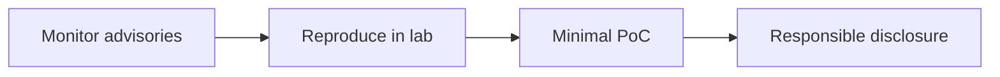
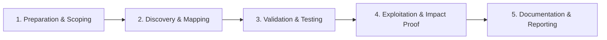

# CVE Research

Track and analyze newly disclosed vulnerabilities.

## Overview Diagram

Visual summary of the **attack/data flow** and the **five-phase testing workflow** for this topic.

### Attack / Data Flow

### Testing Workflow

## How It Works

**CVE** (Common Vulnerabilities and Exposures) identifiers catalog publicly known security flaws. The NVD enriches CVEs with CVSS scores; CISA KEV lists actively exploited issues. Security researchers monitor disclosures to patch their stacks, build detections, and publish analysis.

New CVEs often include insufficient detail for reproduction; vendor advisories and GitHub commits may be needed to understand exploitability in real deployments.

## Exploitation

1. **Monitor feeds**: NVD RSS, vendor security bulletins, GitHub Security Advisories, exploit-db, Packet Storm.
2. **Map to inventory**: correlate CVE product strings with your CMDB and nuclei templates.
3. **Prioritize**: CISA KEV + internet-exposed + high CVSS = immediate action.
4. **Lab reproduction**: isolate vulnerable version in VM/container; never test on production without authorization.
5. **Build detections**: Sigma rules, WAF signatures, or version checks for blue team.
6. **Share responsibly**: coordinate disclosure if you discover variants or bypasses.

Track patch availability and compensating controls when immediate upgrade is impossible.

## Defense & Mitigation

- Maintain **accurate asset inventory** with version numbers for critical software.
- Subscribe to vendor security mailing lists and enable Dependabot/Renovate.
- Patch KEV-listed vulnerabilities on aggressive timelines.
- Use virtual patching (WAF, IPS) only as temporary mitigation.
- Segment networks so vulnerable services are not internet-exposed.
- Run continuous vulnerability scanning with authenticated checks where possible.

## Pro Tips

Practical advice from real engagements — use these to test faster and report better.

!!! tip "Diff the patch"
    git diff between fixed and vulnerable commit isolates root cause.

!!! tip "KEV priority"
    CISA KEV list = vendors already exploited in wild.

!!! tip "Minimal PoC"
    Crash or info leak before full RCE — faster disclosure.

!!! tip "Vendor channel"
    Use security@ or VDP — not public GitHub issue day one.

!!! warning "Isolated lab VM"
    Never weaponize against production.

## Testing Methodology

Work through each phase in order. Every step has a checkbox — complete them all for thorough, reproducible coverage.

### Phase 1 — Preparation & Scoping

- [ ] Confirm target is in program scope and ROE allows this test type
- [ ] Set up isolated lab or proxy (Burp/ZAP) with scope filters
- [ ] Document baseline application behavior and account roles
- [ ] Identify test accounts for each privilege level
- [ ] Select target software and version range

### Phase 2 — Discovery & Mapping

- [ ] Monitor NVD, vendor advisories, and CISA KEV
- [ ] Set up vulnerable version in isolated VM
- [ ] Diff patches between fixed and vulnerable
- [ ] Fuzz or audit source for bug class

### Phase 3 — Validation & Testing

- [ ] Develop minimal crash or PoC
- [ ] Confirm exploitability and impact
- [ ] Write coordinated disclosure report
- [ ] Submit via vendor VDP or ZDI

### Phase 4 — Exploitation & Impact Proof

- [ ] Publish writeup after patch and CVE assignment
- [ ] Add nuclei template for community

### Phase 5 — Documentation & Reporting

- [ ] Write step-by-step reproduction with HTTP requests/responses
- [ ] Capture screenshots or video showing impact (redact sensitive data)
- [ ] Rate severity using program CVSS or impact matrix
- [ ] Provide concrete remediation guidance for developers
- [ ] Retest after fix if program allows verification

## Tools

| Tool | Usage |
|------|-------|
| `nuclei` | [Template-based vuln scanner](../../TOOLS_GUIDE.md#nuclei) |
| `vulners` | Vuln intelligence — [vulners.com](https://vulners.com/) |
| `cisa kev` | Known exploited vulns — [CISA KEV catalog](https://www.cisa.gov/known-exploited-vulnerabilities-catalog) |

## Resources

- [NVD](https://nvd.nist.gov/)

## Verification Checklist

- [ ] Review scope and rules of engagement
- [ ] Document baseline behavior
- [ ] Test edge cases and parser differentials
- [ ] Capture proof-of-concept safely
- [ ] Write remediation guidance
