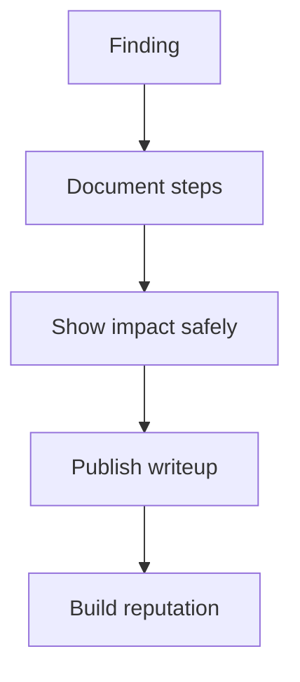
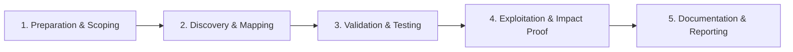

# Writeups & Reputation

Publish quality writeups to build bug bounty reputation.

## Overview Diagram

Visual summary of the **attack/data flow** and the **five-phase testing workflow** for this topic.

### Attack / Data Flow

### Testing Workflow

## How It Works

**Security writeups** document how a vulnerability was found and exploited, building researcher reputation, educating the community, and demonstrating methodology to employers and program triagers.

Quality writeups explain root cause—not just the payload—and show unique techniques. Platforms like HackerOne Hacktivity, Infosec Writeups, and personal blogs serve as portfolio pieces. Poor writeups leak customer data or violate disclosure agreements.

## Exploitation

1. **Document during testing**: save requests, notes, and timestamps as you work.
2. **Structure**: summary, background, discovery, exploitation, impact, remediation, timeline.
3. **Teach**: explain why the bug exists, not only how to trigger it.
4. **Redact**: replace real domains, user emails, and tokens with placeholders.
5. **Respect disclosure**: wait for fix or program permission before publishing.
6. **Cross-post**: blog + Hacktivity + Twitter thread with link to full analysis.
7. **Engage**: respond to comments; correct errors; credit collaborators.

Unique writeups on novel attack classes attract program invites and conference talks.

## Defense & Mitigation

- Organizations should **welcome responsible writeups** after fixes ship.
- Provide researchers clear disclosure policies and safe harbor statements.
- Use public writeups as free QA—review for missed variants in your codebase.
- Encourage internal engineers to publish defensive perspectives and patch deep-dives.
- Monitor Hacktivity for reports against your products even outside formal programs.
- Build a culture where findings lead to systemic fixes, not just one-line patches.

## Pro Tips

Practical advice from real engagements — use these to test faster and report better.

!!! tip "Impact first paragraph"
    Lead with what attacker gains — not how you found it.

!!! tip "Redact aggressively"
    PII, internal hostnames, and live tokens out of public posts.

!!! tip "Repro steps numbered"
    Copy-paste friendly steps get more engagement and bounties.

!!! tip "Screenshots annotated"
    Arrows on Burp screenshots save triage time.

!!! tip "Credit others"
    Link prior art and collaborators — community remembers.

## Testing Methodology

Work through each phase in order. Every step has a checkbox — complete them all for thorough, reproducible coverage.

### Phase 1 — Preparation & Scoping

- [ ] Confirm target is in program scope and ROE allows this test type
- [ ] Set up isolated lab or proxy (Burp/ZAP) with scope filters
- [ ] Document baseline application behavior and account roles
- [ ] Identify test accounts for each privilege level
- [ ] Confirm disclosure timeline and program permission

### Phase 2 — Discovery & Mapping

- [ ] Reconstruct finding from notes and Burp history
- [ ] Write clear impact statement for readers
- [ ] Redact PII, keys, and out-of-scope details
- [ ] Add screenshots and HTTP transcripts

### Phase 3 — Validation & Testing

- [ ] Peer review for accuracy and reproducibility
- [ ] Publish on blog or HackerOne Hacktivity
- [ ] Engage with community feedback
- [ ] Link to CWE and remediation resources

### Phase 4 — Exploitation & Impact Proof

- [ ] Update portfolio and LinkedIn respectfully
- [ ] Credit collaborators and original researchers

### Phase 5 — Documentation & Reporting

- [ ] Write step-by-step reproduction with HTTP requests/responses
- [ ] Capture screenshots or video showing impact (redact sensitive data)
- [ ] Rate severity using program CVSS or impact matrix
- [ ] Provide concrete remediation guidance for developers
- [ ] Retest after fix if program allows verification

## Tools

| Tool | Usage |
|------|-------|
| `markdown` | [Write reports in Markdown for GitHub/HackerOne](../../TOOLS_GUIDE.md) |
| `obsidian` | [Personal knowledge base for writeups & notes](../../TOOLS_GUIDE.md) |

## Resources

- [Infosec Writeups](https://infosecwriteups.com/)

## Verification Checklist

- [ ] Review scope and rules of engagement
- [ ] Document baseline behavior
- [ ] Test edge cases and parser differentials
- [ ] Capture proof-of-concept safely
- [ ] Write remediation guidance
