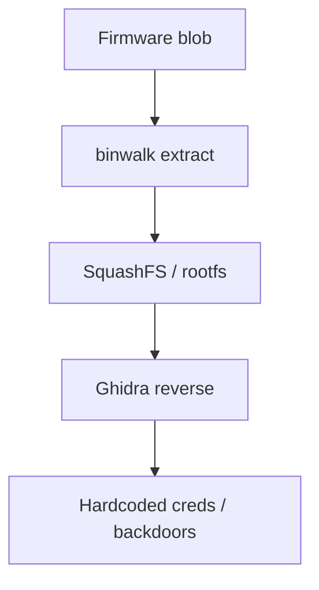
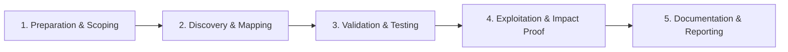

# Firmware Analysis

Extract and analyze embedded device firmware.

## Overview Diagram

Visual summary of the **attack/data flow** and the **five-phase testing workflow** for this topic.

### Attack / Data Flow

### Testing Workflow

## How It Works

**IoT firmware** is the operating system and application stack on embedded devices—routers, cameras, industrial controllers. Firmware images may be downloaded from vendor sites, extracted via UART, or intercepted during OTA updates.

Images often contain compressed root filesystems (squashfs, cramfs), kernel modules, default credentials, private keys, and unpatched open-source components. Many devices never receive updates after sale.

## Exploitation

1. **Acquire image**: vendor download, `binwalk -e firmware.bin`, or UART dump.
2. **Extract filesystem**: identify and mount squashfs/cramfs contents.
3. **Static analysis**: grep for `password`, `api_key`, hardcoded IPs, telnet enable flags.
4. **Binary analysis**: Ghidra on `httpd`, `upnp`, and management daemons.
5. **Emulation**: Firmadyne/QEMU to run services and fuzz network interfaces.
6. **CVE mapping**: match embedded OpenSSL, busybox versions to known vulnerabilities.

Test only on devices you own; IoT botnets harm real users.

## Defense & Mitigation

- **Signed firmware** with verified boot chains; reject unsigned updates.
- No default credentials; force unique passwords or certificate-based provisioning.
- Minimize attack surface: disable telnet, close unused ports, remove debug binaries from release.
- Automated **firmware SBOM** and CVE monitoring for embedded components.
- Secure OTA with encrypted, authenticated update channels.
- Bug bounty or coordinated disclosure program for hardware products.

## Testing Methodology

Work through each phase in order. Every step has a checkbox — complete them all for thorough, reproducible coverage.

### Phase 1 — Preparation & Scoping

- [ ] Confirm target is in program scope and ROE allows this test type
- [ ] Set up isolated lab or proxy (Burp/ZAP) with scope filters
- [ ] Document baseline application behavior and account roles
- [ ] Identify test accounts for each privilege level
- [ ] Obtain firmware legally (download, dump, purchase)

### Phase 2 — Discovery & Mapping

- [ ] Extract with binwalk and identify filesystem
- [ ] Emulate with Firmadyne/QEMU if possible
- [ ] Analyze binaries in Ghidra
- [ ] Search for hardcoded creds and backdoors

### Phase 3 — Validation & Testing

- [ ] Test default telnet/SSH credentials
- [ ] Identify vulnerable services on ports
- [ ] Check unsigned update mechanism
- [ ] Review kernel and BusyBox versions

### Phase 4 — Exploitation & Impact Proof

- [ ] Demonstrate device compromise in lab
- [ ] Report to vendor via coordinated disclosure

### Phase 5 — Documentation & Reporting

- [ ] Write step-by-step reproduction with HTTP requests/responses
- [ ] Capture screenshots or video showing impact (redact sensitive data)
- [ ] Rate severity using program CVSS or impact matrix
- [ ] Provide concrete remediation guidance for developers
- [ ] Retest after fix if program allows verification

## Tools

| Tool | Usage |
|------|-------|
| `binwalk` | [Firmware analysis](../../TOOLS_GUIDE.md#binwalk) |
| `firmadyne` | Firmware emulation — [Firmadyne](https://github.com/firmadyne/firmadyne) |
| `ghidra` | [Reverse engineering suite](../../TOOLS_GUIDE.md#ghidra) |

## Verification Checklist

- [ ] Review scope and rules of engagement
- [ ] Document baseline behavior
- [ ] Test edge cases and parser differentials
- [ ] Capture proof-of-concept safely
- [ ] Write remediation guidance
