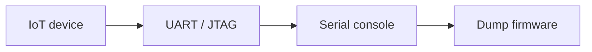

# Hardware Interfaces

Interact with UART, JTAG, and SPI on embedded devices.

## Overview Diagram

Visual summary of the **attack/data flow** and the **five-phase testing workflow** for this topic.

### Attack / Data Flow

### Testing Workflow

## How It Works

Embedded devices expose **hardware debug interfaces**—UART, JTAG, SWD, SPI, I2C—that provide direct memory access, firmware download, and breakpoint debugging when physically connected. Manufacturers sometimes leave pads unpopulated or protect with fuses, but many consumer devices expose full shells over UART.

Logic analyzers identify pin functions by observing boot traffic. **Bus Pirate** and **JTAGulator** automate pin discovery. Physical access defeats many software-only protections.

## Exploitation

1. **PCB inspection**: locate test pads, silkscreen labels (TX, RX, GND, TDI, TDO).
2. **UART**: logic analyzer at 115200/8N1 common baud rates; connect GND, TX, RX.
3. **Shell access**: interrupt boot via UART for u-boot prompt; dump flash.
4. **JTAG**: JTAGulator scan; OpenOCD for memory read and boundary scan.
5. **SPI flash**: desolder or clip SOIC8 reader to extract full firmware offline.
6. **Safety**: ESD precautions, correct voltage levels (3.3V vs 1.8V).

Document pinout for responsible disclosure; do not publish keys that enable mass compromise.

## Defense & Mitigation

- **Disable JTAG/UART** in production via fuses or firmware locks after manufacturing.
- Encrypt flash contents; bind decryption to secure element or TPM.
- Physical tamper detection and enclosure hardening for high-security devices.
- Separate manufacturing debug credentials from field firmware.
- Pen-test hardware before launch with physical access assumptions.
- Provide secure update path so UART is not the only recovery mechanism.

## Pro Tips

Practical advice from real engagements — use these to test faster and report better.

!!! tip "UART baud scan"
    Try 115200, 57600, 38400 — multimeter finds TX/RX/GND.

!!! warning "3.3V vs 5V"
    Wrong voltage fries boards — confirm before connecting.

!!! tip "Boot interrupt"
    Spam key during power-on for U-Boot or CFE shell.

!!! tip "SPI flash dump"
    flashrom or chip programmer when UART locked.

!!! tip "Photo pinout"
    Document pads for report — future you will thank you.

## Testing Methodology

Work through each phase in order. Every step has a checkbox — complete them all for thorough, reproducible coverage.

### Phase 1 — Preparation & Scoping

- [ ] Confirm target is in program scope and ROE allows this test type
- [ ] Set up isolated lab or proxy (Burp/ZAP) with scope filters
- [ ] Document baseline application behavior and account roles
- [ ] Identify test accounts for each privilege level
- [ ] Document board and chip identifiers

### Phase 2 — Discovery & Mapping

- [ ] Identify UART pads with multimeter/continuity
- [ ] Connect Bus Pirate or USB-serial at correct baud
- [ ] Dump flash via SPI/JTAG if protected
- [ ] Capture boot sequence over serial

### Phase 3 — Validation & Testing

- [ ] Access root shell or firmware dump
- [ ] Document pinout and voltage levels
- [ ] Avoid damaging hardware with wrong voltage

### Phase 4 — Exploitation & Impact Proof

- [ ] Analyze dumped firmware offline
- [ ] Recommend disable debug ports in production

### Phase 5 — Documentation & Reporting

- [ ] Write step-by-step reproduction with HTTP requests/responses
- [ ] Capture screenshots or video showing impact (redact sensitive data)
- [ ] Rate severity using program CVSS or impact matrix
- [ ] Provide concrete remediation guidance for developers
- [ ] Retest after fix if program allows verification

## Tools

| Tool | Usage |
|------|-------|
| `bus pirate` | Hardware hacking — [dangerousprototypes.com](http://dangerousprototypes.com/docs/Bus_Pirate) |
| `jtagulator` | JTAG/UART discovery — [Grand Idea Studio](https://www.grandideastudio.com/jtagulator) |
| `logic analyzer` | [Signal analysis with Saleae or PulseView](../../TOOLS_GUIDE.md) |

## Verification Checklist

- [ ] Review scope and rules of engagement
- [ ] Document baseline behavior
- [ ] Test edge cases and parser differentials
- [ ] Capture proof-of-concept safely
- [ ] Write remediation guidance
