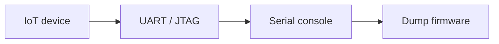

# Hardware Interfaces

Interact with UART, JTAG, and SPI on embedded devices.

## Overview Diagram

## How It Works

Embedded devices expose **hardware debug interfaces**—UART, JTAG, SWD, SPI, I2C—that provide direct memory access, firmware download, and breakpoint debugging when physically connected. Manufacturers sometimes leave pads unpopulated or protect with fuses, but many consumer devices expose full shells over UART.

Logic analyzers identify pin functions by observing boot traffic. **Bus Pirate** and **JTAGulator** automate pin discovery. Physical access defeats many software-only protections.

## Exploitation

1. **PCB inspection**: locate test pads, silkscreen labels (TX, RX, GND, TDI, TDO).
2. **UART**: logic analyzer at 115200/8N1 common baud rates; connect GND, TX, RX.
3. **Shell access**: interrupt boot via UART for u-boot prompt; dump flash.
4. **JTAG**: JTAGulator scan; OpenOCD for memory read and boundary scan.
5. **SPI flash**: desolder or clip SOIC8 reader to extract full firmware offline.
6. **Safety**: ESD precautions, correct voltage levels (3.3V vs 1.8V).

Document pinout for responsible disclosure; do not publish keys that enable mass compromise.

## Defense & Mitigation

- **Disable JTAG/UART** in production via fuses or firmware locks after manufacturing.
- Encrypt flash contents; bind decryption to secure element or TPM.
- Physical tamper detection and enclosure hardening for high-security devices.
- Separate manufacturing debug credentials from field firmware.
- Pen-test hardware before launch with physical access assumptions.
- Provide secure update path so UART is not the only recovery mechanism.

## Methodology

- [ ] Identify debug pads on PCB
- [ ] Connect logic analyzer or bus pirate
- [ ] Dump firmware via UART
- [ ] Follow electrostatic and safety precautions

## Tools

| Tool | Usage |
|------|-------|
| `bus pirate` | Hardware hacking — [dangerousprototypes.com](http://dangerousprototypes.com/docs/Bus_Pirate) |
| `jtagulator` | JTAG/UART discovery — [Grand Idea Studio](https://www.grandideastudio.com/jtagulator) |
| `logic analyzer` | [Signal analysis with Saleae or PulseView](../../TOOLS_GUIDE.md) |

## Verification Checklist

- [ ] Review scope and rules of engagement
- [ ] Document baseline behavior
- [ ] Test edge cases and parser differentials
- [ ] Capture proof-of-concept safely
- [ ] Write remediation guidance
