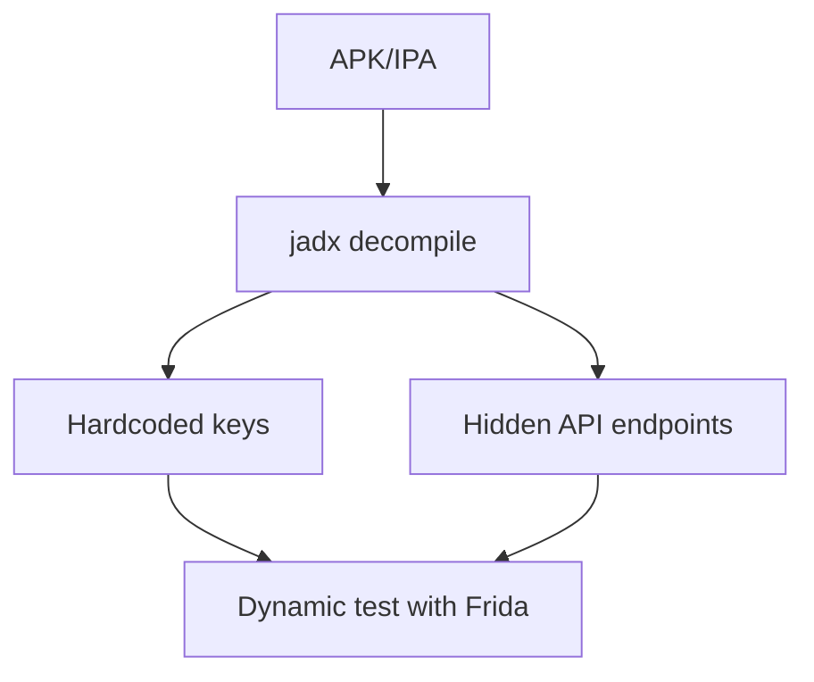
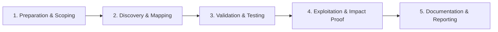

# APK / IPA Analysis

Static and dynamic analysis of mobile applications.

## Overview Diagram

Visual summary of the **attack/data flow** and the **five-phase testing workflow** for this topic.

### Attack / Data Flow

### Testing Workflow

## How It Works

Mobile applications ship as **APK** (Android) or **IPA** (iOS) packages containing compiled bytecode, native libraries, resources, and manifest metadata. Attackers and researchers reverse these packages to recover API endpoints, hardcoded secrets, cryptographic keys, and business logic that was never meant to be public.

On Android, DEX bytecode is decompiled to Java-like source with tools like JADX. The `AndroidManifest.xml` declares permissions, exported components (activities, services, broadcast receivers), deep link handlers, and backup/debug flags. Native `lib/` binaries may contain additional logic or anti-tamper checks.

On iOS, IPA binaries are ARM Mach-O executables. Class metadata, strings, and Objective-C/Swift symbols reveal functionality. Keychain usage, URL schemes, and entitlements define what the app can access on the device.

## Exploitation

1. **Obtain the package** from Play Store, App Store, or program scope assets.
2. **Decompile and map surface**: `jadx -d out app.apk` or use MobSF for a guided report.
3. **Search for secrets**: grep decompiled output for API keys, tokens, AWS credentials, and internal hostnames.
4. **Review manifest exports**: identify `android:exported="true"` components that accept intents without authentication.
5. **Trace network layer**: find Retrofit/OkHttp configs, certificate pinning hooks, and WebView JavaScript bridges.
6. **Dynamic validation**: install on emulator/device, intercept traffic (after pinning bypass if needed), and confirm static findings.

Chain findings: hardcoded admin API key + exported activity that loads arbitrary URLs can escalate to account takeover or data exfiltration.

## Defense & Mitigation

- **Never store secrets in the client**; use short-lived tokens from a backend.
- Minimize exported components; require signature-level permissions for IPC.
- Enable **ProGuard/R8** and native obfuscation; understand this is deterrence, not encryption.
- Disable `android:allowBackup` unless backups are encrypted and scoped.
- Implement certificate pinning and root/jailbreak detection as layered controls.
- Run MobSF or similar in CI for every release build.
- Follow **OWASP MASTG** and MASVS for structured testing and verification.

## Testing Methodology

Work through each phase in order. Every step has a checkbox — complete them all for thorough, reproducible coverage.

### Phase 1 — Preparation & Scoping

- [ ] Confirm target is in program scope and ROE allows this test type
- [ ] Set up isolated lab or proxy (Burp/ZAP) with scope filters
- [ ] Document baseline application behavior and account roles
- [ ] Identify test accounts for each privilege level
- [ ] Obtain APK/IPA and package name in scope

### Phase 2 — Discovery & Mapping

- [ ] Decompile with jadx and apktool
- [ ] Search for hardcoded secrets and API keys
- [ ] Map exported activities and deep links
- [ ] Review network security config and pinning

### Phase 3 — Validation & Testing

- [ ] Validate secrets against live APIs
- [ ] Test backup and debug flags in manifest
- [ ] Run MobSF automated scan
- [ ] Identify certificate pinning implementation

### Phase 4 — Exploitation & Impact Proof

- [ ] Demonstrate insecure data storage or API abuse
- [ ] Document file/line of vulnerable code
- [ ] Recommend secure storage and pinning

### Phase 5 — Documentation & Reporting

- [ ] Write step-by-step reproduction with HTTP requests/responses
- [ ] Capture screenshots or video showing impact (redact sensitive data)
- [ ] Rate severity using program CVSS or impact matrix
- [ ] Provide concrete remediation guidance for developers
- [ ] Retest after fix if program allows verification

## Tools

| Tool | Usage |
|------|-------|
| `jadx` | [Android decompiler](../../TOOLS_GUIDE.md#jadx) |
| `apktool` | [APK reverse engineering](../../TOOLS_GUIDE.md#apktool) |
| `mobsf` | [Mobile security framework](../../TOOLS_GUIDE.md#mobsf) |
| `objection` | [Runtime mobile exploration](../../TOOLS_GUIDE.md#frida-objection) |

## Resources

- [OWASP MASTG](https://owasp.org/www-project-mobile-app-security-testing-guide/)

## Verification Checklist

- [ ] Review scope and rules of engagement
- [ ] Document baseline behavior
- [ ] Test edge cases and parser differentials
- [ ] Capture proof-of-concept safely
- [ ] Write remediation guidance
