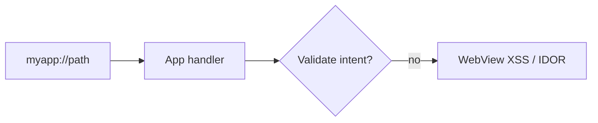

# Deep Links & Universal Links

Test mobile deep link handlers for auth bypass and XSS.

## Overview Diagram

## How It Works

**Deep links** route users into specific app screens via custom URL schemes (`myapp://path`) or **App Links / Universal Links** (`https://domain/path`) verified by `assetlinks.json` (Android) or `apple-app-site-association` (iOS).

When a link is opened, the OS dispatches an intent or hands off to the app with parameters that the target activity parses. If validation is missing, attackers can trigger unintended navigation, inject WebView content, steal tokens from URLs, or bypass authentication by reaching protected screens directly.

## Exploitation

1. **Enumerate schemes**: parse manifest for `intent-filter` data elements and iOS Info.plist URL types.
2. **Fuzz parameters**: `adb shell am start -a android.intent.action.VIEW -d "myapp://login?token=attacker"`.
3. **Test path traversal in handlers**: `myapp://../../admin` or open redirect chains.
4. **WebView deep links**: if a handler loads URLs in WebView, test `javascript:` and file:// schemes for XSS.
5. **Verify App Link ownership**: check if `assetlinks.json` is missing or allows wildcard paths—attackers may register overlapping domains.
6. **Chain with phishing**: send malicious links that auto-open the app and exfiltrate session data via query parameters reflected in logs or analytics.

Use Burp Collaborator or custom logging to detect server-side callbacks from deep link opens.

## Defense & Mitigation

- **Validate every parameter** before navigation; use allowlists for paths and hosts.
- Require authentication before sensitive screens; deep links should not skip login.
- Disable WebView JavaScript or use `shouldOverrideUrlLoading` with strict allowlists.
- Implement **App Link / Universal Link verification** correctly; avoid wildcard paths.
- Never put secrets (tokens, PII) in deep link query strings.
- Log and monitor anomalous deep link patterns; test with OWASP MASTG deep link test cases.

## Methodology

- [ ] Enumerate custom URL schemes
- [ ] Test intent filters and path parameters
- [ ] Check app link verification files
- [ ] Chain open redirects in WebViews

## Tools

| Tool | Usage |
|------|-------|
| `adb` | [Android Debug Bridge](https://developer.android.com/tools/adb) |
| `objection` | [Runtime mobile exploration](../../TOOLS_GUIDE.md#frida-objection) |
| `burp` | [Intercept, repeater & scanner](../../TOOLS_GUIDE.md#burp-suite) |

## Verification Checklist

- [ ] Review scope and rules of engagement
- [ ] Document baseline behavior
- [ ] Test edge cases and parser differentials
- [ ] Capture proof-of-concept safely
- [ ] Write remediation guidance
