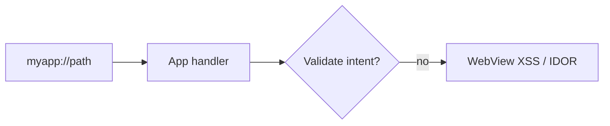
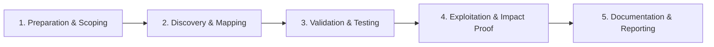

# Deep Links & Universal Links

Test mobile deep link handlers for auth bypass and XSS.

## Overview Diagram

Visual summary of the **attack/data flow** and the **five-phase testing workflow** for this topic.

### Attack / Data Flow

### Testing Workflow

## How It Works

**Deep links** route users into specific app screens via custom URL schemes (`myapp://path`) or **App Links / Universal Links** (`https://domain/path`) verified by `assetlinks.json` (Android) or `apple-app-site-association` (iOS).

When a link is opened, the OS dispatches an intent or hands off to the app with parameters that the target activity parses. If validation is missing, attackers can trigger unintended navigation, inject WebView content, steal tokens from URLs, or bypass authentication by reaching protected screens directly.

## Exploitation

1. **Enumerate schemes**: parse manifest for `intent-filter` data elements and iOS Info.plist URL types.
2. **Fuzz parameters**: `adb shell am start -a android.intent.action.VIEW -d "myapp://login?token=attacker"`.
3. **Test path traversal in handlers**: `myapp://../../admin` or open redirect chains.
4. **WebView deep links**: if a handler loads URLs in WebView, test `javascript:` and file:// schemes for XSS.
5. **Verify App Link ownership**: check if `assetlinks.json` is missing or allows wildcard paths—attackers may register overlapping domains.
6. **Chain with phishing**: send malicious links that auto-open the app and exfiltrate session data via query parameters reflected in logs or analytics.

Use Burp Collaborator or custom logging to detect server-side callbacks from deep link opens.

## Defense & Mitigation

- **Validate every parameter** before navigation; use allowlists for paths and hosts.
- Require authentication before sensitive screens; deep links should not skip login.
- Disable WebView JavaScript or use `shouldOverrideUrlLoading` with strict allowlists.
- Implement **App Link / Universal Link verification** correctly; avoid wildcard paths.
- Never put secrets (tokens, PII) in deep link query strings.
- Log and monitor anomalous deep link patterns; test with OWASP MASTG deep link test cases.

## Pro Tips

Practical advice from real engagements — use these to test faster and report better.

!!! tip "adb intent fuzzing"
    `adb shell am start -a android.intent.action.VIEW -d 'scheme://path'`

!!! tip "WebView loading"
    Deep link params reflected in WebView URL — test XSS and file access.

!!! tip "iOS universal links"
    AASA file mistakes allow cross-app hijacking.

!!! tip "Auth on destination"
    Open `/account/settings` via link without session cookie.

!!! tip "Intent filter export"
    Exported handlers without permission = other apps can trigger them.

## Testing Methodology

Work through each phase in order. Every step has a checkbox — complete them all for thorough, reproducible coverage.

### Phase 1 — Preparation & Scoping

- [ ] Confirm target is in program scope and ROE allows this test type
- [ ] Set up isolated lab or proxy (Burp/ZAP) with scope filters
- [ ] Document baseline application behavior and account roles
- [ ] Identify test accounts for each privilege level
- [ ] Extract intent filters from manifest

### Phase 2 — Discovery & Mapping

- [ ] Map custom URL schemes and app links
- [ ] Fuzz path parameters and exported handlers
- [ ] Test WebView loading from deep link URLs
- [ ] Review authentication on linked screens

### Phase 3 — Validation & Testing

- [ ] Open sensitive screens without login via link
- [ ] Inject JavaScript via WebView deep link
- [ ] Validate intent hijacking between apps
- [ ] Test Android App Links verification bypass

### Phase 4 — Exploitation & Impact Proof

- [ ] Demonstrate unauthorized screen access or XSS
- [ ] Document malicious link format

### Phase 5 — Documentation & Reporting

- [ ] Write step-by-step reproduction with HTTP requests/responses
- [ ] Capture screenshots or video showing impact (redact sensitive data)
- [ ] Rate severity using program CVSS or impact matrix
- [ ] Provide concrete remediation guidance for developers
- [ ] Retest after fix if program allows verification

## Tools

| Tool | Usage |
|------|-------|
| `adb` | [Android Debug Bridge](https://developer.android.com/tools/adb) |
| `objection` | [Runtime mobile exploration](../../TOOLS_GUIDE.md#frida-objection) |
| `burp` | [Intercept, repeater & scanner](../../TOOLS_GUIDE.md#burp-suite) |

## Verification Checklist

- [ ] Review scope and rules of engagement
- [ ] Document baseline behavior
- [ ] Test edge cases and parser differentials
- [ ] Capture proof-of-concept safely
- [ ] Write remediation guidance
