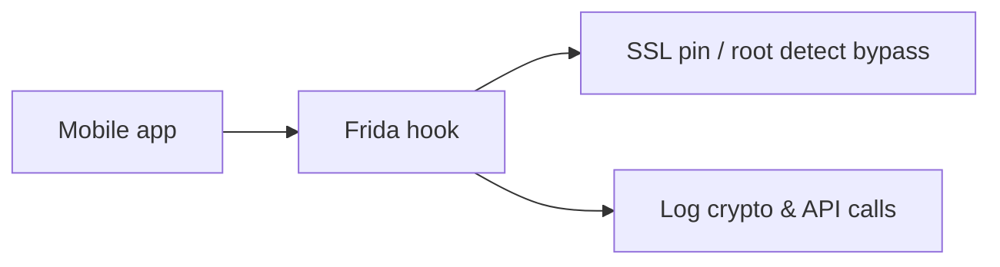
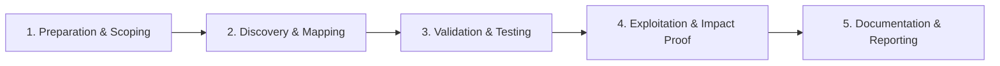

# Frida Instrumentation

Dynamic instrumentation for mobile runtime manipulation.

## Overview Diagram

Visual summary of the **attack/data flow** and the **five-phase testing workflow** for this topic.

### Attack / Data Flow

### Testing Workflow

## How It Works

**Frida** is a dynamic instrumentation framework that injects a JavaScript runtime into running processes. On mobile, `frida-server` runs on the device and exposes an API to hook functions, replace return values, and inspect memory at runtime—without repackaging the app.

Hooks attach to Java methods (via ART), native functions (via `Interceptor.attach`), and Objective-C selectors on iOS. Because checks execute in the app's process, Frida can bypass SSL pinning, root detection, and integrity verification that static analysis alone cannot defeat.

Objection wraps Frida with a REPL for common mobile pentest tasks. **r2frida** combines Radare2's analysis with live Frida hooks for deeper native debugging.

## Exploitation

1. Deploy `frida-server` matching the device architecture (arm64).
2. List apps: `frida-ps -Uai` and attach: `frida -U -f com.target.app -l script.js`.
3. **Hook SSL pinning**: intercept `TrustManager`, `OkHttp CertificatePinner`, or BoringSSL verification routines and force success.
4. **Bypass root checks**: hook `File.exists` on `/system/bin/su` or custom integrity classes to return false.
5. **Extract crypto material**: hook `Cipher.doFinal`, `SecretKeySpec`, or token generation methods to log keys and plaintext.
6. **Patch logic**: replace method implementations to skip license checks or enable debug features.

Use Frida only on apps you own or have explicit authorization to test.

## Defense & Mitigation

- Detect Frida artifacts: named pipes, `frida-server` ports, suspicious loaded libraries.
- Use **multiple integrity checks** at different layers (Java + native + server-side).
- Rely on **server-side authorization**; client bypasses should not grant privilege.
- Obfuscate sensitive native code; avoid single-point pinning implementations.
- Monitor for hook frameworks in production via attestation (Play Integrity, DeviceCheck).
- Rate-limit and anomaly-detect API usage patterns that indicate automated abuse.

## Testing Methodology

Work through each phase in order. Every step has a checkbox — complete them all for thorough, reproducible coverage.

### Phase 1 — Preparation & Scoping

- [ ] Confirm target is in program scope and ROE allows this test type
- [ ] Set up isolated lab or proxy (Burp/ZAP) with scope filters
- [ ] Document baseline application behavior and account roles
- [ ] Identify test accounts for each privilege level
- [ ] Install app on rooted/jailbroken or patched test device

### Phase 2 — Discovery & Mapping

- [ ] Bypass root detection with Frida hooks
- [ ] Hook crypto and API call functions
- [ ] Intercept SSL with pinning bypass
- [ ] Log authentication tokens and parameters

### Phase 3 — Validation & Testing

- [ ] Modify runtime behavior (skip PIN, change values)
- [ ] Validate server-side controls still enforce auth
- [ ] Document hooked methods and offsets
- [ ] Use objection for rapid exploration

### Phase 4 — Exploitation & Impact Proof

- [ ] Demonstrate client-only bypass with server impact proof
- [ ] Recommend server-side authorization

### Phase 5 — Documentation & Reporting

- [ ] Write step-by-step reproduction with HTTP requests/responses
- [ ] Capture screenshots or video showing impact (redact sensitive data)
- [ ] Rate severity using program CVSS or impact matrix
- [ ] Provide concrete remediation guidance for developers
- [ ] Retest after fix if program allows verification

## Tools

| Tool | Usage |
|------|-------|
| `frida` | [Dynamic instrumentation](../../TOOLS_GUIDE.md#frida-objection) |
| `objection` | [Runtime mobile exploration](../../TOOLS_GUIDE.md#frida-objection) |
| `r2frida` | [Radare2 + Frida bridge](../../TOOLS_GUIDE.md#frida-objection) |

## Resources

- [Frida Docs](https://frida.re/docs/home/)

## Verification Checklist

- [ ] Review scope and rules of engagement
- [ ] Document baseline behavior
- [ ] Test edge cases and parser differentials
- [ ] Capture proof-of-concept safely
- [ ] Write remediation guidance
