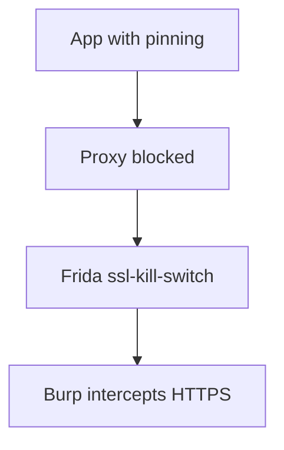

# SSL Pinning Bypass

Intercept HTTPS from mobile apps with certificate pinning.

## Overview Diagram

Visual summary of the **attack/data flow** and the **five-phase testing workflow** for this topic.

### Attack / Data Flow

### Testing Workflow

## How It Works

**SSL/TLS certificate pinning** binds an app to specific public keys or certificates instead of trusting the device's CA store. Even if a tester installs Burp's CA on a rooted device, the app rejects the intercepted connection because the proxy certificate does not match the pinned hash.

Pinning may be implemented in the network stack (OkHttp `CertificatePinner`), NSURLSession delegates on iOS, or custom native TLS libraries. Some apps pin only production hosts while leaving staging environments interceptable—a common misconfiguration.

## Exploitation

1. **Identify pinning**: search decompiled code for `CertificatePinner`, `TrustKit`, `AFSSLPinningMode`, or `flutter_ssl_pinning`.
2. **Frida universal scripts**: run community scripts that hook common pinning APIs.
3. **Objection**: `android sslpinning disable` or `ios sslpinning disable`.
4. **APK patching**: repackage with a modified `network_security_config.xml` that trusts user CAs (`apk-mitm`, manual `apktool` workflow).
5. **Emulator with system CA**: Android 7+ requires placing the CA in the system store or using a Magisk module.
6. Confirm interception in Burp/mitmproxy and replay API calls.

Document which hosts were pinned and whether bypass affected all endpoints.

## Defense & Mitigation

- Pin **public keys** (SPKI hashes) rather than entire certificates to ease rotation.
- Implement **backup pins** and a documented rotation procedure.
- Combine pinning with **certificate transparency** monitoring for mis-issued certs.
- Do not pin staging/dev builds with production keys; use separate trust stores.
- Assume pinning can be bypassed on compromised devices; enforce auth and encryption at the application layer.
- Test pinning with tools like `nabla` or MobSF and verify failure on proxy connections.

## Pro Tips

Practical advice from real engagements — use these to test faster and report better.

!!! tip "Universal SSL kill"
    frida-multiple-unpinning script covers OkHttp, AFNetworking, Flutter.

!!! tip "apk-mitm patch"
    When Frida blocked, repackage APK with mitm proxy cert.

!!! tip "iOS trust store"
    Install Burp CA on device and enable full trust in Settings.

!!! tip "Certificate transparency"
    Some apps pin plus CT — note bypass method per OS version.

!!! tip "Production builds"
    Confirm pinning enabled in release — debug-only pinning is not a vuln.

## Testing Methodology

Work through each phase in order. Every step has a checkbox — complete them all for thorough, reproducible coverage.

### Phase 1 — Preparation & Scoping

- [ ] Confirm target is in program scope and ROE allows this test type
- [ ] Set up isolated lab or proxy (Burp/ZAP) with scope filters
- [ ] Document baseline application behavior and account roles
- [ ] Identify test accounts for each privilege level
- [ ] Configure Burp/mitm proxy on test device

### Phase 2 — Discovery & Mapping

- [ ] Identify pinning library (OkHttp, AFNetworking)
- [ ] Apply Frida ssl-kill-switch or objection
- [ ] Patch APK with apk-mitm if needed
- [ ] Verify HTTPS interception works

### Phase 3 — Validation & Testing

- [ ] Capture and modify API traffic
- [ ] Test sensitive endpoints via proxy
- [ ] Confirm pinning re-enabled in production builds
- [ ] Document bypass method per OS version

### Phase 4 — Exploitation & Impact Proof

- [ ] Demonstrate API abuse via mitm on test build
- [ ] Recommend certificate transparency and pinning rotation

### Phase 5 — Documentation & Reporting

- [ ] Write step-by-step reproduction with HTTP requests/responses
- [ ] Capture screenshots or video showing impact (redact sensitive data)
- [ ] Rate severity using program CVSS or impact matrix
- [ ] Provide concrete remediation guidance for developers
- [ ] Retest after fix if program allows verification

## Tools

| Tool | Usage |
|------|-------|
| `frida` | [Dynamic instrumentation](../../TOOLS_GUIDE.md#frida-objection) |
| `apk-mitm` | [Patch APK for MITM](https://github.com/shroudedcode/apk-mitm) |
| `objection` | [Runtime mobile exploration](../../TOOLS_GUIDE.md#frida-objection) |

## Verification Checklist

- [ ] Review scope and rules of engagement
- [ ] Document baseline behavior
- [ ] Test edge cases and parser differentials
- [ ] Capture proof-of-concept safely
- [ ] Write remediation guidance
