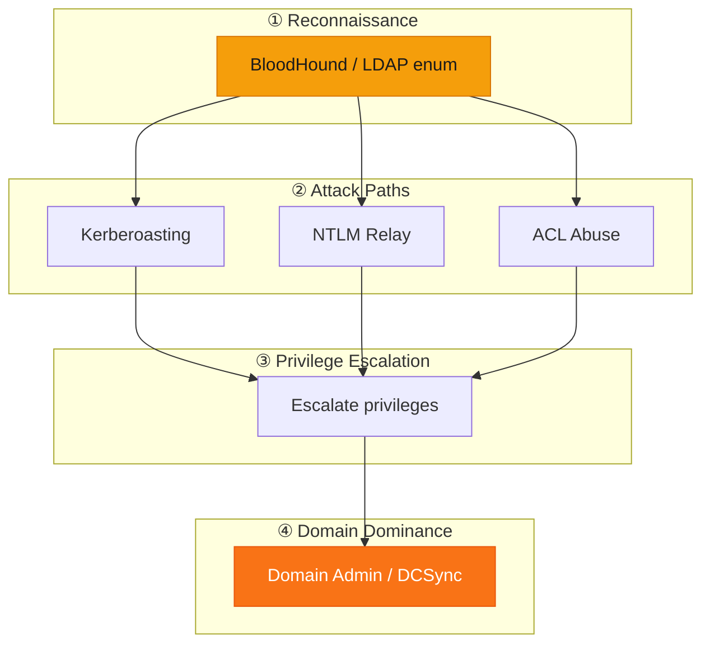
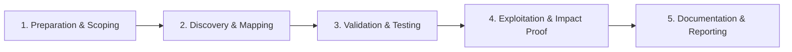

# Active Directory

Attack and assess Windows domain environments.

## Overview Diagram

Visual summary of the **attack/data flow** and the **five-phase testing workflow** for this topic.

### Attack / Data Flow

### Testing Workflow

## How It Works

Active Directory (AD) is Microsoft's centralized identity and access management system for Windows domains. A **domain** contains **users**, **computers**, **groups**, and **Group Policy Objects (GPOs)** stored on **Domain Controllers (DCs)**. Authentication uses **Kerberos** (ticket-based) and **NTLM** (challenge-response); authorization is enforced through **Access Control Lists (ACLs)** on directory objects.

Attackers target AD because compromising a domain admin account grants control over every joined system. Key concepts:

- **LDAP** — Query users, groups, SPNs, and ACLs.
- **Kerberos tickets** — TGT (authentication), TGS (service access).
- **Delegation** — Constrained/unconstrained delegation allows impersonation.
- **Trust relationships** — Parent/child and forest trusts expand blast radius.
- **ACL abuse** — `GenericAll`, `WriteDACL`, `ForceChangePassword` on users or groups enable privilege escalation paths.

BloodHound visualizes these relationships as attack graphs from any compromised principal to Domain Admin.

## Exploitation

1. **Gain initial foothold** — Phishing, VPN creds, or vulnerable external service yields a domain-joined workstation or user account.
2. **Enumerate with LDAP** — `PowerView`, `ldapsearch`, or `bloodhound-python` to list users, groups, computers, and ACLs.
3. **Identify quick wins** — AS-REP roastable accounts (no preauth), Kerberoastable SPNs, GPP passwords in SYSVOL, LLMNR/NBT-NS poisoning via Responder.
4. **Crack or relay** — Offline hash cracking (hashcat) or NTLM relay to SMB/LDAP.
5. **Map attack paths** — Import BloodHound data; find shortest path to `Domain Admins` or `Enterprise Admins`.
6. **Exploit ACL edges** — `GenericAll` on user → reset password; `WriteOwner` on group → add self.
7. **Escalate to DA** — DCSync, Golden Ticket, or group membership abuse.
8. **Document per ROE** — Use `-ldap` safe mode in labs; avoid destructive changes in production assessments.

## Defense & Mitigation

- **Tiered Administration Model** — Separate admin accounts (Tier 0) from daily-use workstations; never log into Tier 0 systems from Tier 2.
- **Enable AES-only Kerberos** and require preauthentication; disable RC4 where possible.
- **Audit and harden ACLs** — Remove excessive `GenericAll`/`WriteDACL` on users, groups, and OUs; use tools like `BloodHound` defensively.
- **Deploy LAPS** for local admin password randomization on workstations.
- **Disable LLMNR/NBT-NS** and SMB signing enforcement to block relay attacks.
- **Enable Protected Users group** for privileged accounts; enforce MFA for all admin authentication.
- **Monitor** Event ID 4769 (Kerberoasting), 4662 (replication), and 4624 anomalous logons.
- Follow [Microsoft's AD security baseline](https://learn.microsoft.com/en-us/windows-server/identity/ad-ds/plan/security-best-practices/best-practices-for-securing-active-directory).

## Pro Tips

Practical advice from real engagements — use these to test faster and report better.

!!! tip "BloodHound first"
    Run SharpHound before manual enum — paths to DA save hours of guessing.

!!! tip "Low-priv is enough"
    Domain user creds unlock Kerberoast, ACL abuse, and LLMNR poisoning.

!!! tip "Tier 0 focus"
    Document paths to Domain Admins, not every local admin on workstations.

!!! warning "Snapshot before DCSync"
    Credential dumps are destructive evidence — get written approval.

!!! tip "Clean up artifacts"
    Remove created SPNs, accounts, and scheduled tasks before engagement ends.

## Testing Methodology

Work through each phase in order. Every step has a checkbox — complete them all for thorough, reproducible coverage.

### Phase 1 — Preparation & Scoping

- [ ] Confirm target is in program scope and ROE allows this test type
- [ ] Set up isolated lab or proxy (Burp/ZAP) with scope filters
- [ ] Document baseline application behavior and account roles
- [ ] Identify test accounts for each privilege level
- [ ] Obtain written AD test authorization and emergency contact

### Phase 2 — Discovery & Mapping

- [ ] Run BloodHound/SharpHound collection
- [ ] Enumerate users, groups, computers, GPOs
- [ ] Identify Kerberoastable and AS-REP roastable accounts
- [ ] Map trust relationships and ACL abuse paths

### Phase 3 — Validation & Testing

- [ ] Validate attack paths from low-priv user to DA
- [ ] Test Kerberoasting, NTLM relay, and ACL abuse
- [ ] Check for LLMNR/NBT-NS poisoning opportunities
- [ ] Review LAPS and tiered admin implementation

### Phase 4 — Exploitation & Impact Proof

- [ ] Execute shortest path to Domain Admin in lab or approved window
- [ ] Demonstrate DCSync or Golden Ticket if in scope
- [ ] Document each hop with timestamps and tools
- [ ] Clean up created accounts and SPNs

### Phase 5 — Documentation & Reporting

- [ ] Write step-by-step reproduction with HTTP requests/responses
- [ ] Capture screenshots or video showing impact (redact sensitive data)
- [ ] Rate severity using program CVSS or impact matrix
- [ ] Provide concrete remediation guidance for developers
- [ ] Retest after fix if program allows verification
- [ ] Map findings to MITRE ATT&CK and BloodHound remediation

## Tools

| Tool | Usage |
|------|-------|
| `bloodhound` | [AD attack path analysis](../../TOOLS_GUIDE.md#bloodhound) |
| `rubeus` | [Kerberos abuse toolkit](../../TOOLS_GUIDE.md#rubeus) |
| `impacket` | [Network protocol tools](../../TOOLS_GUIDE.md#impacket) |
| `powerview` | [AD situational awareness](https://github.com/PowerShellMafia/PowerSploit) |

## Resources

- [HackTricks AD](https://book.hacktricks.xyz/windows-hardening/active-directory-methodology)

## Verification Checklist

- [ ] Review scope and rules of engagement
- [ ] Document baseline behavior
- [ ] Test edge cases and parser differentials
- [ ] Capture proof-of-concept safely
- [ ] Write remediation guidance
