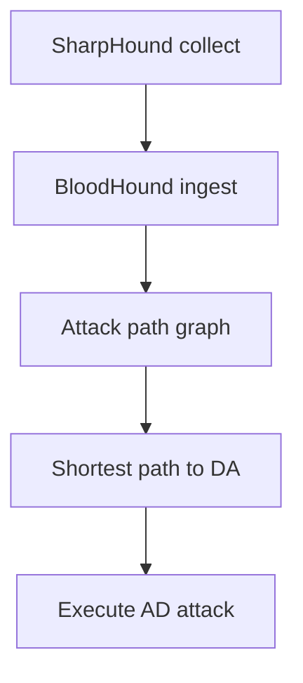
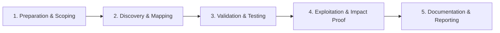

# BloodHound

Graph-based Active Directory attack path analysis.

## Overview Diagram

Visual summary of the **attack/data flow** and the **five-phase testing workflow** for this topic.

### Attack / Data Flow

### Testing Workflow

## How It Works

BloodHound is a graph analysis tool that maps **Active Directory attack paths**. Collectors (`SharpHound`, `bloodhound.py`) ingest LDAP, session, ACL, GPO, and trust data into a Neo4j graph database. Nodes represent users, computers, groups, GPOs, and domains; edges represent relationships like **MemberOf**, **HasSession**, **GenericAll**, **AdminTo**, and **CanRDP**.

Pre-built queries find:

- Shortest path from owned principals to **Domain Admins**.
- **Kerberoastable** and **AS-REP roastable** users.
- Computers where Domain Users have **local admin**.
- **Unconstrained delegation** and **ADCS ESC** misconfigurations (with SharpHound CE).

BloodHound turns manual ACL review into visual, queryable attack planning—used by both red and blue teams.

## Exploitation

1. **Collect data** — `SharpHound.exe -c All,GPOLocalGroup` from a domain-joined host or `bloodhound-python -u user -p pass -d domain -ns <DC>`.
2. **Import ZIP** — Upload collector output to BloodHound CE or legacy GUI.
3. **Mark owned nodes** — Right-click compromised users/computers as "Owned".
4. **Run path queries** — "Shortest Path to Domain Admins from Owned".
5. **Review high-value edges** — `GenericAll`, `WriteDACL`, `ForceChangePassword`, `AddMember`, `Owns`.
6. **Check session data** — `HasSession` edges show where domain admins are logged in (credential theft targets).
7. **Iterate** — After each escalation, re-mark owned and re-query paths.
8. **Export for reporting** — Screenshot attack paths for pentest deliverables.

## Defense & Mitigation

- **Run BloodHound defensively** — Schedule monthly collections; remediate paths before attackers find them.
- **Break attack paths** — Remove `GenericAll` on users/groups, disable unnecessary SPNs, enforce tiered admin.
- **Limit session exposure** — Admins should use PAW (Privileged Access Workstations); avoid daily DA logons on workstations.
- **Monitor collector activity** — LDAP enumeration from non-admin workstations may indicate SharpHound execution.
- **Harden ADCS** — BloodHound CE ESC queries reveal certificate template misconfigurations; apply [SpecterOps hardening guidance](https://specterops.io/wp-content/uploads/sites/3/2022/06/Certified_Pre-Owned.pdf).
- **Integrate with SIEM** — Alert on mass LDAP queries and unusual SPN enumeration.

## Pro Tips

Practical advice from real engagements — use these to test faster and report better.

!!! tip "All collection methods"
    Run `-c All` once, then targeted collections on schedule.

!!! tip "CE vs legacy"
    BloodHound CE uses different ingest — match collector to your version.

!!! tip "Shortest path export"
    Screenshot the path graph for reports — analysts love visual proof.

!!! tip "Validate top 3 paths"
    BloodHound suggests many paths — manually confirm the shortest real one.

!!! tip "Defensive Cypher"
    Export remediation queries (`MATCH ...`) for blue team handoff.

## Testing Methodology

Work through each phase in order. Every step has a checkbox — complete them all for thorough, reproducible coverage.

### Phase 1 — Preparation & Scoping

- [ ] Confirm target is in program scope and ROE allows this test type
- [ ] Set up isolated lab or proxy (Burp/ZAP) with scope filters
- [ ] Document baseline application behavior and account roles
- [ ] Identify test accounts for each privilege level
- [ ] Deploy SharpHound from domain-joined or credentialed host

### Phase 2 — Discovery & Mapping

- [ ] Collect ACL, session, and group data (all collection methods)
- [ ] Ingest JSON into BloodHound CE/legacy
- [ ] Review shortest paths to Domain Admins
- [ ] Identify high-value targets: Tier 0, unconstrained delegation

### Phase 3 — Validation & Testing

- [ ] Validate top 3 attack paths manually
- [ ] Check for kerberoastable paths to DA
- [ ] Export path details for reporting
- [ ] Re-run after remediation to verify fix

### Phase 4 — Exploitation & Impact Proof

- [ ] Execute one path as proof if authorized
- [ ] Document nodes and edges in attack path
- [ ] Provide defensive Cypher queries for detection

### Phase 5 — Documentation & Reporting

- [ ] Write step-by-step reproduction with HTTP requests/responses
- [ ] Capture screenshots or video showing impact (redact sensitive data)
- [ ] Rate severity using program CVSS or impact matrix
- [ ] Provide concrete remediation guidance for developers
- [ ] Retest after fix if program allows verification

## Tools

| Tool | Usage |
|------|-------|
| `bloodhound` | [AD attack path analysis](../../TOOLS_GUIDE.md#bloodhound) |
| `sharphound` | [BloodHound collector](../../TOOLS_GUIDE.md#bloodhound) |
| `bloodhound.py` | [BloodHound ingestor (Python)](../../TOOLS_GUIDE.md#bloodhound) |

## Resources

- [BloodHound Docs](https://bloodhound.readthedocs.io/)

## Verification Checklist

- [ ] Review scope and rules of engagement
- [ ] Document baseline behavior
- [ ] Test edge cases and parser differentials
- [ ] Capture proof-of-concept safely
- [ ] Write remediation guidance
