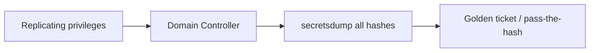
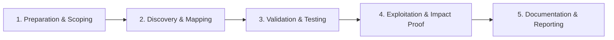

# DCSync

Replicate directory credentials from domain controllers.

## Overview Diagram

Visual summary of the **attack/data flow** and the **five-phase testing workflow** for this topic.

### Attack / Data Flow

### Testing Workflow

## How It Works

DCSync is a technique that abuses the **Directory Replication** protocol (MS-DRSR) to impersonate a Domain Controller and **replicate password hashes** from a real DC without running code on it. The attacker requests replication of user objects (including `unicodePwd` and `ntlmhash` attributes) as if they were a legitimate DC.

Required rights (any one suffices in practice):

- `Replicating Directory Changes`
- `Replicating Directory Changes All`
- Membership in **Domain Admins**, **Enterprise Admins**, or **Administrators** on the domain root object.

DCSync dumps **all domain password hashes**, enabling Golden Ticket creation, Pass-the-Hash across the domain, and offline cracking of every account. It is stealthier than running Mimikatz on a DC because it uses normal replication traffic.

## Exploitation

1. **Obtain replication rights** — Via prior escalation (ACL abuse granting `Replicating Directory Changes All`) or Domain Admin membership.
2. **Run DCSync** — `mimikatz # lsadump::dcsync /domain:corp.local /user:krbtgt` or `secretsdump.py domain/admin:pass@<DC> -just-dc`.
3. **Dump krbtgt hash** — Required for Golden Ticket forgery.
4. **Dump all users** — `secretsdump.py` outputs NTLM hashes for offline cracking or Pass-the-Hash.
5. **Avoid DC execution** — DCSync runs from any machine with rights; no need to compromise the DC itself.
6. **Golden Ticket** — Use krbtgt hash to forge TGTs for any user indefinitely (until krbtgt password is rotated twice).
7. **Handle evidence carefully** — Per engagement ROE; hashes are crown-jewel data.
8. **Report remediation** — Identify which ACL edge granted replication rights.

## Defense & Mitigation

- **Restrict replication rights** — Only Domain Controllers should hold `Replicating Directory Changes All`; audit ACLs on domain root.
- **Monitor Event ID 4662** — Operations with properties `1131f6aa-9c07-11d1-f79f-00c04fc2dcd2` (DS-Replication-Get-Changes-All) from non-DC sources.
- **Tier 0 isolation** — Limit Domain Admin membership; use JIT/JEA for admin tasks.
- **Rotate krbtgt twice** after compromise — Required to invalidate Golden Tickets.
- **Deploy Microsoft Defender for Identity** — Detects DCSync anomalies.
- **Use Protected Users** for admin accounts — Prevents NTLM and unconstrained delegation abuse.
- **Regular BloodHound ACL audits** — Find and remove unintended replication rights.

## Testing Methodology

Work through each phase in order. Every step has a checkbox — complete them all for thorough, reproducible coverage.

### Phase 1 — Preparation & Scoping

- [ ] Confirm target is in program scope and ROE allows this test type
- [ ] Set up isolated lab or proxy (Burp/ZAP) with scope filters
- [ ] Document baseline application behavior and account roles
- [ ] Identify test accounts for each privilege level
- [ ] Confirm Replicating Directory Changes rights or equivalent

### Phase 2 — Discovery & Mapping

- [ ] Identify accounts with DCSync privileges via BloodHound
- [ ] Verify replication rights: GetChanges + GetChangesAll
- [ ] Prepare secretsdump command and output handling
- [ ] Ensure legal authorization for credential dump

### Phase 3 — Validation & Testing

- [ ] Execute DCSync against single high-value account first
- [ ] Validate NT hashes obtained
- [ ] Test pass-the-hash with extracted creds
- [ ] Avoid full domain dump unless required

### Phase 4 — Exploitation & Impact Proof

- [ ] Demonstrate Golden Ticket or DA access from hash
- [ ] Securely store and destroy hash dumps after test
- [ ] Recommend tiered admin and protected users

### Phase 5 — Documentation & Reporting

- [ ] Write step-by-step reproduction with HTTP requests/responses
- [ ] Capture screenshots or video showing impact (redact sensitive data)
- [ ] Rate severity using program CVSS or impact matrix
- [ ] Provide concrete remediation guidance for developers
- [ ] Retest after fix if program allows verification

## Tools

| Tool | Usage |
|------|-------|
| `mimikatz` | [Credential extraction](../../TOOLS_GUIDE.md#mimikatz) |
| `impacket secretsdump` | [DCSync / credential dumping](../../TOOLS_GUIDE.md#impacket) |

## Verification Checklist

- [ ] Review scope and rules of engagement
- [ ] Document baseline behavior
- [ ] Test edge cases and parser differentials
- [ ] Capture proof-of-concept safely
- [ ] Write remediation guidance
