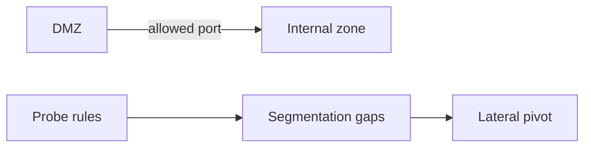
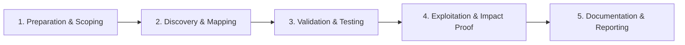

# Firewall & Segmentation

Validate network segmentation and firewall rule effectiveness.

## Overview Diagram

Visual summary of the **attack/data flow** and the **five-phase testing workflow** for this topic.

### Attack / Data Flow

### Testing Workflow

## How It Works

Firewall and network segmentation testing validates that **security zones** are properly isolated and that firewall rules enforce least-privilege access. Organizations define zones such as:

- **DMZ** — Public-facing web servers.
- **Internal/Corporate** — Workstations and general servers.
- **Restricted/PCI** — Payment systems, databases, domain controllers.
- **Management** — Jump hosts, backup systems, monitoring.

Testing maps **allowed paths** between zones by probing from compromised or test hosts in each segment. Common failures: overly permissive egress (`any:any` outbound), flat networks without VLANs, and "temporary" rules never removed.

## Exploitation

1. **Document zone map** — Obtain network diagram and rule sets from client (or infer from traceroute and ARP).
2. **Baseline from each zone** — Place test hosts in DMZ, corp, and guest VLANs.
3. **Probe cross-zone** — `nmap` and `hping3` to targets in other segments; record allowed ports.
4. **Test egress filtering** — Attempt outbound connections to internet, DNS tunneling, and C2 ports from internal hosts.
5. **Verify DMZ isolation** — From DMZ host, attempt direct access to database and DC subnets.
6. **Check dual-homed hosts** — Systems spanning zones become pivot points.
7. **Review rule sprawl** — Compare documented policy vs actual `iptables`/`pf`/Palo Alto configs.
8. **Report gaps** — Rank findings by data sensitivity of reachable assets.

## Defense & Mitigation

- **Default-deny** firewall policies between all zones.
- **Micro-segmentation** — Workload-level policies (NSX, Illumio) beyond VLANs.
- **Quarterly rule reviews** — Remove stale permits; document business justification.
- **Restrict egress** — Allow only required destinations; block direct internet from servers.
- **Separate management plane** — Admin access only via PAM/jump hosts.
- **Log and alert** — Deny-rule hits may indicate lateral movement attempts.
- **Validate with continuous testing** — Internal scanners that verify segmentation after every change.

## Pro Tips

Practical advice from real engagements — use these to test faster and report better.

!!! tip "Diagram vs reality"
    Probe every zone boundary — policies drift from documentation.

!!! tip "Dual-homed hosts"
    Jump boxes and backup servers often bridge segments unintentionally.

!!! tip "Management plane"
    iLO, IPMI, and hypervisor APIs frequently sit on flat networks.

!!! tip "hping3 for ACL map"
    Send SYN to one port at a time across zones to build allow matrix.

!!! tip "Business justification"
    Report each unexpected flow with risk — not just open port lists.

## Testing Methodology

Work through each phase in order. Every step has a checkbox — complete them all for thorough, reproducible coverage.

### Phase 1 — Preparation & Scoping

- [ ] Confirm target is in program scope and ROE allows this test type
- [ ] Set up isolated lab or proxy (Burp/ZAP) with scope filters
- [ ] Document baseline application behavior and account roles
- [ ] Identify test accounts for each privilege level
- [ ] Obtain network diagram and segmentation policy

### Phase 2 — Discovery & Mapping

- [ ] Probe allowed ports between zones with nmap/hping3
- [ ] Test default deny between DMZ and internal
- [ ] Identify overly permissive rules (any-any)
- [ ] Map paths from internet to crown jewels

### Phase 3 — Validation & Testing

- [ ] Validate bypass via dual-homed hosts
- [ ] Test management plane exposure
- [ ] Document each allowed flow with business justification
- [ ] Correlate with actual vs intended policy

### Phase 4 — Exploitation & Impact Proof

- [ ] Demonstrate segment crossing if gap found
- [ ] Recommend rule tightening and micro-segmentation
- [ ] Provide test cases for ongoing validation

### Phase 5 — Documentation & Reporting

- [ ] Write step-by-step reproduction with HTTP requests/responses
- [ ] Capture screenshots or video showing impact (redact sensitive data)
- [ ] Rate severity using program CVSS or impact matrix
- [ ] Provide concrete remediation guidance for developers
- [ ] Retest after fix if program allows verification

## Tools

| Tool | Usage |
|------|-------|
| `nmap` | [Network scanner](../../TOOLS_GUIDE.md#nmap) |
| `hping3` | [Firewall probing](https://github.com/antirez/hping) |
| `custom probes` | [ICMP/TCP probes to map firewall rules](../../TOOLS_GUIDE.md) |

## Verification Checklist

- [ ] Review scope and rules of engagement
- [ ] Document baseline behavior
- [ ] Test edge cases and parser differentials
- [ ] Capture proof-of-concept safely
- [ ] Write remediation guidance
