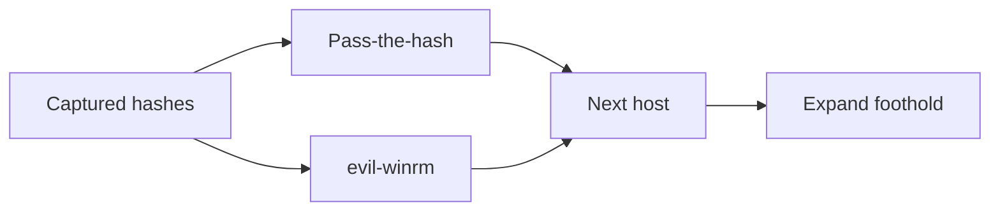
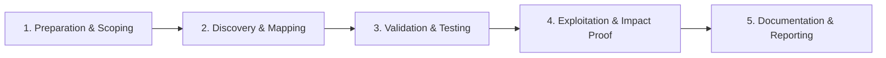

# Lateral Movement

Move through networks using harvested credentials and trust relationships.

## Overview Diagram

Visual summary of the **attack/data flow** and the **five-phase testing workflow** for this topic.

### Attack / Data Flow

### Testing Workflow

## How It Works

Lateral movement is the technique of **expanding access** from one compromised host to others within a network using harvested credentials, tokens, and trust relationships. Unlike privilege escalation (local root/admin), lateral movement operates **across systems**.

Common protocols and methods:

- **Pass-the-Hash (PtH)** — NTLM hash authentication without plaintext password.
- **Pass-the-Ticket (PtT)** — Reuse Kerberos TGT/TGS tickets.
- **SMB/WMI/WinRM** — Remote command execution with valid creds.
- **RDP** — Interactive desktop access.
- **SSH** — Key reuse and agent forwarding on Linux.
- **DCOM** — Remote instantiation of COM objects.

Domain environments amplify lateral movement: shared local admin passwords, excessive group memberships, and cached credentials on workstations.

## Exploitation

1. **Harvest credentials** — Mimikatz, LSASS dumps, Kerberoasting, and credential manager on foothold host.
2. **Identify targets** — BloodHound `HasSession`, `AdminTo`, and `CanRDP` edges.
3. **Spray or PtH** — `crackmapexec smb 10.0.0.0/24 -u admin -H <NTLM> --local-auth`.
4. **WinRM access** — `evil-winrm -i <host> -u user -p pass` for PowerShell remoting.
5. **PSExec/WMI** — `impacket-psexec` or `wmiexec.py` for semi-interactive shells.
6. **Pass-the-Ticket** — `mimikatz kerberos::ptt` with exported .kirbi files.
7. **SSH key reuse** — Copy `id_rsa` from `~/.ssh` to pivot to Linux servers.
8. **Maintain OPSEC** — Use `-session` logging; avoid noisy mass scans in production.

## Defense & Mitigation

- **Disable NTLM** where possible; enforce Kerberos with AES and EPA.
- **Enable SMB signing** and LDAP signing/channel binding.
- **LAPS and unique local admin passwords** — Block PtH across workstations.
- **Restrict WinRM/RDP** — Allow only from jump hosts/PAM solutions.
- **Credential Guard and Protected Users** — Limit hash/ticket extraction.
- **Network segmentation** — Firewall rules between VLANs; assume breach design.
- **Monitor** — Event 4624 type 3 (network logon), 4648 (explicit creds), and anomalous SMB/WinRM from workstations.

## Testing Methodology

Work through each phase in order. Every step has a checkbox — complete them all for thorough, reproducible coverage.

### Phase 1 — Preparation & Scoping

- [ ] Confirm target is in program scope and ROE allows this test type
- [ ] Set up isolated lab or proxy (Burp/ZAP) with scope filters
- [ ] Document baseline application behavior and account roles
- [ ] Identify test accounts for each privilege level
- [ ] Document initial foothold host and credentials

### Phase 2 — Discovery & Mapping

- [ ] Identify reachable hosts from current position
- [ ] Spray or pass captured hashes (within ROE)
- [ ] Map admin shares and WinRM/SSH access
- [ ] Use CrackMapExec for enum and exec

### Phase 3 — Validation & Testing

- [ ] Validate access to next target with evil-winrm or psexec
- [ ] Capture new credentials from memory (if authorized)
- [ ] Track attack path for reporting
- [ ] Respect scope boundaries per host

### Phase 4 — Exploitation & Impact Proof

- [ ] Demonstrate access to critical segment or server
- [ ] Stop at agreed objective (file server, DB, DC)
- [ ] Document each hop with tools and creds used

### Phase 5 — Documentation & Reporting

- [ ] Write step-by-step reproduction with HTTP requests/responses
- [ ] Capture screenshots or video showing impact (redact sensitive data)
- [ ] Rate severity using program CVSS or impact matrix
- [ ] Provide concrete remediation guidance for developers
- [ ] Retest after fix if program allows verification

## Tools

| Tool | Usage |
|------|-------|
| `crackmapexec` | [Network pentest swiss army knife](../../TOOLS_GUIDE.md#crackmapexec-netexec) |
| `evil-winrm` | [WinRM shell](https://github.com/Hackplayers/evil-winrm) |
| `impacket` | [Network protocol tools](../../TOOLS_GUIDE.md#impacket) |

## Verification Checklist

- [ ] Review scope and rules of engagement
- [ ] Document baseline behavior
- [ ] Test edge cases and parser differentials
- [ ] Capture proof-of-concept safely
- [ ] Write remediation guidance
