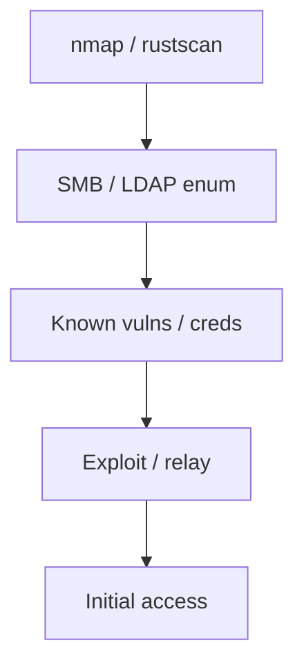
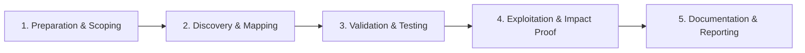

# Network Pentesting

Internal and external network penetration testing methodology.

## Overview Diagram

Visual summary of the **attack/data flow** and the **five-phase testing workflow** for this topic.

### Attack / Data Flow

### Testing Workflow

## How It Works

Network penetration testing simulates real-world attackers against **internal and external network infrastructure** within defined scope and rules of engagement (ROE). The methodology follows PTES (Penetration Testing Execution Standard) phases:

1. **Pre-engagement** — Scope subnets, critical assets, excluded systems, and emergency contacts.
2. **Intelligence gathering** — OSINT, DNS, and passive recon on external ranges.
3. **Threat modeling** — Identify high-value targets (DCs, databases, payment systems).
4. **Vulnerability analysis** — Port scans, vulnerability scans, and manual review.
5. **Exploitation** — Gain foothold, escalate, and pivot per ROE.
6. **Post-exploitation** — Demonstrate impact (data access, domain compromise).
7. **Reporting** — Risk-ranked findings with reproduction steps and remediation.

External tests start from the internet; internal tests simulate insider or breached-perimeter scenarios from a corporate VLAN or VPN.

## Exploitation

1. **External recon** — Map in-scope IPs/ASNs; `nmap`, `masscan`, and service enumeration on perimeter.
2. **Initial access** — Exploit vulnerable services (VPN, Exchange, Citrix), phishing, or credential stuffing.
3. **Internal enumeration** — `crackmapexec`, `enum4linux-ng`, LLMNR poisoning, and BloodHound collection.
4. **Vulnerability exploitation** — Target unpatched SMB, RDP, and web apps on internal hosts.
5. **Credential harvesting** — Mimikatz, LSASS dumps, Kerberoasting, and GPP passwords.
6. **Lateral movement** — Pass-the-Hash, WinRM, PsExec to reach critical segments.
7. **Objective completion** — Access domain admin, sensitive database, or crown jewel per scope.
8. **Maintain OPSEC** — Document all actions; avoid production outages and data exfiltration beyond proof.

## Defense & Mitigation

- **Defense in depth** — Perimeter firewalls, segmentation, EDR, and SIEM correlation.
- **Patch management** — Prioritize internet-facing and critical internal systems.
- **Network segmentation** — VLANs, micro-segmentation, and zero-trust policies limit lateral movement.
- **Credential hygiene** — MFA everywhere, LAPS, no shared admin passwords.
- **Regular pentests** — Annual external + internal; retest remediated findings.
- **Purple team exercises** — Validate detections against ATT&CK techniques.
- **Incident response readiness** — Playbooks for containment when pentest-like activity is detected.

## Pro Tips

Practical advice from real engagements — use these to test faster and report better.

!!! tip "Rules of engagement"
    Define stop conditions, excluded hosts, and emergency contact before scanning.

!!! tip "External then internal"
    Map internet-facing attack surface before assuming VPN access.

!!! tip "Default creds checklist"
    Tomcat/manager, Jenkins, Grafana, vCenter — test on every service.

!!! tip "Segmentation proof"
    Show which zone crossing matters — not just individual CVEs.

!!! tip "Journal everything"
    Timestamp each shell, cred, and host for clean reporting.

## Testing Methodology

Work through each phase in order. Every step has a checkbox — complete them all for thorough, reproducible coverage.

### Phase 1 — Preparation & Scoping

- [ ] Confirm target is in program scope and ROE allows this test type
- [ ] Set up isolated lab or proxy (Burp/ZAP) with scope filters
- [ ] Document baseline application behavior and account roles
- [ ] Identify test accounts for each privilege level
- [ ] Define internal vs external test boundaries and stop conditions

### Phase 2 — Discovery & Mapping

- [ ] External: port scan, service enum, vulnerability scan
- [ ] Internal: host discovery, SMB/LDAP enum
- [ ] Identify default credentials and patch gaps
- [ ] Map network segmentation and trust zones

### Phase 3 — Validation & Testing

- [ ] Exploit critical vulns for initial access
- [ ] Capture credentials via responder or phishing (if in scope)
- [ ] Validate findings with manual exploitation
- [ ] Maintain access journal for client

### Phase 4 — Exploitation & Impact Proof

- [ ] Demonstrate objective completion (DA, data access, segment crossing)
- [ ] Pivot through allowed segments only
- [ ] Avoid production disruption

### Phase 5 — Documentation & Reporting

- [ ] Write step-by-step reproduction with HTTP requests/responses
- [ ] Capture screenshots or video showing impact (redact sensitive data)
- [ ] Rate severity using program CVSS or impact matrix
- [ ] Provide concrete remediation guidance for developers
- [ ] Retest after fix if program allows verification
- [ ] Structure report by PTES phases with risk ratings

## Tools

| Tool | Usage |
|------|-------|
| `nmap` | [Network scanner](../../TOOLS_GUIDE.md#nmap) |
| `crackmapexec` | [Network pentest swiss army knife](../../TOOLS_GUIDE.md#crackmapexec-netexec) |
| `responder` | [LLMNR/NBT-NS poisoning](../../TOOLS_GUIDE.md#responder) |
| `enum4linux-ng` | [SMB/LDAP enumeration](https://github.com/cddmp/enum4linux-ng) |

## Resources

- [PTES](http://www.pentest-standard.org/)

## Verification Checklist

- [ ] Review scope and rules of engagement
- [ ] Document baseline behavior
- [ ] Test edge cases and parser differentials
- [ ] Capture proof-of-concept safely
- [ ] Write remediation guidance
