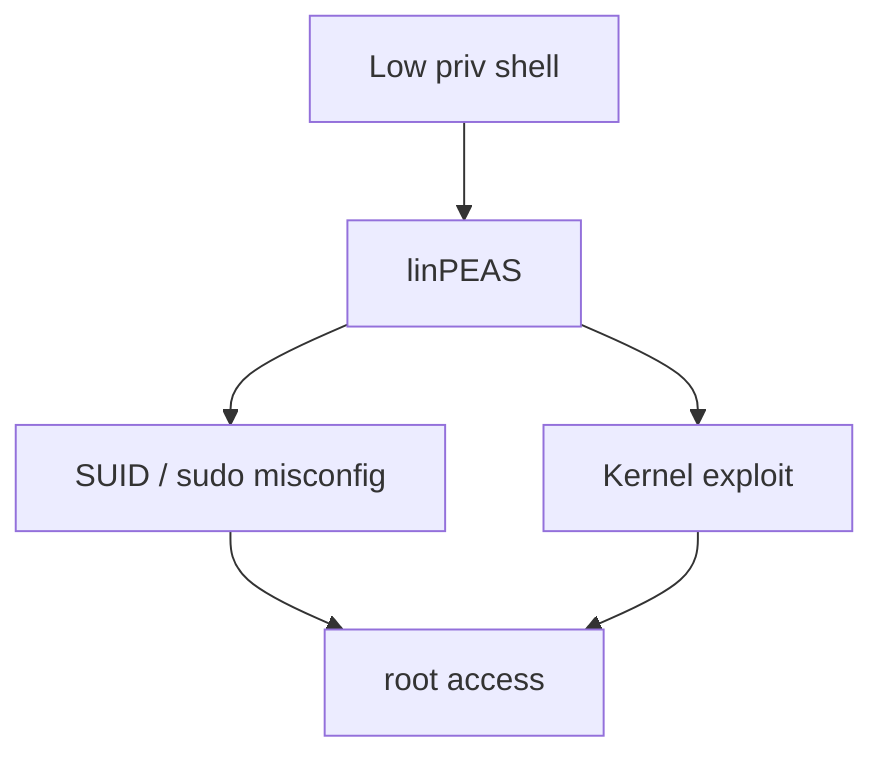
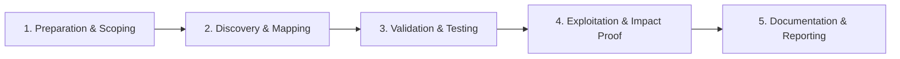

# Linux Privilege Escalation

Escalate privileges on Linux systems.

## Overview Diagram

Visual summary of the **attack/data flow** and the **five-phase testing workflow** for this topic.

### Attack / Data Flow

### Testing Workflow

## How It Works

Linux privilege escalation gains **root** from an unprivileged shell. Attack surface includes:

- **SUID/SGID binaries** — Programs running with elevated privileges (find, vim, custom apps with command injection).
- **Sudo misconfigurations** — `(ALL) NOPASSWD: ALL` or exploitable allowed commands (`sudo vim`, `sudo find`).
- **Cron jobs** — World-writable scripts executed as root.
- **Capabilities** — `cap_setuid` on binaries like `python3`.
- **Kernel exploits** — Dirty COW, PwnKit, OverlayFS when unpatched.
- **Container escapes** — Docker socket (`/var/run/docker.sock`), privileged containers, mounted host paths.
- **Secrets in files** — `.bash_history`, config files, SSH keys, `/etc/shadow` if readable.

`linpeas.sh` automates enumeration across these categories.

## Exploitation

1. **Run linpeas** — `curl -L linpeas.sh | sh` or upload and execute offline.
2. **Check sudo** — `sudo -l` for NOPASSWD entries; GTFOBins for exploit paths.
3. **Find SUID** — `find / -perm -4000 2>/dev/null`; cross-reference GTFOBins.
4. **Review cron** — `cat /etc/crontab`, `/etc/cron.d/`, user crontabs.
5. **Capabilities** — `getcap -r / 2>/dev/null`.
6. **Writable /etc/passwd** — Add root user with known password hash.
7. **Container escape** — If in Docker, check `docker.sock`, `--privileged`, host mounts; use `cdk` or `deepce`.
8. **Kernel exploit** — `uname -a` vs exploit-db; lab-only unless explicitly in scope.

## Defense & Mitigation

- **Minimize SUID binaries** — Remove unnecessary setuid; audit with `find / -perm -4000`.
- **Restrict sudo** — Explicit command lists; no NOPASSWD for shells or editors.
- **Secure cron** — Root-only writable cron directories; validate script permissions.
- **Patch kernels** — Automated unattended-upgrades; monitor CVE feeds.
- **Harden containers** — Non-root users, drop capabilities, read-only rootfs, no docker.sock mounts.
- **AppArmor/SELinux** — Enforce mandatory access controls.
- **Audit logging** — `auditd` rules for privilege changes and sudo usage.

## Pro Tips

Practical advice from real engagements — use these to test faster and report better.

!!! tip "sudo -l before exploits"
    `sudo -l` output often gives direct root without kernel bugs.

!!! tip "SUID GTFOBins"
    Match SUID binaries to gtfobins.github.io one-liners.

!!! tip "Capabilities"
    `getcap -r / 2>/dev/null` — cap_setuid on python = instant root.

!!! tip "Cron writable scripts"
    World-writable cron entries running as root are still everywhere.

!!! tip "Container on host?"
    Docker group membership equals root — check `id` and socket access.

## Testing Methodology

Work through each phase in order. Every step has a checkbox — complete them all for thorough, reproducible coverage.

### Phase 1 — Preparation & Scoping

- [ ] Confirm target is in program scope and ROE allows this test type
- [ ] Set up isolated lab or proxy (Burp/ZAP) with scope filters
- [ ] Document baseline application behavior and account roles
- [ ] Identify test accounts for each privilege level
- [ ] Obtain low-priv shell on Linux target

### Phase 2 — Discovery & Mapping

- [ ] Run linPEAS and linux-exploit-suggester
- [ ] Check sudo -l, SUID binaries, cron jobs, capabilities
- [ ] Review writable /etc/passwd and docker group
- [ ] Hunt SSH keys and credentials in configs

### Phase 3 — Validation & Testing

- [ ] Exploit SUID, sudo misconfig, or kernel CVE
- [ ] Validate root access with id and /root proof
- [ ] Check container breakout if on Docker host
- [ ] Document kernel version and exploit used

### Phase 4 — Exploitation & Impact Proof

- [ ] Capture minimal root proof
- [ ] Clean up added users or keys
- [ ] Recommend patching and sudo hardening

### Phase 5 — Documentation & Reporting

- [ ] Write step-by-step reproduction with HTTP requests/responses
- [ ] Capture screenshots or video showing impact (redact sensitive data)
- [ ] Rate severity using program CVSS or impact matrix
- [ ] Provide concrete remediation guidance for developers
- [ ] Retest after fix if program allows verification

## Tools

| Tool | Usage |
|------|-------|
| `linpeas` | [Linux privesc enumeration](../../TOOLS_GUIDE.md#linpeas) |
| `linux-exploit-suggester` | [Kernel exploit suggestions](https://github.com/mzet-/linux-exploit-suggester) |

## Resources

- [HackTricks Linux Privilege Escalation](https://book.hacktricks.xyz/linux-hardening/privilege-escalation)

## Verification Checklist

- [ ] Review scope and rules of engagement
- [ ] Document baseline behavior
- [ ] Test edge cases and parser differentials
- [ ] Capture proof-of-concept safely
- [ ] Write remediation guidance
