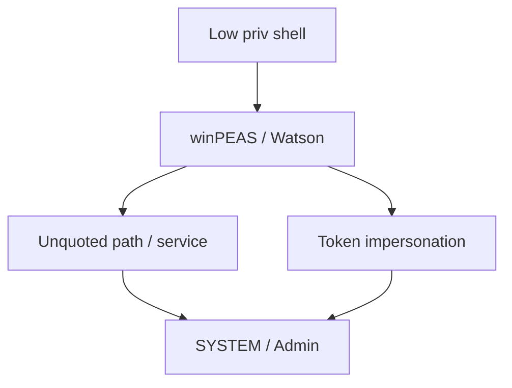
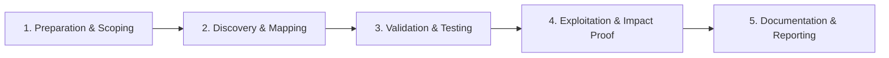

# Windows Privilege Escalation

Escalate privileges on Windows hosts.

## Overview Diagram

Visual summary of the **attack/data flow** and the **five-phase testing workflow** for this topic.

### Attack / Data Flow

### Testing Workflow

## How It Works

Windows privilege escalation elevates access from a **low-privilege user** to **LOCAL SYSTEM** or **Administrator** on a host. Common vectors:

- **Misconfigured services** — Unquoted service paths, weak service binary permissions, modifiable service DLLs.
- **Registry and scheduled tasks** — Writable `AutoRun` keys, tasks running as SYSTEM.
- **Token impersonation** — `SeImpersonatePrivilege` (PrintSpoofer, Juicy Potato) on service accounts.
- **Credential storage** — Saved RDP creds, WiFi passwords, browser vaults, DPAPI.
- **Kernel exploits** — Unpatched CVEs when patching is behind.
- **AlwaysInstallElevated** — MSI installs run as SYSTEM.

Post-exploitation enumeration (`winPEAS`, `PowerUp`) automates checking hundreds of misconfiguration patterns.

## Exploitation

1. **Enumerate** — `winPEAS.exe`, `seatbelt.exe system`, or manual `whoami /priv`.
2. **Check service misconfigs** — `accesschk.exe` on service binaries and unquoted paths (`wmic service get pathname`).
3. **Exploit SeImpersonate** — `PrintSpoofer.exe -i -c cmd` or `GodPotato` on Windows Server 2019+.
4. **Writable directories** — Replace DLLs in PATH or service folders.
5. **Scheduled tasks** — `schtasks` listing; modify scripts run as SYSTEM.
6. **Stored credentials** — `cmdkey /list`, `mimikatz vault::list`.
7. **Kernel exploits** — Last resort; `systeminfo` for patch level vs exploit-db.
8. **Document** — Capture `whoami` before/after; note exact misconfiguration.

## Defense & Mitigation

- **Apply CIS Windows benchmarks** — Harden service permissions, UAC, and PowerShell logging.
- **Quote all service paths** and set restrictive ACLs on service binaries.
- **Disable SeImpersonate** for service accounts that do not require it.
- **Patch aggressively** — Automate WSUS/Intune patching; prioritize critical CVEs.
- **Remove local admin rights** from standard users.
- **Enable Credential Guard** and LSA protection on supported Windows versions.
- **Deploy EDR** with tamper protection; alert on Mimikatz, Potato exploits, and suspicious service modifications.

## Pro Tips

Practical advice from real engagements — use these to test faster and report better.

!!! tip "winPEAS first pass"
    Automated output highlights SeImpersonate, unquoted paths, and AlwaysInstallElevated.

!!! tip "Potato family"
    SeImpersonatePrivilege → PrintSpoofer or GodPotato on modern builds.

!!! tip "Service permissions"
    `accesschk.exe -uwcqv *` on services — weak DACLs are common.

!!! tip "Saved creds hunt"
    `cmdkey /list` and registry blobs under `HKLM\SECURITY`.

!!! tip "Patch gap = quick win"
    Watson/CVE mapping on stale servers finds kernel exploits fast.

## Testing Methodology

Work through each phase in order. Every step has a checkbox — complete them all for thorough, reproducible coverage.

### Phase 1 — Preparation & Scoping

- [ ] Confirm target is in program scope and ROE allows this test type
- [ ] Set up isolated lab or proxy (Burp/ZAP) with scope filters
- [ ] Document baseline application behavior and account roles
- [ ] Identify test accounts for each privilege level
- [ ] Establish low-priv shell on Windows target

### Phase 2 — Discovery & Mapping

- [ ] Run winPEAS and Watson for missing patches
- [ ] Check service permissions, unquoted paths, AlwaysInstallElevated
- [ ] Review token privileges (SeImpersonate, SeBackup)
- [ ] Hunt saved credentials and registry secrets

### Phase 3 — Validation & Testing

- [ ] Exploit identified misconfiguration or CVE
- [ ] Test potato-family privesc on SeImpersonate
- [ ] Validate admin/SYSTEM access
- [ ] Document exact binary and path abused

### Phase 4 — Exploitation & Impact Proof

- [ ] Capture proof: whoami, hostname, admin groups
- [ ] Avoid installing persistent backdoors
- [ ] Recommend specific GPO and service hardening

### Phase 5 — Documentation & Reporting

- [ ] Write step-by-step reproduction with HTTP requests/responses
- [ ] Capture screenshots or video showing impact (redact sensitive data)
- [ ] Rate severity using program CVSS or impact matrix
- [ ] Provide concrete remediation guidance for developers
- [ ] Retest after fix if program allows verification

## Tools

| Tool | Usage |
|------|-------|
| `winpeas` | [Windows privesc enumeration](../../TOOLS_GUIDE.md#winpeas) |
| `powerup` | [Windows privesc checks](https://github.com/PowerShellMafia/PowerSploit) |
| `watson` | [Windows patch enumeration](https://github.com/rasta-mouse/Watson) |

## Resources

- [HackTricks Windows Local Privilege Escalation](https://book.hacktricks.xyz/windows-hardening/windows-local-privilege-escalation)

## Verification Checklist

- [ ] Review scope and rules of engagement
- [ ] Document baseline behavior
- [ ] Test edge cases and parser differentials
- [ ] Capture proof-of-concept safely
- [ ] Write remediation guidance
