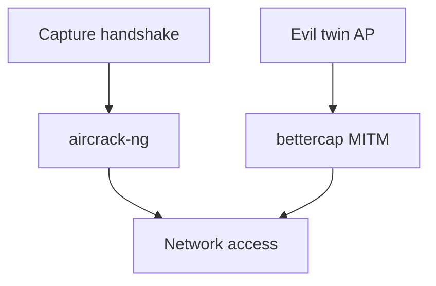
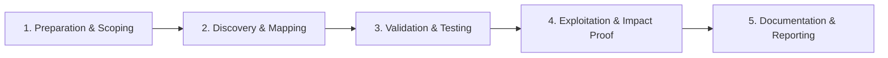

# Wireless Security

Assess Wi-Fi networks and rogue access point risks.

## Overview Diagram

Visual summary of the **attack/data flow** and the **five-phase testing workflow** for this topic.

### Attack / Data Flow

### Testing Workflow

## How It Works

Wireless security assessment evaluates **Wi-Fi networks** (802.11) for encryption weaknesses, authentication bypass, and segmentation failures. Networks operate in **managed mode** (clients connect to access points) or **ad hoc**.

Security modes:

- **Open** — No encryption; captive portals only.
- **WPA2-Personal (PSK)** — Pre-shared key; vulnerable to offline dictionary attack after 4-way handshake capture.
- **WPA2/WPA3-Enterprise (802.1X)** — Per-user certificates or credentials via RADIUS; misconfigs include weak EAP methods (LEAP, PEAP without cert validation).
- **WPA3** — SAE (Dragonfly) resists offline attacks; transition mode may downgrade.

Assessments also cover **rogue AP detection**, guest network isolation, and evil-twin resistance.

## Exploitation

1. **Survey with monitor mode** — `airmon-ng start wlan0`; `airodump-ng wlan0mon` to list SSIDs, channels, and clients.
2. **Capture handshake** — Deauth clients (`aireplay-ng -0`) to force reconnect and capture WPA2 4-way handshake.
3. **Crack PSK** — `aircrack-ng -w wordlist.txt capture.cap` or `hashcat -m 22000`.
4. **Test enterprise EAP** — `eaphammer` or `hostapd-wpe` for credential capture on rogue APs (authorized assessments only).
5. **Evil twin** — Clone corporate SSID; test if clients auto-connect without certificate pinning.
6. **Guest network isolation** — Connect to guest WiFi; attempt to reach internal RFC1918 ranges.
7. **WPS attacks** — `reaver` against WPS-enabled routers (if in scope).
8. **Document** — Signal strength, encryption type, and segmentation test results.

## Defense & Mitigation

- **Use WPA3 or WPA2-Enterprise** with certificate-based EAP-TLS.
- **Strong PSKs** — 20+ random characters if PSK is required; rotate periodically.
- **Disable WPS and legacy WEP/WPA**.
- **Isolate guest networks** — VLAN segmentation; no route to corporate subnets.
- **Deploy WIDS/WIPS** — Detect rogue APs and deauth attacks.
- **Certificate pinning for 802.1X** — Prevent evil-twin credential capture.
- **Monitor** — Alert on duplicate SSIDs and anomalous AP MAC addresses.

## Testing Methodology

Work through each phase in order. Every step has a checkbox — complete them all for thorough, reproducible coverage.

### Phase 1 — Preparation & Scoping

- [ ] Confirm target is in program scope and ROE allows this test type
- [ ] Set up isolated lab or proxy (Burp/ZAP) with scope filters
- [ ] Document baseline application behavior and account roles
- [ ] Identify test accounts for each privilege level
- [ ] Confirm wireless test authorization and physical location

### Phase 2 — Discovery & Mapping

- [ ] Passively scan SSIDs, encryption, and clients
- [ ] Identify WPA2-PSK, WPA3, or enterprise networks
- [ ] Capture handshake or PMKID for offline crack
- [ ] Test evil twin and captive portal scenarios

### Phase 3 — Validation & Testing

- [ ] Crack weak PSK with aircrack-ng wordlist
- [ ] Test WPA enterprise cert validation
- [ ] Attempt MITM with bettercap after association
- [ ] Validate client isolation bypass

### Phase 4 — Exploitation & Impact Proof

- [ ] Demonstrate network access from wireless compromise
- [ ] Document SSID, encryption, and crack time
- [ ] Recommend WPA3, strong PSK, and 802.1X

### Phase 5 — Documentation & Reporting

- [ ] Write step-by-step reproduction with HTTP requests/responses
- [ ] Capture screenshots or video showing impact (redact sensitive data)
- [ ] Rate severity using program CVSS or impact matrix
- [ ] Provide concrete remediation guidance for developers
- [ ] Retest after fix if program allows verification

## Tools

| Tool | Usage |
|------|-------|
| `aircrack-ng` | [Wi-Fi security auditing](https://www.aircrack-ng.org/) |
| `bettercap` | [Network attack & monitoring](https://github.com/bettercap/bettercap) |
| `kismet` | [Wireless network detector](https://www.kismetwireless.net/) |

## Verification Checklist

- [ ] Review scope and rules of engagement
- [ ] Document baseline behavior
- [ ] Test edge cases and parser differentials
- [ ] Capture proof-of-concept safely
- [ ] Write remediation guidance
