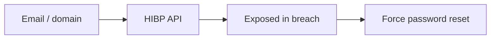
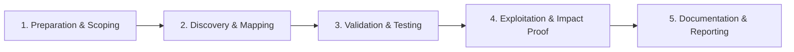

# Data Breach Search

Check for credential exposure in breach datasets.

## Overview Diagram

Visual summary of the **attack/data flow** and the **five-phase testing workflow** for this topic.

### Attack / Data Flow

### Testing Workflow

## How It Works

**Data breach datasets** aggregate credentials and PII from past compromises, sold or leaked on criminal forums and indexed by services like Have I Been Pwned. Security teams check whether employee or customer emails appear in breaches to drive password resets and MFA adoption.

Unauthorized use of breach data for account takeover violates computer fraud laws and bug bounty rules. Legitimate use is defensive: credential stuffing prevention and awareness.

## Exploitation

1. **Authorized services only**: HIBP API with k-anonymity, enterprise breach monitoring.
2. **Scope check**: verify testing corporate emails is permitted in engagement ROE.
3. **Validate passwords**: never log into user accounts with leaked creds outside lab.
4. **Report findings**: count of affected emails, breach sources, recommendation for MFA.
5. **Credential stuffing test**: in pentest, use known breach pairs only on client-owned test accounts with permission.
6. **Monitor dark web**: brand monitoring for new dumps mentioning the organization.

Researchers: do not publish raw breach data; reference breach name and date only.

## Defense & Mitigation

- Enforce **MFA** on all external-facing and admin authentication.
- Block password reuse via breach password list checks at registration and login.
- Subscribe to HIBP Domain Search or equivalent for employee credential monitoring.
- Force reset when breaches affect corporate identities.
- Detect credential stuffing with rate limits, CAPTCHA, and impossible travel signals.
- Never store passwords in reversible encryption; use strong hashing for any secrets.

## Testing Methodology

Work through each phase in order. Every step has a checkbox — complete them all for thorough, reproducible coverage.

### Phase 1 — Preparation & Scoping

- [ ] Confirm target is in program scope and ROE allows this test type
- [ ] Set up isolated lab or proxy (Burp/ZAP) with scope filters
- [ ] Document baseline application behavior and account roles
- [ ] Identify test accounts for each privilege level
- [ ] Confirm authorized defensive use only

### Phase 2 — Discovery & Mapping

- [ ] Query HIBP API for corporate domain emails
- [ ] Use authorized breach monitoring services
- [ ] Correlate exposed passwords with policy violations
- [ ] Never use data for unauthorized login attempts

### Phase 3 — Validation & Testing

- [ ] Notify affected users via security team
- [ ] Force password resets for exposed accounts
- [ ] Measure credential stuffing risk
- [ ] Document breach sources and dates

### Phase 4 — Exploitation & Impact Proof

- [ ] Recommend MFA and password manager adoption
- [ ] Monitor for ongoing exposure

### Phase 5 — Documentation & Reporting

- [ ] Write step-by-step reproduction with HTTP requests/responses
- [ ] Capture screenshots or video showing impact (redact sensitive data)
- [ ] Rate severity using program CVSS or impact matrix
- [ ] Provide concrete remediation guidance for developers
- [ ] Retest after fix if program allows verification

## Tools

| Tool | Usage |
|------|-------|
| `have i been pwned api` | Defensive credential exposure checks via [HIBP API](https://haveibeenpwned.com/API/v3) |
| `dehashed (authorized)` | [Authorized breach monitoring services only](../../TOOLS_GUIDE.md) |

## Verification Checklist

- [ ] Review scope and rules of engagement
- [ ] Document baseline behavior
- [ ] Test edge cases and parser differentials
- [ ] Capture proof-of-concept safely
- [ ] Write remediation guidance
