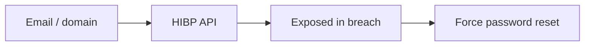

# Data Breach Search

Check for credential exposure in breach datasets.

## Overview Diagram

## How It Works

**Data breach datasets** aggregate credentials and PII from past compromises, sold or leaked on criminal forums and indexed by services like Have I Been Pwned. Security teams check whether employee or customer emails appear in breaches to drive password resets and MFA adoption.

Unauthorized use of breach data for account takeover violates computer fraud laws and bug bounty rules. Legitimate use is defensive: credential stuffing prevention and awareness.

## Exploitation

1. **Authorized services only**: HIBP API with k-anonymity, enterprise breach monitoring.
2. **Scope check**: verify testing corporate emails is permitted in engagement ROE.
3. **Validate passwords**: never log into user accounts with leaked creds outside lab.
4. **Report findings**: count of affected emails, breach sources, recommendation for MFA.
5. **Credential stuffing test**: in pentest, use known breach pairs only on client-owned test accounts with permission.
6. **Monitor dark web**: brand monitoring for new dumps mentioning the organization.

Researchers: do not publish raw breach data; reference breach name and date only.

## Defense & Mitigation

- Enforce **MFA** on all external-facing and admin authentication.
- Block password reuse via breach password list checks at registration and login.
- Subscribe to HIBP Domain Search or equivalent for employee credential monitoring.
- Force reset when breaches affect corporate identities.
- Detect credential stuffing with rate limits, CAPTCHA, and impossible travel signals.
- Never store passwords in reversible encryption; use strong hashing for any secrets.

## Methodology

- [ ] Use authorized breach search services
- [ ] Validate findings before reporting
- [ ] Recommend password resets and MFA
- [ ] Never exploit leaked credentials outside scope

## Tools

| Tool | Usage |
|------|-------|
| `have i been pwned api` | Defensive credential exposure checks via [HIBP API](https://haveibeenpwned.com/API/v3) |
| `dehashed (authorized)` | [Authorized breach monitoring services only](../../TOOLS_GUIDE.md) |

## Verification Checklist

- [ ] Review scope and rules of engagement
- [ ] Document baseline behavior
- [ ] Test edge cases and parser differentials
- [ ] Capture proof-of-concept safely
- [ ] Write remediation guidance
