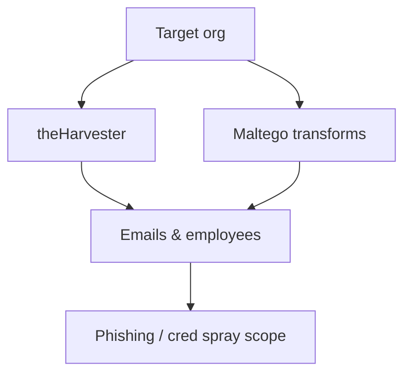
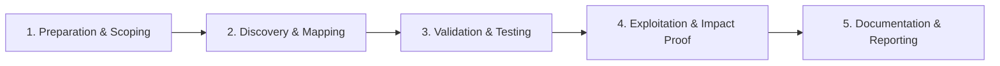

# People & Organization OSINT

Gather open-source intelligence on people and organizations.

## Overview Diagram

Visual summary of the **attack/data flow** and the **five-phase testing workflow** for this topic.

### Attack / Data Flow

### Testing Workflow

## How It Works

**OSINT** on people and organizations collects publicly available data—social profiles, job postings, press releases, WHOIS, certificate transparency, GitHub commits, and government filings—to map structure, technology stack, and personnel without touching target systems directly.

Attackers use OSINT for spear-phishing target selection, password guessing (company mascot + year), and identifying forgotten subdomains. Researchers must respect privacy laws (GDPR, CFAA boundaries) and program rules.

## Exploitation

1. **Organization mapping**: LinkedIn employees, job ads listing tech stack, Crunchbase.
2. **Email format**: discover `first.last@` patterns from press releases or Hunter.io.
3. **Infrastructure**: reverse WHOIS, crt.sh for cert names, Shodan for org netblocks.
4. **Code leaks**: GitHub search for `org:target password`, Pastebin monitoring.
5. **Social graphs**: Maltego transforms linking domains, people, and email addresses.
6. **Document sources**: maintain citation list for report defensibility.

Stay within legal boundaries and program scope; OSINT on individuals may be restricted.

## Defense & Mitigation

- **Minimize public exposure**: review what job posts and social media reveal.
- Enforce **GitHub secret scanning** and DLP on code repositories.
- Register defensive domains for common typosquats.
- Train employees on social media and LinkedIn information sharing policies.
- Monitor certificate transparency and new subdomain registrations for impersonation.
- Conduct periodic OSINT self-assessments to see attacker-visible attack surface.

## Testing Methodology

Work through each phase in order. Every step has a checkbox — complete them all for thorough, reproducible coverage.

### Phase 1 — Preparation & Scoping

- [ ] Confirm target is in program scope and ROE allows this test type
- [ ] Set up isolated lab or proxy (Burp/ZAP) with scope filters
- [ ] Document baseline application behavior and account roles
- [ ] Identify test accounts for each privilege level
- [ ] Define OSINT scope and privacy/legal boundaries

### Phase 2 — Discovery & Mapping

- [ ] Run theHarvester for emails and subdomains
- [ ] Use Maltego for relationship mapping
- [ ] Search LinkedIn and public records
- [ ] Collect breach data via HIBP (defensive use)

### Phase 3 — Validation & Testing

- [ ] Verify data accuracy across sources
- [ ] Build org chart and email format
- [ ] Identify key personnel for phishing sim (authorized)
- [ ] Document sources and collection dates

### Phase 4 — Exploitation & Impact Proof

- [ ] Deliver intel report for red team or defense
- [ ] Do not harass or dox individuals

### Phase 5 — Documentation & Reporting

- [ ] Write step-by-step reproduction with HTTP requests/responses
- [ ] Capture screenshots or video showing impact (redact sensitive data)
- [ ] Rate severity using program CVSS or impact matrix
- [ ] Provide concrete remediation guidance for developers
- [ ] Retest after fix if program allows verification

## Tools

| Tool | Usage |
|------|-------|
| `maltego` | [Link analysis & OSINT](https://www.maltego.com/) |
| `theharvester` | [Email & subdomain OSINT](https://github.com/laramies/theHarvester) |
| `recon-ng` | [OSINT framework](../../TOOLS_GUIDE.md#recon-ng) |

## Resources

- [OSINT Framework](https://osintframework.com/)

## Verification Checklist

- [ ] Review scope and rules of engagement
- [ ] Document baseline behavior
- [ ] Test edge cases and parser differentials
- [ ] Capture proof-of-concept safely
- [ ] Write remediation guidance
