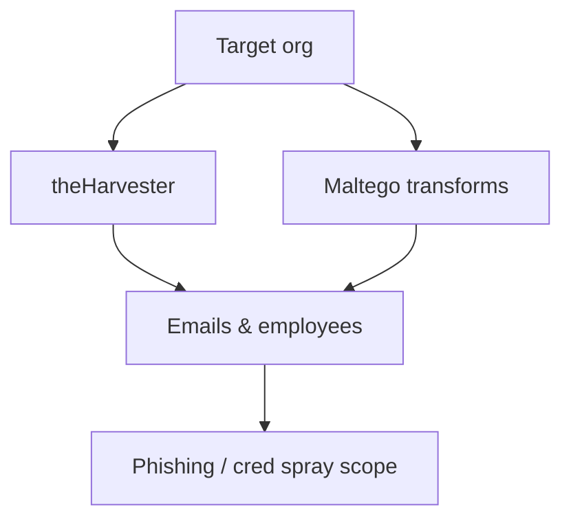

# People & Organization OSINT

Gather open-source intelligence on people and organizations.

## Overview Diagram

## How It Works

**OSINT** on people and organizations collects publicly available data—social profiles, job postings, press releases, WHOIS, certificate transparency, GitHub commits, and government filings—to map structure, technology stack, and personnel without touching target systems directly.

Attackers use OSINT for spear-phishing target selection, password guessing (company mascot + year), and identifying forgotten subdomains. Researchers must respect privacy laws (GDPR, CFAA boundaries) and program rules.

## Exploitation

1. **Organization mapping**: LinkedIn employees, job ads listing tech stack, Crunchbase.
2. **Email format**: discover `first.last@` patterns from press releases or Hunter.io.
3. **Infrastructure**: reverse WHOIS, crt.sh for cert names, Shodan for org netblocks.
4. **Code leaks**: GitHub search for `org:target password`, Pastebin monitoring.
5. **Social graphs**: Maltego transforms linking domains, people, and email addresses.
6. **Document sources**: maintain citation list for report defensibility.

Stay within legal boundaries and program scope; OSINT on individuals may be restricted.

## Defense & Mitigation

- **Minimize public exposure**: review what job posts and social media reveal.
- Enforce **GitHub secret scanning** and DLP on code repositories.
- Register defensive domains for common typosquats.
- Train employees on social media and LinkedIn information sharing policies.
- Monitor certificate transparency and new subdomain registrations for impersonation.
- Conduct periodic OSINT self-assessments to see attacker-visible attack surface.

## Methodology

- [ ] Search social profiles and job postings
- [ ] Review breach data responsibly
- [ ] Map corporate infrastructure from public records
- [ ] Document sources and legal boundaries

## Tools

| Tool | Usage |
|------|-------|
| `maltego` | [Link analysis & OSINT](https://www.maltego.com/) |
| `theharvester` | [Email & subdomain OSINT](https://github.com/laramies/theHarvester) |
| `recon-ng` | [OSINT framework](../../TOOLS_GUIDE.md#recon-ng) |

## Resources

- [OSINT Framework](https://osintframework.com/)

## Verification Checklist

- [ ] Review scope and rules of engagement
- [ ] Document baseline behavior
- [ ] Test edge cases and parser differentials
- [ ] Capture proof-of-concept safely
- [ ] Write remediation guidance
