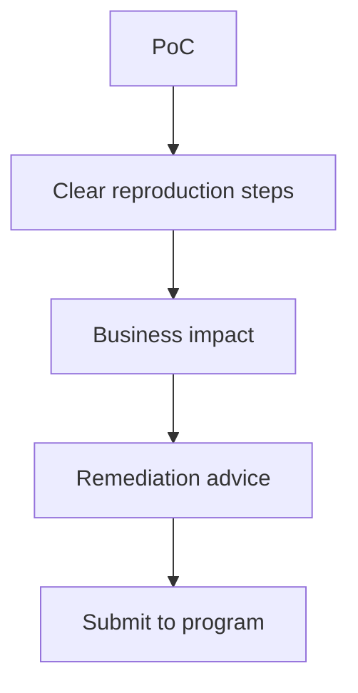
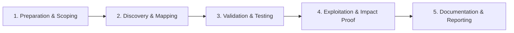

# Vulnerability Reporting

Write clear, actionable security reports for bug bounty and pentest engagements.

## Overview Diagram

Visual summary of the **attack/data flow** and the **five-phase testing workflow** for this topic.

### Attack / Data Flow

### Testing Workflow

## How It Works

A **vulnerability report** translates a technical finding into actionable intelligence for developers and risk owners. Effective reports include impact, reproduction steps, evidence, and remediation—structured so triagers can validate quickly and engineers can fix without guesswork.

Bug bounty triagers process hundreds of submissions; vague reports get closed as N/A or informative. Pentest deliverables add executive summaries mapping findings to business risk and compliance frameworks (PCI, SOC 2).

## Exploitation

1. **Title**: concise impact statement (e.g., "IDOR exposes all user invoices").
2. **Severity**: use program matrix or CVSS 3.1 with vector string justification.
3. **Steps to reproduce**: numbered, minimal, with exact URLs, headers, and bodies.
4. **Proof of concept**: screenshots, HTTP requests (Burp export), or short video.
5. **Impact**: what an attacker gains—data types, account types, regulatory exposure.
6. **Remediation**: specific fix (parameterized queries, authz check on resource ID).
7. **References**: CWE, OWASP, prior similar reports if helpful.

Redact PII and production credentials; use test accounts created for the engagement.

## Defense & Mitigation

- Establish **internal report templates** for consistent triage and metrics.
- Train developers on reading PoCs and reproducing in staging.
- Set SLA targets for acknowledgment and resolution by severity.
- Use structured intake (HackerOne, Jira security) with required fields.
- Feed confirmed bugs into regression tests and threat models.
- Publish safe disclosure timelines and thank researchers who report in good faith.

## Testing Methodology

Work through each phase in order. Every step has a checkbox — complete them all for thorough, reproducible coverage.

### Phase 1 — Preparation & Scoping

- [ ] Confirm target is in program scope and ROE allows this test type
- [ ] Set up isolated lab or proxy (Burp/ZAP) with scope filters
- [ ] Document baseline application behavior and account roles
- [ ] Identify test accounts for each privilege level
- [ ] Confirm program template and severity rubric

### Phase 2 — Discovery & Mapping

- [ ] Write executive summary (1–2 sentences)
- [ ] Detail reproduction steps numbered exactly
- [ ] Include HTTP requests, screenshots, and video
- [ ] State impact in business terms

### Phase 3 — Validation & Testing

- [ ] Assign CVSS or program severity with justification
- [ ] Suggest specific remediation steps
- [ ] Proofread for clarity and redact secrets
- [ ] Submit via platform and monitor triage

### Phase 4 — Exploitation & Impact Proof

- [ ] Respond to analyst questions promptly
- [ ] Verify fix when marked resolved
- [ ] Request disclosure timeline if publishing

### Phase 5 — Documentation & Reporting

- [ ] Write step-by-step reproduction with HTTP requests/responses
- [ ] Capture screenshots or video showing impact (redact sensitive data)
- [ ] Rate severity using program CVSS or impact matrix
- [ ] Provide concrete remediation guidance for developers
- [ ] Retest after fix if program allows verification

## Tools

| Tool | Usage |
|------|-------|
| `burp` | [Intercept, repeater & scanner](../../TOOLS_GUIDE.md#burp-suite) |
| `markdown` | [Write reports in Markdown for GitHub/HackerOne](../../TOOLS_GUIDE.md) |
| `cvss calculator` | Score severity with [FIRST CVSS calculator](https://www.first.org/cvscalc/) |

## Resources

- [HackerOne Disclosure Guidelines](https://www.hackerone.com/disclosure-guidelines)

## Verification Checklist

- [ ] Review scope and rules of engagement
- [ ] Document baseline behavior
- [ ] Test edge cases and parser differentials
- [ ] Capture proof-of-concept safely
- [ ] Write remediation guidance
