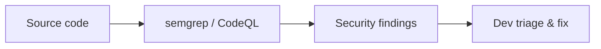

# SAST & Manual Code Review

Combine static analysis with manual review for vulnerability discovery.

## Overview Diagram

## How It Works

**SAST** (Static Application Security Testing) analyzes source or bytecode without execution to find patterns matching vulnerabilities—SQL injection sinks, XSS, hardcoded secrets, weak crypto. Tools include Semgrep, CodeQL, SonarQube, and language-specific analyzers.

SAST produces high false-positive rates; **manual code review** traces data flow from sources (HTTP params) to sinks (SQL queries, shell exec) and validates authorization on every sensitive operation.

## Exploitation

1. **Run SAST in CI**: Semgrep with OWASP rulesets, CodeQL `security-extended`.
2. **Triage**: prioritize findings in auth, payment, admin, and file upload modules.
3. **Data flow**: manually trace untrusted input to dangerous functions.
4. **Authz review**: for each endpoint, verify object-level checks on IDs from user input.
5. **Business logic**: race conditions, state machine bypasses SAST cannot see.
6. **Confirm**: dynamic test (Burp) on suspected lines to validate exploitability.

Integrate SARIF output into PR comments for developer-friendly remediation.

## Defense & Mitigation

- **Shift-left**: mandatory SAST on every PR with blocking rules for critical patterns.
- Customize rules for framework-specific pitfalls (Django ORM, Spring Security).
- Pair SAST with **DAST** and dependency scanning for defense in depth.
- Security champions review high-risk modules quarterly.
- Track mean time to remediate SAST findings by severity.
- Follow OWASP Code Review Guide checklists for manual coverage gaps.

## Methodology

- [ ] Run SAST tools on repositories
- [ ] Triage false positives manually
- [ ] Trace data flow for high-risk sinks
- [ ] Review authz checks on sensitive operations

## Tools

| Tool | Usage |
|------|-------|
| `semgrep` | [Static analysis (SAST)](../../TOOLS_GUIDE.md#semgrep) |
| `codeql` | [Semantic code analysis](../../TOOLS_GUIDE.md#codeql) |
| `sonarqube` | [Code quality & security](../../TOOLS_GUIDE.md#sonarqube) |

## Resources

- [OWASP Code Review Guide](https://owasp.org/www-project-code-review-guide/)

## Verification Checklist

- [ ] Review scope and rules of engagement
- [ ] Document baseline behavior
- [ ] Test edge cases and parser differentials
- [ ] Capture proof-of-concept safely
- [ ] Write remediation guidance
