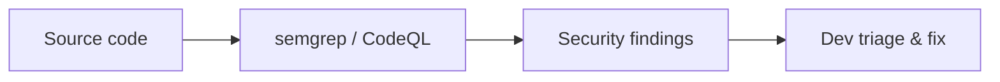
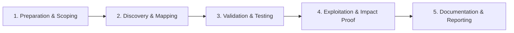

# SAST & Manual Code Review

Combine static analysis with manual review for vulnerability discovery.

## Overview Diagram

Visual summary of the **attack/data flow** and the **five-phase testing workflow** for this topic.

### Attack / Data Flow

### Testing Workflow

## How It Works

**SAST** (Static Application Security Testing) analyzes source or bytecode without execution to find patterns matching vulnerabilities—SQL injection sinks, XSS, hardcoded secrets, weak crypto. Tools include Semgrep, CodeQL, SonarQube, and language-specific analyzers.

SAST produces high false-positive rates; **manual code review** traces data flow from sources (HTTP params) to sinks (SQL queries, shell exec) and validates authorization on every sensitive operation.

## Exploitation

1. **Run SAST in CI**: Semgrep with OWASP rulesets, CodeQL `security-extended`.
2. **Triage**: prioritize findings in auth, payment, admin, and file upload modules.
3. **Data flow**: manually trace untrusted input to dangerous functions.
4. **Authz review**: for each endpoint, verify object-level checks on IDs from user input.
5. **Business logic**: race conditions, state machine bypasses SAST cannot see.
6. **Confirm**: dynamic test (Burp) on suspected lines to validate exploitability.

Integrate SARIF output into PR comments for developer-friendly remediation.

## Defense & Mitigation

- **Shift-left**: mandatory SAST on every PR with blocking rules for critical patterns.
- Customize rules for framework-specific pitfalls (Django ORM, Spring Security).
- Pair SAST with **DAST** and dependency scanning for defense in depth.
- Security champions review high-risk modules quarterly.
- Track mean time to remediate SAST findings by severity.
- Follow OWASP Code Review Guide checklists for manual coverage gaps.

## Pro Tips

Practical advice from real engagements — use these to test faster and report better.

!!! tip "semgrep auto rules"
    `semgrep --config p/owasp-top-ten` on every PR.

!!! tip "Triage by reachability"
    Sink without source path = likely false positive.

!!! tip "Auth hotspots"
    grep `isAdmin`, `role`, `permission` — manual review there.

!!! tip "CodeQL path queries"
    Data flow from `getParameter` to SQL execution.

!!! tip "File:line in ticket"
    Developers fix faster with exact location and fix snippet.

## Testing Methodology

Work through each phase in order. Every step has a checkbox — complete them all for thorough, reproducible coverage.

### Phase 1 — Preparation & Scoping

- [ ] Confirm target is in program scope and ROE allows this test type
- [ ] Set up isolated lab or proxy (Burp/ZAP) with scope filters
- [ ] Document baseline application behavior and account roles
- [ ] Identify test accounts for each privilege level
- [ ] Define codebase scope and languages

### Phase 2 — Discovery & Mapping

- [ ] Run semgrep and CodeQL with security rulesets
- [ ] Triage findings by reachability and severity
- [ ] Manual review of auth, crypto, and injection hotspots
- [ ] Trace data flow from source to sink

### Phase 3 — Validation & Testing

- [ ] Confirm true positives with PoC or debugger
- [ ] Eliminate false positives with dev team
- [ ] Prioritize fixes by exploitability
- [ ] Integrate SAST into CI pipeline

### Phase 4 — Exploitation & Impact Proof

- [ ] Deliver findings with file:line references
- [ ] Recommend secure coding guidelines per issue

### Phase 5 — Documentation & Reporting

- [ ] Write step-by-step reproduction with HTTP requests/responses
- [ ] Capture screenshots or video showing impact (redact sensitive data)
- [ ] Rate severity using program CVSS or impact matrix
- [ ] Provide concrete remediation guidance for developers
- [ ] Retest after fix if program allows verification

## Tools

| Tool | Usage |
|------|-------|
| `semgrep` | [Static analysis (SAST)](../../TOOLS_GUIDE.md#semgrep) |
| `codeql` | [Semantic code analysis](../../TOOLS_GUIDE.md#codeql) |
| `sonarqube` | [Code quality & security](../../TOOLS_GUIDE.md#sonarqube) |

## Resources

- [OWASP Code Review Guide](https://owasp.org/www-project-code-review-guide/)

## Verification Checklist

- [ ] Review scope and rules of engagement
- [ ] Document baseline behavior
- [ ] Test edge cases and parser differentials
- [ ] Capture proof-of-concept safely
- [ ] Write remediation guidance
