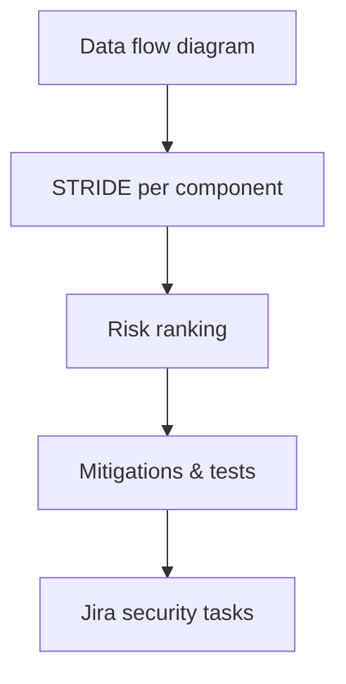

# Threat Modeling

Identify threats using structured modeling approaches.

## Overview Diagram

## How It Works

**Threat modeling** systematically identifies threats to a system using structured approaches—**STRIDE** (Spoofing, Tampering, Repudiation, Information Disclosure, Denial of Service, Elevation of Privilege), **PASTA**, or **Attack Trees**.

Practitioners diagram **data flow diagrams** with trust boundaries, enumerate threats per component, rank risk, and define mitigations and test cases. Threat models should update when architecture changes—not a one-time paperwork exercise.

## Exploitation

1. **Scope the system**: define assets, actors, entry points, and dependencies.
2. **Draw DFD**: processes, data stores, external entities, trust boundaries.
3. **Apply STRIDE**: per element, ask what spoofing/tampering/etc. is possible.
4. **Prioritize**: likelihood × impact; focus pentest on highest-ranked threats.
5. **Derive test cases**: each threat maps to security requirements and validation steps.
6. **Tools**: OWASP Threat Dragon, Microsoft Threat Modeling Tool for structured output.

Use threat models to guide bug bounty scope and internal red team objectives.

## Defense & Mitigation

- Integrate threat modeling into **design reviews** before major features ship.
- Store models in version control; diff on architecture changes.
- Link threats to **Jira security tasks** and verification tests in CI.
- Train developers on STRIDE with hands-on workshops on their actual services.
- Revisit models after incidents and pen test findings.
- Align mitigations with OWASP ASVS levels appropriate to application risk tier.

## Methodology

- [ ] Diagram data flows and trust boundaries
- [ ] Apply STRIDE per component
- [ ] Prioritize threats by risk
- [ ] Define mitigations and test cases

## Tools

| Tool | Usage |
|------|-------|
| `draw.io` | [Data-flow & architecture diagrams](../../TOOLS_GUIDE.md#drawio) |
| `microsoft threat modeling tool` | [STRIDE threat modeling (Windows)](../../TOOLS_GUIDE.md#microsoft-threat-modeling-tool) |
| `owasp threat dragon` | [OWASP threat modeling](../../TOOLS_GUIDE.md#owasp-threat-dragon) |

## Resources

- [OWASP Threat Modeling](https://owasp.org/www-community/Threat_Modeling)

## Verification Checklist

- [ ] Review scope and rules of engagement
- [ ] Document baseline behavior
- [ ] Test edge cases and parser differentials
- [ ] Capture proof-of-concept safely
- [ ] Write remediation guidance
