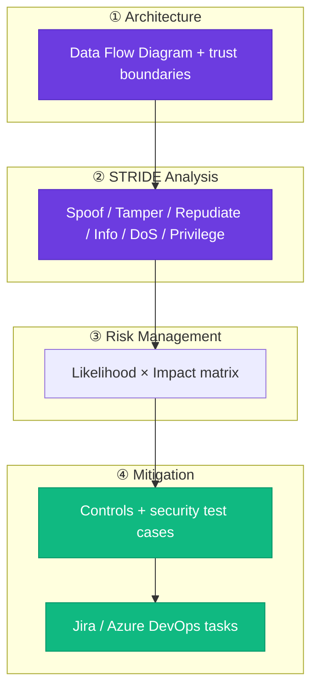
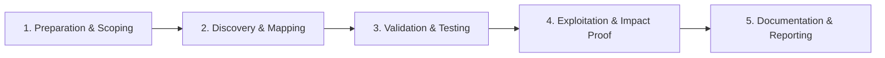

# Threat Modeling

Identify threats using structured modeling approaches.

## Overview Diagram

Visual summary of the **attack/data flow** and the **five-phase testing workflow** for this topic.

### Attack / Data Flow

### Testing Workflow

## How It Works

**Threat modeling** systematically identifies threats to a system using structured approaches—**STRIDE** (Spoofing, Tampering, Repudiation, Information Disclosure, Denial of Service, Elevation of Privilege), **PASTA**, or **Attack Trees**.

Practitioners diagram **data flow diagrams** with trust boundaries, enumerate threats per component, rank risk, and define mitigations and test cases. Threat models should update when architecture changes—not a one-time paperwork exercise.

## Exploitation

1. **Scope the system**: define assets, actors, entry points, and dependencies.
2. **Draw DFD**: processes, data stores, external entities, trust boundaries.
3. **Apply STRIDE**: per element, ask what spoofing/tampering/etc. is possible.
4. **Prioritize**: likelihood × impact; focus pentest on highest-ranked threats.
5. **Derive test cases**: each threat maps to security requirements and validation steps.
6. **Tools**: OWASP Threat Dragon, Microsoft Threat Modeling Tool for structured output.

Use threat models to guide bug bounty scope and internal red team objectives.

## Defense & Mitigation

- Integrate threat modeling into **design reviews** before major features ship.
- Store models in version control; diff on architecture changes.
- Link threats to **Jira security tasks** and verification tests in CI.
- Train developers on STRIDE with hands-on workshops on their actual services.
- Revisit models after incidents and pen test findings.
- Align mitigations with OWASP ASVS levels appropriate to application risk tier.

## Pro Tips

Practical advice from real engagements — use these to test faster and report better.

!!! tip "Data flow diagram"
    Draw trust boundaries before STRIDE — boxes and arrows first.

!!! tip "STRIDE per element"
    One worksheet row per component — don't batch threats.

!!! tip "Store in git"
    Threat model YAML/MD versioned with architecture changes.

!!! tip "Test cases from threats"
    Each high threat becomes a security test case in QA.

!!! tip "OWASP Threat Dragon"
    Free tool exports models shareable with dev teams.

## Testing Methodology

Work through each phase in order. Every step has a checkbox — complete them all for thorough, reproducible coverage.

### Phase 1 — Preparation & Scoping

- [ ] Confirm target is in program scope and ROE allows this test type
- [ ] Set up isolated lab or proxy (Burp/ZAP) with scope filters
- [ ] Document baseline application behavior and account roles
- [ ] Identify test accounts for each privilege level
- [ ] Gather architecture docs and data classification

### Phase 2 — Discovery & Mapping

- [ ] Draw data flow diagram with trust boundaries
- [ ] Apply STRIDE to each component
- [ ] Rank threats by likelihood × impact
- [ ] Map mitigations to OWASP ASVS controls

### Phase 3 — Validation & Testing

- [ ] Create security test cases per threat
- [ ] Review with dev and product teams
- [ ] Store model in version control
- [ ] Schedule update on architecture changes

### Phase 4 — Exploitation & Impact Proof

- [ ] Track mitigation tasks in Jira/Azure DevOps
- [ ] Verify mitigations in pen test or code review

### Phase 5 — Documentation & Reporting

- [ ] Write step-by-step reproduction with HTTP requests/responses
- [ ] Capture screenshots or video showing impact (redact sensitive data)
- [ ] Rate severity using program CVSS or impact matrix
- [ ] Provide concrete remediation guidance for developers
- [ ] Retest after fix if program allows verification

## Tools

| Tool | Usage |
|------|-------|
| `draw.io` | [Data-flow & architecture diagrams](../../TOOLS_GUIDE.md#drawio) |
| `microsoft threat modeling tool` | [STRIDE threat modeling (Windows)](../../TOOLS_GUIDE.md#microsoft-threat-modeling-tool) |
| `owasp threat dragon` | [OWASP threat modeling](../../TOOLS_GUIDE.md#owasp-threat-dragon) |

## Resources

- [OWASP Threat Modeling](https://owasp.org/www-community/Threat_Modeling)

## Verification Checklist

- [ ] Review scope and rules of engagement
- [ ] Document baseline behavior
- [ ] Test edge cases and parser differentials
- [ ] Capture proof-of-concept safely
- [ ] Write remediation guidance
