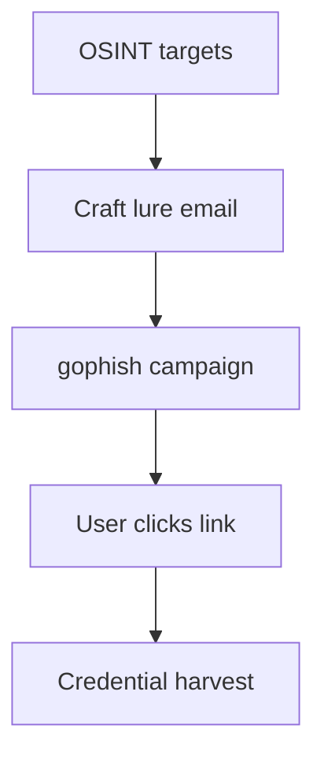
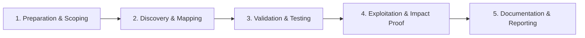

# Phishing Assessments

Authorized phishing simulations for security awareness.

## Overview Diagram

Visual summary of the **attack/data flow** and the **five-phase testing workflow** for this topic.

### Attack / Data Flow

### Testing Workflow

## How It Works

**Phishing** deceives users into clicking malicious links, opening attachments, or entering credentials on fake sites. **Authorized phishing assessments** simulate these attacks to measure awareness and technical controls (email filtering, link protection).

Campaigns use cloned login pages, OAuth consent phishing, QR codes, and thread hijacking. Success rates inform training priorities; unauthorized phishing is illegal and harmful.

## Exploitation

1. **Written authorization** specifying targets, timing, and forbidden tactics.
2. **Platform setup**: Gophish or King Phisher with tracking on controlled infrastructure.
3. **Template design**: realistic but safe—no malware attachments unless explicitly scoped.
4. **Landing page**: clone internal portal; capture metrics only, not real passwords (or use unique tokens per user).
5. **Measure**: open rate, click rate, submission rate, report-to-security rate.
6. **Debrief**: immediate training for clickers; positive reinforcement for reporters.

Coordinate with IT to whitelist test infrastructure and avoid help desk overload.

## Defense & Mitigation

- Deploy **email authentication** (DMARC p=reject), anti-phishing gateways, and URL rewriting.
- Enable **FIDO2/WebAuthn**; phishing-resistant MFA stops credential theft.
- Run regular simulations with improving metrics over time.
- Easy **report phish** button integrated with SOC workflows.
- Browser isolation for risky links; block newly registered domains at egress.
- Executive protection program for high-value targets (spear-phish monitoring).

## Pro Tips

Practical advice from real engagements — use these to test faster and report better.

!!! tip "gophish metrics"
    Click rate and submit rate — not individual shaming.

!!! tip "Legal sign-off"
    Written approval naming date range and target groups.

!!! tip "Realistic not cruel"
    Urgent payroll lure works — fake termination does harm.

!!! tip "Landing on isolated domain"
    Use lookalike you control — not real login page clone on prod.

!!! tip "Delete captured creds"
    Test passwords destroyed after debrief.

## Testing Methodology

Work through each phase in order. Every step has a checkbox — complete them all for thorough, reproducible coverage.

### Phase 1 — Preparation & Scoping

- [ ] Confirm target is in program scope and ROE allows this test type
- [ ] Set up isolated lab or proxy (Burp/ZAP) with scope filters
- [ ] Document baseline application behavior and account roles
- [ ] Identify test accounts for each privilege level
- [ ] Obtain written phishing simulation authorization

### Phase 2 — Discovery & Mapping

- [ ] Define targets, timing, and forbidden pretexts
- [ ] Build realistic lure and landing page
- [ ] Configure gophish campaign and tracking
- [ ] Get legal/comms approval on email content

### Phase 3 — Validation & Testing

- [ ] Launch campaign within agreed window
- [ ] Track click and credential submission rates
- [ ] Stop campaign at agreed end time
- [ ] Prepare debrief without shaming individuals

### Phase 4 — Exploitation & Impact Proof

- [ ] Deliver metrics to security awareness team
- [ ] Recommend training for clicked users
- [ ] Securely delete captured test credentials

### Phase 5 — Documentation & Reporting

- [ ] Write step-by-step reproduction with HTTP requests/responses
- [ ] Capture screenshots or video showing impact (redact sensitive data)
- [ ] Rate severity using program CVSS or impact matrix
- [ ] Provide concrete remediation guidance for developers
- [ ] Retest after fix if program allows verification

## Tools

| Tool | Usage |
|------|-------|
| `gophish` | [Phishing campaign framework](../../TOOLS_GUIDE.md#gophish) |
| `king phisher` | [Phishing campaigns](../../TOOLS_GUIDE.md#gophish) |

## Verification Checklist

- [ ] Review scope and rules of engagement
- [ ] Document baseline behavior
- [ ] Test edge cases and parser differentials
- [ ] Capture proof-of-concept safely
- [ ] Write remediation guidance
