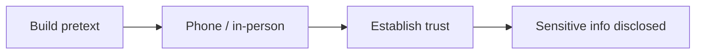
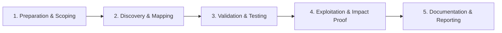

# Pretexting & Vishing

Phone and in-person social engineering with strict authorization.

## Overview Diagram

Visual summary of the **attack/data flow** and the **five-phase testing workflow** for this topic.

### Attack / Data Flow

### Testing Workflow

## How It Works

**Pretexting** builds a fabricated scenario (IT support, vendor, auditor) to manipulate people into revealing information or performing actions. **Vishing** applies this via phone; **in-person** pretexting tests physical security and help desk procedures.

Authorized exercises validate whether staff verify caller identity, challenge unknown visitors, and follow escalation procedures before resetting passwords or granting access.

## Exploitation

1. **ROE defines allowed pretexts**: no fake law enforcement, medical, or family emergencies unless approved.
2. **Scenario design**: "new vendor needing VPN access", "CEO urgent wire transfer" (if in scope).
3. **Vishing**: call help desk requesting password reset; test verification questions.
4. **Physical**: tailgating, badge cloning tests, dropping USBs (if authorized).
5. **Record outcomes**: who verified, who bypassed policy, time to escalation.
6. **Blue team debrief**: share indicators without humiliating individuals.

Never use obtained credentials beyond proof-of-concept in controlled validation.

## Defense & Mitigation

- **Help desk procedures**: out-of-band callback to registered numbers for resets.
- Physical security: badge checks, mantrap entries, visitor escorts.
- Security awareness including vishing and in-person social engineering.
- Limit information on public phone directories and org charts.
- Incident playbooks for suspected social engineering attempts.
- Regular tabletop exercises combining digital and human attack vectors.

## Testing Methodology

Work through each phase in order. Every step has a checkbox — complete them all for thorough, reproducible coverage.

### Phase 1 — Preparation & Scoping

- [ ] Confirm target is in program scope and ROE allows this test type
- [ ] Set up isolated lab or proxy (Burp/ZAP) with scope filters
- [ ] Document baseline application behavior and account roles
- [ ] Identify test accounts for each privilege level
- [ ] Define approved pretext scenarios and boundaries

### Phase 2 — Discovery & Mapping

- [ ] Research target org publicly for believable story
- [ ] Prepare callback numbers and personas
- [ ] Coordinate with client security contact
- [ ] Document stop phrases if target uncomfortable

### Phase 3 — Validation & Testing

- [ ] Execute phone or in-person pretext
- [ ] Attempt information elicitation only within ROE
- [ ] End immediately if target requests verification
- [ ] Log outcomes without recording illegally

### Phase 4 — Exploitation & Impact Proof

- [ ] Debrief client with lessons learned
- [ ] Recommend verification procedures for staff

### Phase 5 — Documentation & Reporting

- [ ] Write step-by-step reproduction with HTTP requests/responses
- [ ] Capture screenshots or video showing impact (redact sensitive data)
- [ ] Rate severity using program CVSS or impact matrix
- [ ] Provide concrete remediation guidance for developers
- [ ] Retest after fix if program allows verification

## Tools

| Tool | Usage |
|------|-------|
| `custom scripts` | [Python/Bash automation for repeatable tests](../../TOOLS_GUIDE.md) |

## Verification Checklist

- [ ] Review scope and rules of engagement
- [ ] Document baseline behavior
- [ ] Test edge cases and parser differentials
- [ ] Capture proof-of-concept safely
- [ ] Write remediation guidance
