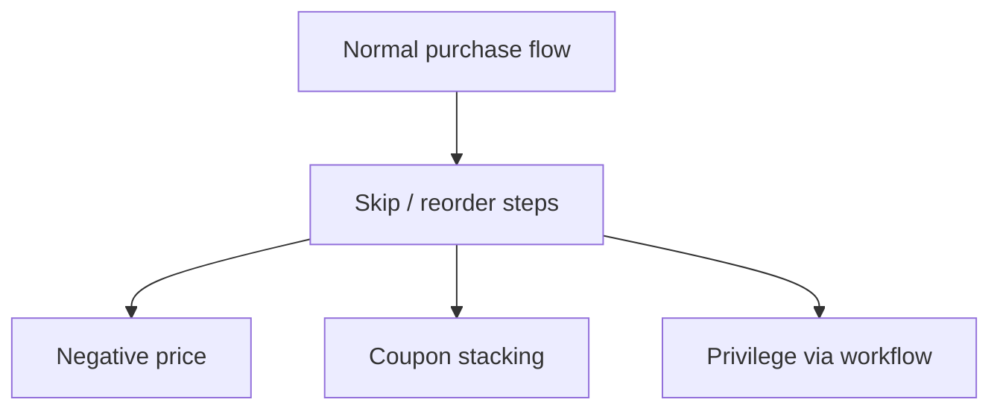
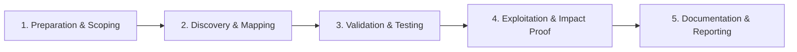

# Business Logic Flaws

Abuse application workflows beyond technical vulnerabilities.

## Overview Diagram

Visual summary of the **attack/data flow** and the **five-phase testing workflow** for this topic.

### Attack / Data Flow

<div class="sr-diagram" markdown="1">



</div>

### Testing Workflow

<div class="sr-diagram sr-diagram-methodology" markdown="1">



</div>

## How It Works

Business logic flaws violate application rules and workflow assumptions rather than breaking technical controls. The code executes "correctly" from a programmer's view but allows abuse of intended process.

Examples:

- Purchasing items for negative prices or zero totals via cart manipulation
- Applying stacked discounts beyond policy
- Skipping payment step by direct URL to confirmation page
- Voting or rating more than once by parameter tampering
- Tier downgrade not enforced when subscription expires
- Referral bonuses farmed with self-referrals

These bugs arise from incomplete threat modeling of multi-step flows, trusting client-side state, race windows between microservices, and missing server-side validation of prices, quantities, and roles.

Automated scanners rarely detect logic flaws; they require understanding domain rules and adversarial creativity.

## Exploitation

**Workflow mapping**

1. Document every step: browse → cart → coupon → payment → fulfillment.
2. Identify assumptions: "user already paid", "coupon applied once", "role checked on page load only".
3. Test skipping steps: jump to `/checkout/complete` without payment.

**Parameter tampering**

- Change `quantity=-1`, `price=0.01`, `currency=USD` → `currency=XXX`
- Swap `product_id` to higher-value SKU after price locked client-side
- Replay old promotional API calls after campaign ended

**Race conditions**

- Parallel coupon application (see race-condition topic)
- Simultaneous withdrawal requests exceeding balance

**Attack flow**

```
Attacker manipulates workflow state or parameters → server enforces incomplete rules → financial/governance impact without classic injection
```

**Authorization logic**

- Feature flags in JSON: `"isPremium": true` accepted from client
- Admin functions gated only by hidden URL

**Documentation for reports**

- Exact $ impact or policy violated
- Minimal reproduction with two accounts or single account steps

## Defense & Mitigation

**Server-side authority**

- All prices, discounts, inventory, and permissions computed server-side from authoritative DB state.
- Never trust hidden fields, client JSON, or previous step cookies for security decisions.

**Workflow enforcement**

- State machine tokens: each step issues signed token required for next step.
- Idempotent payment callbacks verified against gateway records.

**Validation rules**

- Business rule engine or centralized policy layer for promotions and limits.
- Negative quantity, zero price, and cross-product constraints rejected at API layer.

**Monitoring**

- Anomaly detection: sudden spike in coupon usage, negative orders, refund patterns.
- Audit logs for manual review of high-value transactions.

**Testing**

- Threat modeling per feature (STRIDE on purchase flow).
- Pair QA testers with security reviewers for "what if I try..." scenarios.

## Testing Methodology

Work through each phase in order. Every step has a checkbox — complete them all for thorough, reproducible coverage.

### Phase 1 — Preparation & Scoping

- [ ] Confirm target is in program scope and ROE allows this test type
- [ ] Set up isolated lab or proxy (Burp/ZAP) with scope filters
- [ ] Document baseline application behavior and account roles
- [ ] Identify test accounts for each privilege level
- [ ] Map complete user workflows: checkout, signup, subscription, rewards

### Phase 2 — Discovery & Mapping

- [ ] Diagram state machine for each multi-step process
- [ ] Identify price, quantity, and role fields in requests
- [ ] Review negative numbers, zero amounts, and integer overflow
- [ ] Find race windows between validation and commit

### Phase 3 — Validation & Testing

- [ ] Skip steps by calling final API directly
- [ ] Modify prices, discounts, and currencies client-side
- [ ] Replay coupons, referral bonuses, and loyalty points
- [ ] Test role escalation via workflow reorder

### Phase 4 — Exploitation & Impact Proof

- [ ] Complete purchase at $0 or negative total as proof
- [ ] Demonstrate unauthorized feature access
- [ ] Show impact with finance or fraud team context
- [ ] Use test payment gateways only

### Phase 5 — Documentation & Reporting

- [ ] Write step-by-step reproduction with HTTP requests/responses
- [ ] Capture screenshots or video showing impact (redact sensitive data)
- [ ] Rate severity using program CVSS or impact matrix
- [ ] Provide concrete remediation guidance for developers
- [ ] Retest after fix if program allows verification
- [ ] Recommend server-side price authority and workflow tokens

## Tools

| Tool | Usage |
|------|-------|
| `burp` | [Intercept, repeater & scanner](../../TOOLS_GUIDE.md#burp-suite) |
| `manual testing` | [Hands-on business logic testing with Burp Repeater](../../TOOLS_GUIDE.md) |

## Resources

- [OWASP Business Logic](https://owasp.org/www-community/vulnerabilities/Business_logic_vulnerability)

## Verification Checklist

- [ ] Review scope and rules of engagement
- [ ] Document baseline behavior
- [ ] Test edge cases and parser differentials
- [ ] Capture proof-of-concept safely
- [ ] Write remediation guidance
