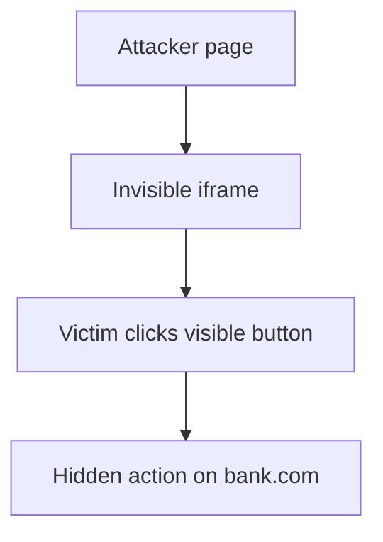
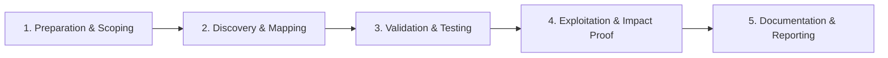

# Clickjacking

Frame sensitive actions to trick users into unintended clicks.

## Overview Diagram

Visual summary of the **attack/data flow** and the **five-phase testing workflow** for this topic.

### Attack / Data Flow

<div class="sr-diagram" markdown="1">



</div>

### Testing Workflow

<div class="sr-diagram sr-diagram-methodology" markdown="1">



</div>

## How It Works

Clickjacking (UI redressing) tricks users into clicking hidden or overlaid elements on a victim site while believing they interact with the attacker's visible UI. The attack typically embeds the target in a transparent `<iframe>` over decoy buttons.

Requirements for exploitation:

- Target page lacks frame-busting or proper `X-Frame-Options` / CSP `frame-ancestors`
- Victim is authenticated
- Click performs a sensitive action without re-authentication (one-click purchase, follow, disable security, grant OAuth)

Variants:

- **Classic overlay**: opacity-0 iframe over "Win iPad" button
- **Double clickjacking**: rapid iframe repositioning on mouse down
- **Likejacking**: hidden Facebook like iframe (legacy social widgets)

Mobile WebViews and hybrid apps may omit frame protections entirely.

## Exploitation

**Verify framing**

```html
<iframe src="https://target.com/account/delete" style="opacity:0; position:absolute; top:0; left:0; width:100%; height:100%;">
</iframe>
<button style="position:relative; z-index:-1;">Click for prize</button>
```

If target loads in iframe, check if sensitive action is one click away.

**Attack flow**

```
Attacker page loads victim in iframe → user clicks visible decoy → click passes to iframe → unintended action on victim session
```

**High-value targets**

- "Delete account", "Add payee", "Grant admin", OAuth consent, security setting toggles
- CSRF-token-free JSON endpoints rarely help if action is pure GET link

**Bypass legacy frame busters**

- HTML5 sandbox attributes without `allow-top-navigation`
- Double framing, `onbeforeunload` race techniques (historical)

**Proof for reports**

- Screen recording of POC with test account
- Document missing `frame-ancestors` and successful framed sensitive page

## Defense & Mitigation

**Frame denial headers**

```
X-Frame-Options: DENY
# or SAMEORIGIN when same-site embedding needed

Content-Security-Policy: frame-ancestors 'self'
```

CSP `frame-ancestors` supersedes XFO in modern browsers—deploy both for legacy coverage.

**Sensitive actions**

- Require re-authentication (password, MFA) for destructive operations.
- Nonces on state-changing requests; avoid sensitive GET links.

**OAuth**

- Use explicit consent screens that cannot be framed.

**Testing**

- Attempt to iframe every authenticated page in QA automation.
- Mobile app WebViews: set equivalent policies.

**User education**

- Secondary channel confirmation for financial transactions (out-of-band).

## Testing Methodology

Work through each phase in order. Every step has a checkbox — complete them all for thorough, reproducible coverage.

### Phase 1 — Preparation & Scoping

- [ ] Confirm target is in program scope and ROE allows this test type
- [ ] Set up isolated lab or proxy (Burp/ZAP) with scope filters
- [ ] Document baseline application behavior and account roles
- [ ] Identify test accounts for each privilege level
- [ ] Check `X-Frame-Options` and `Content-Security-Policy frame-ancestors`

### Phase 2 — Discovery & Mapping

- [ ] Identify sensitive actions: transfer, delete, change email, grant admin
- [ ] Test if pages load in iframe on attacker domain
- [ ] Review frame-busting JS (often bypassable)
- [ ] Map double-click and drag-drop UI actions

### Phase 3 — Validation & Testing

- [ ] Build HTML PoC overlaying invisible iframe
- [ ] Test mobile viewport and touch event hijacking
- [ ] Validate bypass of `X-Frame-Options: SAMEORIGIN` via subdomain
- [ ] Check CSP `frame-ancestors` coverage on all sensitive routes

### Phase 4 — Exploitation & Impact Proof

- [ ] Record video of victim click performing protected action
- [ ] Demonstrate with self-click on PoC page
- [ ] Show combined impact with CSRF if cookies not protected
- [ ] Do not target real users

### Phase 5 — Documentation & Reporting

- [ ] Write step-by-step reproduction with HTTP requests/responses
- [ ] Capture screenshots or video showing impact (redact sensitive data)
- [ ] Rate severity using program CVSS or impact matrix
- [ ] Provide concrete remediation guidance for developers
- [ ] Retest after fix if program allows verification
- [ ] Recommend `frame-ancestors 'none'` or explicit allow-list

## Tools

| Tool | Usage |
|------|-------|
| `burp` | [Intercept, repeater & scanner](../../TOOLS_GUIDE.md#burp-suite) |
| `custom html poc` | [Minimal HTML page demonstrating clickjacking](../../TOOLS_GUIDE.md) |

## Resources

- [PortSwigger Clickjacking](https://portswigger.net/web-security/clickjacking)

## Verification Checklist

- [ ] Review scope and rules of engagement
- [ ] Document baseline behavior
- [ ] Test edge cases and parser differentials
- [ ] Capture proof-of-concept safely
- [ ] Write remediation guidance
