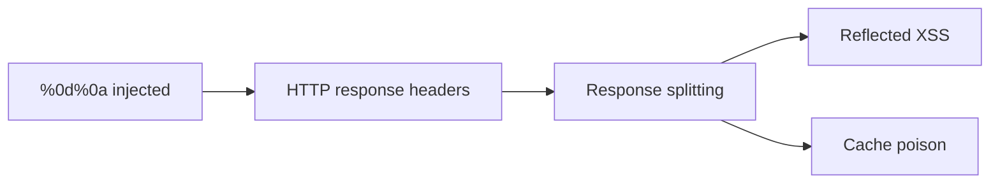
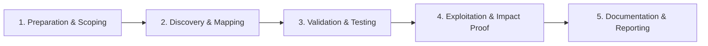

# CRLF Injection

Inject carriage return and line feed to manipulate HTTP responses.

## Overview Diagram

Visual summary of the **attack/data flow** and the **five-phase testing workflow** for this topic.

### Attack / Data Flow

<div class="sr-diagram" markdown="1">



</div>

### Testing Workflow

<div class="sr-diagram sr-diagram-methodology" markdown="1">



</div>

## How It Works

CRLF injection inserts Carriage Return (`%0d`) and Line Feed (`%0a`) characters to terminate HTTP headers or inject new ones. When applications reflect input into response headers (`Location`, `Set-Cookie`, custom headers) without stripping newline characters, attackers perform **HTTP response splitting**.

Classic scenario:

```
https://target.com/redirect?url=foo%0d%0aSet-Cookie:admin=true%0d%0a%0d%0a<script>...
```

Server emits:

```
HTTP/1.1 302 Found
Location: foo
Set-Cookie: admin=true

<script>...
```

Legacy browsers parsed the injected body as part of the response; modern mitigations reduced impact but header injection into `Set-Cookie` and cache poisoning chains remain relevant.

Log injection via CRLF in User-Agent also pollutes SIEM parsing and can forge log entries.

## Exploitation

**Find injection points**

1. Parameters reflected in `Location` redirects.
2. Custom headers built from query input (`X-User-Lang: %input%`).
3. Cookie values set from URL parameters.

**Redirect header injection**

```
/page?redirect=/%0d%0aSet-Cookie:%20session=attacker%0d%0a
```

**Response splitting for XSS (historical)**

Inject `%0d%0a%0d%0a` then HTML/JS body in same parameter when proxies concatenate responses naively.

**Attack flow**

```
CRLF in parameter → reflected in response header → extra headers or premature body → session fixation / XSS / cache poison
```

**Tools**

- crlfuzz for automated scanning
- Burp Collaborator for out-of-band header reflection tests

**Chain with open redirect**

Poison `Location` to attacker URL plus injected cookies on victim domain.

## Defense & Mitigation

**Input sanitization**

- Reject `%0d`, `%0a`, `%00` in any input used in headers.
- URL encode redirects; validate path-only targets.

**Framework defaults**

- Modern frameworks often block newline in header values—verify all custom header code paths.

**Headers**

- Use framework redirect helpers instead of manual `header()` concatenation.

**Logging**

- Sanitize log fields; structured JSON logging reduces CRLF log forging impact.

**Infrastructure**

- HTTP/2 and strict response parsing reduce response splitting; do not rely on this alone.

**Testing**

- Fuzz all redirect and cookie-setting endpoints with CRLF payloads in CI security tests.

## Testing Methodology

Work through each phase in order. Every step has a checkbox — complete them all for thorough, reproducible coverage.

### Phase 1 — Preparation & Scoping

- [ ] Confirm target is in program scope and ROE allows this test type
- [ ] Set up isolated lab or proxy (Burp/ZAP) with scope filters
- [ ] Document baseline application behavior and account roles
- [ ] Identify test accounts for each privilege level
- [ ] Find parameters reflected in HTTP response headers

### Phase 2 — Discovery & Mapping

- [ ] Inject `%0d%0a` into redirects, cookies, and custom headers
- [ ] Test log injection via User-Agent and Referer
- [ ] Map Set-Cookie injection points
- [ ] Review email/header generation from user input

### Phase 3 — Validation & Testing

- [ ] Confirm new header injection: `%0d%0aSet-Cookie: injected=true`
- [ ] Test response splitting leading to XSS
- [ ] Validate cache poisoning via injected headers
- [ ] Use crlfuzz for automated discovery

### Phase 4 — Exploitation & Impact Proof

- [ ] Demonstrate XSS via split response body
- [ ] Show session fixation via injected cookies
- [ ] Document encoding bypasses that worked
- [ ] Avoid log flooding on production

### Phase 5 — Documentation & Reporting

- [ ] Write step-by-step reproduction with HTTP requests/responses
- [ ] Capture screenshots or video showing impact (redact sensitive data)
- [ ] Rate severity using program CVSS or impact matrix
- [ ] Provide concrete remediation guidance for developers
- [ ] Retest after fix if program allows verification
- [ ] Strip CR/LF from header values and encode outputs

## Tools

| Tool | Usage |
|------|-------|
| `burp` | [Intercept, repeater & scanner](../../TOOLS_GUIDE.md#burp-suite) |
| `crlfuzz` | [CRLF injection fuzzer](../../TOOLS_GUIDE.md#crlfuzz) |

## Resources

- [PayloadsAllTheThings CRLF](https://github.com/swisskyrepo/PayloadsAllTheThings/tree/master/CRLF%20Injection)

## Verification Checklist

- [ ] Review scope and rules of engagement
- [ ] Document baseline behavior
- [ ] Test edge cases and parser differentials
- [ ] Capture proof-of-concept safely
- [ ] Write remediation guidance
