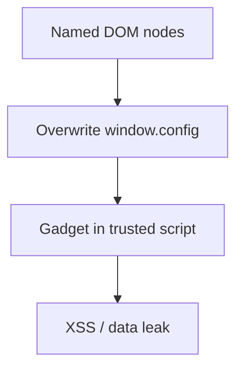
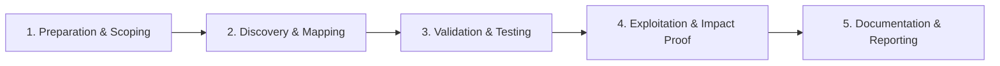

# DOM Clobbering

Overwrite DOM properties using named HTML elements.

## Overview Diagram

Visual summary of the **attack/data flow** and the **five-phase testing workflow** for this topic.

### Attack / Data Flow

<div class="sr-diagram" markdown="1">



</div>

### Testing Workflow

<div class="sr-diagram sr-diagram-methodology" markdown="1">



</div>

## How It Works

DOM clobbering overwrites DOM APIs or global variables using named HTML elements (`id` and `name` attributes) that browsers expose as properties on `window`, `document`, or form elements.

Example:

```html
<a id="defaultAvatar" href="https://evil.com/avatar.jpg">
```

If script uses `window.defaultAvatar` expecting a string but receives the `<a>` element, logic branches change:

```javascript
img.src = window.defaultAvatar || '/safe.png';
// becomes img.src = <a> element → may coerce to attacker URL
```

Collections form when multiple elements share names—`id=x` creates `window.x`; form fields named `x` appear as `form.x`.

Chains with scripts that use `getElementById` fallbacks incorrectly, sanitizer configuration objects, or `contentWindow` references in iframe gadgets.

## Exploitation

**Find sinks**

1. Search JS for `window.*`, `document.*`, or bare global lookups used in security decisions.
2. Identify HTML injection points allowing `<form>`, ``, `<a>` with attacker `id`/`name`.

**Clobber payload**

```html
<form id="config"><input name="apiUrl" value="https://evil.com"></form>
```

If code does `config.apiUrl || '/api'` and `config` is clobbered to the form, `config.apiUrl` may resolve to the input element—coerced URL in some paths.

**Attack flow**

```
HTML injection (even without script) → named elements clobber globals → existing script misreads attacker-controlled object → XSS or data exfil
```

**Combine with prototype pollution**

Pollute prototypes so clobbered nodes chain into gadget execution.

**DOMPurify bypass research**

Historical bypasses used clobbering to override sanitizer config via `id="allowedAttributes"`.

## Defense & Mitigation

**Code hygiene**

- Use `document.getElementById` with explicit checks `typeof x === 'string'`.
- Avoid relying on `window` named element resolution in security paths.
- `const` and module scope reduce accidental global clobbering.

**HTML injection**

- Fix underlying XSS/HTML injection—clobbering requires attacker HTML in page.
- Strict CSP blocks inline script even if clobbering alters config.

**Sanitizer**

- Keep DOMPurify updated; use isolated config objects not read from DOM.

**Testing**

- Static analysis for global lookups; dynamic tests injecting clobber HTML in QA.

## Testing Methodology

Work through each phase in order. Every step has a checkbox — complete them all for thorough, reproducible coverage.

### Phase 1 — Preparation & Scoping

- [ ] Confirm target is in program scope and ROE allows this test type
- [ ] Set up isolated lab or proxy (Burp/ZAP) with scope filters
- [ ] Document baseline application behavior and account roles
- [ ] Identify test accounts for each privilege level
- [ ] Review pages using named DOM elements and inline config scripts

### Phase 2 — Discovery & Mapping

- [ ] Find `window.config`, `defaultAvatar`, and similar globals
- [ ] Identify scripts reading `document.getElementById` named anchors
- [ ] Map gadget paths in third-party libraries
- [ ] Check HTML sanitizers allowing `id`/`name` attributes

### Phase 3 — Validation & Testing

- [ ] Inject `<a id=config href=evil>` clobbering globals
- [ ] Test CSP bypass via clobbered script loaders
- [ ] Validate XSS or data leak via clobbered URL
- [ ] Review DOMPurify config for known bypasses

### Phase 4 — Exploitation & Impact Proof

- [ ] Demonstrate script load from attacker domain via clobber
- [ ] Show impact on authenticated pages
- [ ] Document clobbered identifier and consuming script
- [ ] Pair with stored HTML injection if needed

### Phase 5 — Documentation & Reporting

- [ ] Write step-by-step reproduction with HTTP requests/responses
- [ ] Capture screenshots or video showing impact (redact sensitive data)
- [ ] Rate severity using program CVSS or impact matrix
- [ ] Provide concrete remediation guidance for developers
- [ ] Retest after fix if program allows verification
- [ ] Avoid named element lookups; use `data-*` attributes safely

## Tools

| Tool | Usage |
|------|-------|
| `burp` | [Intercept, repeater & scanner](../../TOOLS_GUIDE.md#burp-suite) |
| `dompurify bypass research` | [Review DOMPurify bypass advisories & test sinks](../../TOOLS_GUIDE.md) |

## Resources

- [PortSwigger DOM Clobbering](https://portswigger.net/web-security/dom-based/dom-clobbering)

## Verification Checklist

- [ ] Review scope and rules of engagement
- [ ] Document baseline behavior
- [ ] Test edge cases and parser differentials
- [ ] Capture proof-of-concept safely
- [ ] Write remediation guidance
