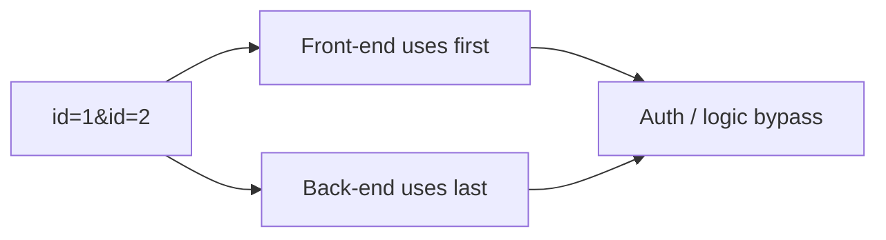
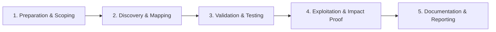

# HTTP Parameter Pollution

Abuse duplicate parameters handled differently by proxies and backends.

## Overview Diagram

Visual summary of the **attack/data flow** and the **five-phase testing workflow** for this topic.

### Attack / Data Flow

<div class="sr-diagram" markdown="1">



</div>

### Testing Workflow

<div class="sr-diagram sr-diagram-methodology" markdown="1">



</div>

## How It Works

HTTP Parameter Pollution (HPP) sends duplicate parameters in one request (`?id=1&id=2`) knowing different components parse duplicates inconsistently.

Split behavior examples:

- **ASP.NET/IIS**: concatenates `id=1,2`
- **PHP**: often uses last value `id=2`
- **Apache**: often first value `id=1`
- **WAF vs app**: WAF inspects first; app uses second (bypass)

Impact scenarios:

- WAF/filter bypass for XSS/SQLi payloads in second parameter
- Access control: `user=attacker&user=admin`—front-end checks first, back-end authorizes second
- OAuth scope manipulation with duplicate query keys
- HPP in redirects and tracking links altering payment amounts

## Exploitation

**WAF bypass**

```
/search?q=safe&q=<script>alert(1)</script>
```

If WAF scores first `q` only and PHP uses last.

**Authorization test**

```
GET /transfer?from=attacker&from=victim&amount=1000
```

Compare stack behavior with single-parameter baseline.

**Attack flow**

```
Duplicate params → parser differential between security tier and app → filter bypass / logic abuse
```

**Framework-specific research**

- Document target stack parsing rules from HackTricks/OWASP tables.
- Test GET, POST form, and JSON+query combinations.

**Tools**

- Manual Burp: duplicate rows in Params tab
- Custom scripts doubling every parameter

## Defense & Mitigation

**Consistent parsing**

- Configure reverse proxy to normalize requests—reject duplicate parameter names or canonicalize to first/last explicitly at edge.

**Application**

- Explicitly read expected single value; reject duplicates:

```python
if len(request.GET.getlist('id')) > 1:
    abort(400)
```

**Security tier alignment**

- Ensure WAF uses same parsing as application server—or place WAF after canonicalization.

**Testing**

- Security tests include duplicate parameter cases for critical endpoints.

**Logging**

- Log full parameter lists, not only first occurrence.

## Pro Tips

Practical advice from real engagements — use these to test faster and report better.

!!! tip "Framework differences"
    PHP uses last, ASP.NET uses first — test both orders: `id=1&id=2`.

!!! tip "HPP in OAuth"
    Duplicate `redirect_uri` or `state` parameters confuse validation.

!!! tip "WAF bypass"
    Split blocked keywords: `id=1&sele=id&lect` concatenated server-side.

!!! tip "File upload boundaries"
    Duplicate `filename` in multipart — parser differential.

!!! tip "Document server stack"
    HPP behavior is framework-specific — name it in report.

## Testing Methodology

Work through each phase in order. Every step has a checkbox — complete them all for thorough, reproducible coverage.

### Phase 1 — Preparation & Scoping

- [ ] Confirm target is in program scope and ROE allows this test type
- [ ] Set up isolated lab or proxy (Burp/ZAP) with scope filters
- [ ] Document baseline application behavior and account roles
- [ ] Identify test accounts for each privilege level
- [ ] Note frameworks that merge duplicate parameters differently

### Phase 2 — Discovery & Mapping

- [ ] Send duplicate keys: `id=1&id=2` in query and body
- [ ] Test mixed GET/POST parameter precedence
- [ ] Review WAF bypass via parameter splitting
- [ ] Map front-end vs back-end parameter selection

### Phase 3 — Validation & Testing

- [ ] Confirm auth bypass when front-end checks first value, back-end uses last
- [ ] Test HPP in OAuth and SAML flows
- [ ] Validate file upload boundary HPP
- [ ] Compare behavior across server stacks

### Phase 4 — Exploitation & Impact Proof

- [ ] Demonstrate privilege or filter bypass
- [ ] Chain HPP with other vulnerabilities
- [ ] Document server-specific behavior
- [ ] Capture raw HTTP showing duplicate keys

### Phase 5 — Documentation & Reporting

- [ ] Write step-by-step reproduction with HTTP requests/responses
- [ ] Capture screenshots or video showing impact (redact sensitive data)
- [ ] Rate severity using program CVSS or impact matrix
- [ ] Provide concrete remediation guidance for developers
- [ ] Retest after fix if program allows verification
- [ ] Normalize parameter handling server-side

## Tools

| Tool | Usage |
|------|-------|
| `burp` | [Intercept, repeater & scanner](../../TOOLS_GUIDE.md#burp-suite) |
| `manual fuzzing` | [Custom wordlists and Burp Intruder payloads](../../TOOLS_GUIDE.md) |

## Resources

- [OWASP HPP](https://owasp.org/www-project-web-security-testing-guide/latest/4-Web_Application_Security_Testing/07-Input_Validation_Testing/04-Testing_for_HTTP_Parameter_Pollution)

## Verification Checklist

- [ ] Review scope and rules of engagement
- [ ] Document baseline behavior
- [ ] Test edge cases and parser differentials
- [ ] Capture proof-of-concept safely
- [ ] Write remediation guidance
