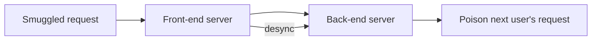

# HTTP Request Smuggling

Desynchronize front-end and back-end HTTP parsers.

## Overview Diagram

<div class="sr-diagram" markdown="1">



</div>

## How It Works

HTTP request smuggling exploits disagreements between front-end (CDN, load balancer, WAF) and back-end (app server) on message boundaries. Attackers craft ambiguous requests so each parser splits headers/body differently—desynchronizing the connection queue.

Classic variants:

- **CL.TE**: Front-end uses `Content-Length`, back-end uses `Transfer-Encoding: chunked`
- **TE.CL**: Opposite priority
- **TE.TE**: Obfuscated `Transfer-Encoding` headers confuse one parser

When desync occurs, leftover bytes prefix the **next** user's request on a reused connection—hijacking victims' requests or poisoning caches.

HTTP/2 downgrades and HTTP/2-specific smuggling (H2.CL, H2.TE) extend the class to modern stacks when H2 is translated to H1 behind the edge.

## Exploitation

**Detection (timing)**

Send ambiguous CL/TE requests; observe delays or error patterns vs baseline. Burp HTTP Request Smuggler automates probe templates.

**CL.TE smuggle skeleton**

```
POST / HTTP/1.1
Host: target.com
Content-Length: 6
Transfer-Encoding: chunked

0

GPOST /admin HTTP/1.1
Host: target.com
...
```

Front-end forwards one request; back-end reads smuggled prefix as next request start.

**Attack flow**

```
Smuggled bytes on keep-alive connection → prepended to victim request → cache poison / credential hijack / bypass front-end ACL
```

**Impact chains**

- Force victims to hit attacker-controlled URLs (cache or redirect poisoning)
- Access internal admin paths only front-end should block
- Reflect victim headers to attacker via smuggled log endpoints

**Tools**

- Burp Smuggler, `smuggler.py`, `h2csmuggler` for H2 contexts

**Requirements**

- HTTP/1.1 keep-alive between tiers
- Parser differential confirmed—not theoretical on target architecture

## Defense & Mitigation

**Normalize HTTP at edge**

- Re-encode requests at CDN/WAF; terminate ambiguous `Transfer-Encoding`.
- Disable HTTP/2 downgrade unless strictly validated.
- Prefer HTTP/2 end-to-end with strict RFC compliance.

**Back-end hardening**

- Reject requests with both CL and TE.
- Close connections after anomalous parsing instead of recovering.
- Use distinct connection pools; limit keep-alive for untrusted paths.

**Architecture**

- Isolate admin interfaces on separate hostnames without shared front-end connection reuse with public traffic.

**Detection**

- Monitor for malformed TE headers, duplicate Content-Length, abnormal chunk sequences.
- Vendor patches: keep proxies (nginx, Apache, IIS, HAProxy, Cloudflare) updated—many smuggling variants are version-specific.

## Methodology

- [ ] Identify CL.TE and TE.CL behavior
- [ ] Use timing-based detection
- [ ] Exploit for cache poisoning or request hijacking
- [ ] Test HTTP/2 downgrade scenarios

## Tools

| Tool | Usage |
|------|-------|
| `burp` | [Intercept, repeater & scanner](../../TOOLS_GUIDE.md#burp-suite) |
| `smuggler` | [HTTP request smuggling](../../TOOLS_GUIDE.md#smuggler) |
| `h2csmuggler` | [H2C smuggling detection](../../TOOLS_GUIDE.md#h2csmuggler) |

## Resources

- [PortSwigger Request Smuggling](https://portswigger.net/web-security/request-smuggling)

## Verification Checklist

- [ ] Review scope and rules of engagement
- [ ] Document baseline behavior
- [ ] Test edge cases and parser differentials
- [ ] Capture proof-of-concept safely
- [ ] Write remediation guidance
