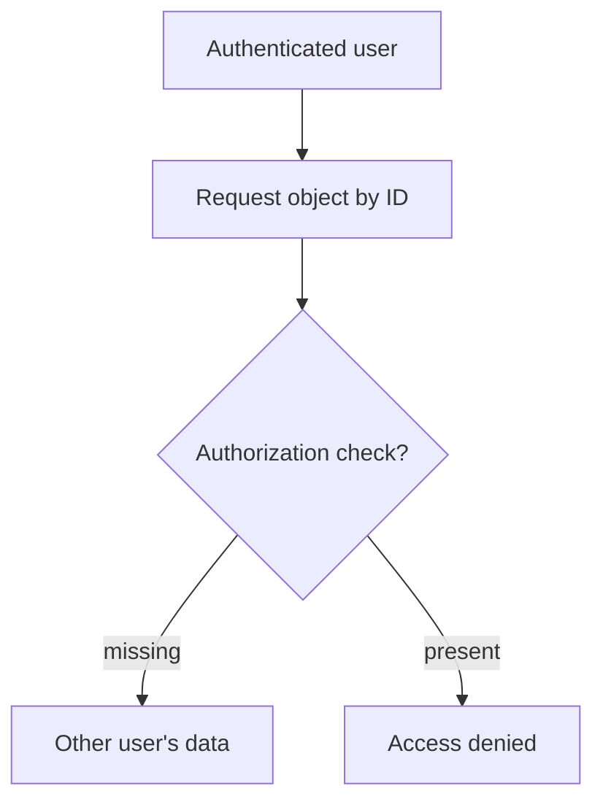
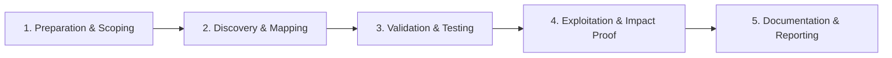

# Insecure Direct Object Reference (IDOR)

Access unauthorized objects by manipulating identifiers.

## Overview Diagram

Visual summary of the **attack/data flow** and the **five-phase testing workflow** for this topic.

### Attack / Data Flow

<div class="sr-diagram" markdown="1">



</div>

### Testing Workflow

<div class="sr-diagram sr-diagram-methodology" markdown="1">



</div>

## How It Works

Insecure Direct Object Reference (IDOR) is an access control failure where the application exposes object identifiers (IDs, filenames, tokens) in requests but fails to verify that the authenticated user is authorized to access the referenced object.

Examples:

- `GET /api/orders/12345` returns any order when IDs are swapped
- `GET /files/report_2024.pdf?user_id=2` exposes another user's file
- GraphQL node IDs or UUIDs that are predictable or leaked elsewhere

IDOR differs from missing authentication: the user is logged in but accesses objects outside their tenancy, role, or ownership. Identifiers may be sequential integers, UUIDs, hashed values, or encoded strings (`base64(userId:docId)`).

Root causes:

- Authorization checked only at menu/UI level, not per API call
- Relying on obscurity of UUIDs instead of server-side policy
- Mass assignment updating fields the user should not control alongside ID swaps

## Exploitation

**Methodology**

1. Create two accounts: low-privilege (attacker) and victim (or second low account).
2. Capture object IDs from legitimate traffic for each account.
3. Replay victim object IDs with attacker session tokens.
4. Test HTTP methods: GET, PUT, PATCH, DELETE.

**Techniques**

- Increment/decrement numeric IDs: `/invoice/1001` → `/invoice/1002`
- Swap UUIDs discovered in JS bundles, emails, or public listings
- Decode encoded IDs: `base64`, JWT payload fields
- Change parent scope: `accountId=100` → `accountId=101`
- Test batch endpoints that accept arrays of IDs

**Attack flow**

```
Attacker authenticates → requests object by ID → server fetches by ID only → no ownership check → unauthorized data returned
```

**Tools**

- Burp Autorize: compare responses across roles automatically
- Custom scripts iterating ID ranges (respect scope and rate limits)

**Impact**

- PII exposure (health records, invoices, messages)
- Account modification (email change, password reset tokens)
- Financial fraud (transfer endpoints with weak checks)

## Defense & Mitigation

**Authorize every request**: After authentication, enforce object-level authorization—"Does this user own or have permission for this `orderId`?" Use central policy services or consistent middleware, not ad hoc checks in scattered controllers.

**Design patterns**

- Use non-guessable IDs (UUIDv4) **plus** authorization—not UUIDs alone.
- Prefer indirect references: session-scoped maps from opaque tokens to internal IDs.
- Scope queries: `SELECT * FROM orders WHERE id = ? AND user_id = ?` in the same query.

**API hygiene**

- Avoid exposing internal sequential IDs in URLs when possible.
- Validate tenant/account context on every nested resource (`/orgs/{orgId}/projects/{projectId}`).
- Log and alert on cross-tenant access attempts.

**Testing**

- Role matrix testing in CI: each endpoint tested with wrong user's object IDs must return 403/404 consistently.

## Testing Methodology

Work through each phase in order. Every step has a checkbox — complete them all for thorough, reproducible coverage.

### Phase 1 — Preparation & Scoping

- [ ] Confirm target is in program scope and ROE allows this test type
- [ ] Set up isolated lab or proxy (Burp/ZAP) with scope filters
- [ ] Document baseline application behavior and account roles
- [ ] Identify test accounts for each privilege level
- [ ] Create two test accounts: attacker (low priv) and victim (target data)

### Phase 2 — Discovery & Mapping

- [ ] Collect object IDs from URLs, JSON bodies, and API responses
- [ ] Note predictable patterns: sequential ints, UUIDs, base64 blobs
- [ ] Map CRUD operations per resource type (orders, invoices, messages)
- [ ] Identify horizontal vs vertical privilege targets

### Phase 3 — Validation & Testing

- [ ] Swap IDs in requests while keeping attacker's session token
- [ ] Test UUIDs — guessable or leaked from other endpoints?
- [ ] Replay requests with `X-User-Id` or `accountId` body fields changed
- [ ] Verify server enforces ownership on every method (GET/PUT/DELETE)

### Phase 4 — Exploitation & Impact Proof

- [ ] Access one victim record as minimal proof
- [ ] Test mass assignment: can attacker modify `role` or `userId`?
- [ ] Check batch/export endpoints for bulk IDOR
- [ ] Document API vs web UI authorization gaps

### Phase 5 — Documentation & Reporting

- [ ] Write step-by-step reproduction with HTTP requests/responses
- [ ] Capture screenshots or video showing impact (redact sensitive data)
- [ ] Rate severity using program CVSS or impact matrix
- [ ] Provide concrete remediation guidance for developers
- [ ] Retest after fix if program allows verification
- [ ] Show exact ID swap and recommend server-side authorization checks

## Tools

| Tool | Usage |
|------|-------|
| `burp` | [Intercept, repeater & scanner](../../TOOLS_GUIDE.md#burp-suite) |
| `autorize` | [Authorization testing (Burp)](../../TOOLS_GUIDE.md#autorize) |

## Resources

- [PortSwigger Access Control](https://portswigger.net/web-security/access-control)

## Verification Checklist

- [ ] Review scope and rules of engagement
- [ ] Document baseline behavior
- [ ] Test edge cases and parser differentials
- [ ] Capture proof-of-concept safely
- [ ] Write remediation guidance
