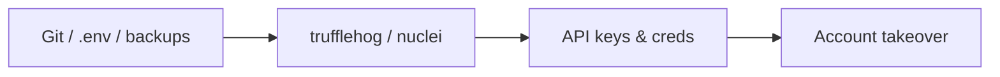
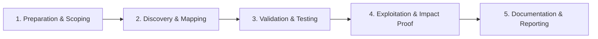

# Information Disclosure

Find sensitive data exposed through errors, backups, and misconfigurations.

## Overview Diagram

Visual summary of the **attack/data flow** and the **five-phase testing workflow** for this topic.

### Attack / Data Flow

<div class="sr-diagram" markdown="1">



</div>

### Testing Workflow

<div class="sr-diagram sr-diagram-methodology" markdown="1">



</div>

## How It Works

Information disclosure exposes sensitive data through errors, misconfiguration, excessive API responses, and forgotten assets—not always a CVE-class bug but often high impact for attackers doing recon and chaining findings.

Common sources:

- **Verbose errors**: stack traces, SQL errors, internal paths
- **Misconfigured storage**: public S3 buckets, directory listing enabled
- **Source/repo leaks**: `.git/`, `.env`, backup files (`backup.zip`, `.sql`)
- **Metadata**: `X-Powered-By`, internal IPs in headers, comments with credentials
- **API over-fetching**: returning full user objects including PII fields
- **Client bundles**: API keys, internal URLs, feature flags in minified JS

Attackers combine small disclosures (employee names, schema hints) into larger exploits (password reset, SQLi, social engineering).

## Exploitation

**Recon pipeline**

```bash
# Historical URLs and backups
gau target.com | grep -E '\.(sql|zip|env|bak|config)$'
ffuf -u https://target.com/FUZZ -w sensitive-files.txt

# Secrets in repos and JS
trufflehog git https://github.com/org/repo
linkfinder -i bundle.js -o api-endpoints.txt
```

**Error triggering**

- Invalid IDs, type confusion (`id=abc`), missing headers—capture stack traces.
- Compare error verbosity across environments (staging more leaky).

**Attack flow**

```
Disclosure source → attacker collects credentials/schema/paths → enables targeted exploit or direct credential use
```

**Cloud checks**

- Enumerate bucket names `target-backup`, `target-dev`
- Search certificate transparency for hidden subdomains leaking internal names

**API review**

- Diff responses for `GET /users/me` vs admin; note fields like `ssn`, `internalNotes`.

## Defense & Mitigation

**Error handling**

- Generic client messages; detailed logs server-side only.
- Disable debug mode in production (`DEBUG=False`).

**Configuration**

- Block web access to `.git`, `.env`, IDE folders at server/CDN.
- Disable directory listing; audit cloud bucket ACLs continuously.

**Data minimization**

- API field allow-lists per role; GraphQL max depth and field auth.
- Remove secrets from client bundles; use backend proxies for third-party APIs.

**Headers**

- Strip `X-Powered-By`, server version headers at proxy.

**Monitoring**

- DAST for sensitive paths; GitHub secret scanning; cloud CSPM (Prowler, ScoutSuite).

**Process**

- Rotate any credential ever committed; treat disclosure as incident.

## Testing Methodology

Work through each phase in order. Every step has a checkbox — complete them all for thorough, reproducible coverage.

### Phase 1 — Preparation & Scoping

- [ ] Confirm target is in program scope and ROE allows this test type
- [ ] Set up isolated lab or proxy (Burp/ZAP) with scope filters
- [ ] Document baseline application behavior and account roles
- [ ] Identify test accounts for each privilege level
- [ ] Define sensitive data types: PII, keys, internal paths, stack traces

### Phase 2 — Discovery & Mapping

- [ ] Crawl for `.git`, `.env`, backup files, and directory listings
- [ ] Run nuclei exposures templates and trufflehog on repos
- [ ] Review JS bundles for API keys and internal URLs
- [ ] Check error pages, debug flags, and `/actuator` endpoints

### Phase 3 — Validation & Testing

- [ ] Confirm downloadable `.git` or exposed `.env`
- [ ] Validate API keys found in JS are active
- [ ] Test verbose errors on malformed input
- [ ] Scan responses for SSN, tokens, and internal IPs

### Phase 4 — Exploitation & Impact Proof

- [ ] Demonstrate account takeover via leaked key if applicable
- [ ] Show internal network map from disclosure
- [ ] Redact secrets in report — prove type not full value
- [ ] Notify program immediately for critical leaks

### Phase 5 — Documentation & Reporting

- [ ] Write step-by-step reproduction with HTTP requests/responses
- [ ] Capture screenshots or video showing impact (redact sensitive data)
- [ ] Rate severity using program CVSS or impact matrix
- [ ] Provide concrete remediation guidance for developers
- [ ] Retest after fix if program allows verification
- [ ] Remove debug endpoints and rotate exposed credentials

## Tools

| Tool | Usage |
|------|-------|
| `trufflehog` | [Secret scanner](../../TOOLS_GUIDE.md#trufflehog) |
| `gitleaks` | [Git secret scanner](../../TOOLS_GUIDE.md#gitleaks) |
| `nuclei` | [Template-based vuln scanner](../../TOOLS_GUIDE.md#nuclei) |
| `linkfinder` | [JS endpoint discovery](../../TOOLS_GUIDE.md#linkfinder) |

## Resources

- [OWASP Information Exposure](https://owasp.org/www-project-web-security-testing-guide/latest/4-Web_Application_Security_Testing/11-Client-side_Testing/05-Testing_for_Information_Disclosure)

## Verification Checklist

- [ ] Review scope and rules of engagement
- [ ] Document baseline behavior
- [ ] Test edge cases and parser differentials
- [ ] Capture proof-of-concept safely
- [ ] Write remediation guidance
