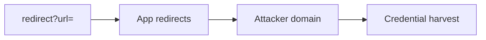
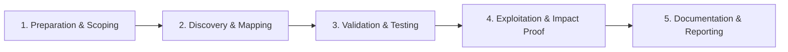

# Open Redirect

Abuse redirect parameters for phishing and OAuth token theft.

## Overview Diagram

Visual summary of the **attack/data flow** and the **five-phase testing workflow** for this topic.

### Attack / Data Flow

<div class="sr-diagram" markdown="1">



</div>

### Testing Workflow

<div class="sr-diagram sr-diagram-methodology" markdown="1">



</div>

## How It Works

Open redirects occur when an application redirects users to arbitrary URLs based on unvalidated query parameters (`url`, `next`, `return`, `redirect`, `r`). The browser trusts the initial domain in the link, but the user ends up on an attacker-controlled site.

Impact extends beyond phishing:

- **OAuth/OIDC token theft**: `redirect_uri` or post-login redirect chains leak tokens to attacker pages
- **SSRF filter bypass**: some parsers allow redirects to internal URLs after passing an allow-list check on the first hop
- **JavaScript execution** on some mobile WebViews with `intent://` or `javascript:` schemes (context-dependent)

Bypass techniques exploit URL parser differences:

- `//evil.com` (scheme-relative)
- `https://target.com.evil.com`
- `@evil.com` in URL userinfo
- Encoded slashes and Unicode homoglyphs
- Backslash handling: `https://target.com@evil.com` (parser-dependent)

## Exploitation

**Discovery**

1. Crawl for redirect parameters in login, logout, OAuth, email links.
2. Replace value with `https://evil.com` and observe 302 `Location` header.

**Phishing POC**

```
https://bank.com/login?next=https://evil.com/fake-login
```

Email presents legitimate `bank.com` hostname; victim lands on credential harvester after redirect.

**OAuth chain**

Weak redirect validation plus `response_mode` or open redirect on partner site steals `access_token` from fragment.

**Attack flow**

```
User clicks trusted link → app returns 302 to attacker URL → victim trusts phishing page / token leaked
```

**Tools**

- OpenRedireX, manual Burp testing
- Fuzz common parameter names across archived URLs (gau, waybackurls)

**Validation bypass checklist**

Test `//`, encoded slashes (`%2f%2f`), tab/newline before hostname, subdomain tricks, and allow-list bypass via registered domain `eviltarget.com`.

## Defense & Mitigation

**Avoid URL redirects from user input** when possible; use server-side route names mapped internally.

**Allow-list validation**

- Parse URL with a robust library; compare host to fixed allow-list of partner domains.
- Reject scheme-relative and non-https URLs in production.

**Relative paths only**

- Accept only paths starting with `/` that do not start with `//`:
  - Validate: `path.startsWith('/') && !path.startsWith('//')`

**OAuth**

- Strict `redirect_uri` exact match per client registration (no wildcards).

**User experience**

- Interstitial warning page for any external redirect with clear destination display.

**Monitoring**

- Log redirect targets; alert on external domains in redirect parameters.

## Pro Tips

Practical advice from real engagements — use these to test faster and report better.

!!! tip "Bypass patterns"
    Try `//evil.com`, `\/evil.com`, `https:evil.com`, `%09evil.com`, `@evil.com`.

!!! tip "OAuth redirect_uri"
    Open redirect + OAuth = token theft — always test login flows.

!!! tip "JavaScript redirects"
    `?next=javascript:alert(1)` or `data:text/html` in `location=` params.

!!! tip "Chain to XSS"
    Redirect to `javascript:` URI if scheme filter is weak.

!!! tip "Low severity alone"
    Combine with sensitive action or OAuth for higher impact in report.

## Testing Methodology

Work through each phase in order. Every step has a checkbox — complete them all for thorough, reproducible coverage.

### Phase 1 — Preparation & Scoping

- [ ] Confirm target is in program scope and ROE allows this test type
- [ ] Set up isolated lab or proxy (Burp/ZAP) with scope filters
- [ ] Document baseline application behavior and account roles
- [ ] Identify test accounts for each privilege level
- [ ] Find redirect parameters: `url`, `next`, `return`, `redirect`, `continue`

### Phase 2 — Discovery & Mapping

- [ ] Crawl application for 302/301 with user-controlled Location
- [ ] Check OAuth `redirect_uri` and logout redirects
- [ ] Test path-only vs full URL validation
- [ ] Review JavaScript `window.location` assignments from URL params

### Phase 3 — Validation & Testing

- [ ] Inject external domain and confirm redirect follows
- [ ] Bypass filters: `//evil.com`, `\/evil.com`, `@evil.com`, encoding
- [ ] Test open redirect chained to OAuth token theft
- [ ] Validate stored vs reflected redirect variants

### Phase 4 — Exploitation & Impact Proof

- [ ] Show phishing scenario with realistic redirect chain
- [ ] Demonstrate token leakage via redirect if applicable
- [ ] Use benign destination domain you control
- [ ] Document every bypass variant that worked

### Phase 5 — Documentation & Reporting

- [ ] Write step-by-step reproduction with HTTP requests/responses
- [ ] Capture screenshots or video showing impact (redact sensitive data)
- [ ] Rate severity using program CVSS or impact matrix
- [ ] Provide concrete remediation guidance for developers
- [ ] Retest after fix if program allows verification
- [ ] Recommend allow-list redirect destinations

## Tools

| Tool | Usage |
|------|-------|
| `burp` | [Intercept, repeater & scanner](../../TOOLS_GUIDE.md#burp-suite) |
| `openredirex` | [Open redirect fuzzer](../../TOOLS_GUIDE.md#openredirex) |

## Resources

- [PayloadsAllTheThings Open Redirect](https://github.com/swisskyrepo/PayloadsAllTheThings/tree/master/Open%20Redirect)

## Verification Checklist

- [ ] Review scope and rules of engagement
- [ ] Document baseline behavior
- [ ] Test edge cases and parser differentials
- [ ] Capture proof-of-concept safely
- [ ] Write remediation guidance
