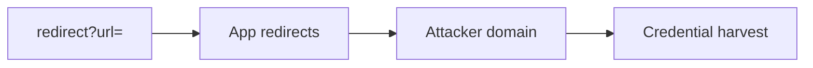

# Open Redirect

Abuse redirect parameters for phishing and OAuth token theft.

## Overview Diagram

<div class="sr-diagram" markdown="1">



</div>

## How It Works

Open redirects occur when an application redirects users to arbitrary URLs based on unvalidated query parameters (`url`, `next`, `return`, `redirect`, `r`). The browser trusts the initial domain in the link, but the user ends up on an attacker-controlled site.

Impact extends beyond phishing:

- **OAuth/OIDC token theft**: `redirect_uri` or post-login redirect chains leak tokens to attacker pages
- **SSRF filter bypass**: some parsers allow redirects to internal URLs after passing an allow-list check on the first hop
- **JavaScript execution** on some mobile WebViews with `intent://` or `javascript:` schemes (context-dependent)

Bypass techniques exploit URL parser differences:

- `//evil.com` (scheme-relative)
- `https://target.com.evil.com`
- `@evil.com` in URL userinfo
- Encoded slashes and Unicode homoglyphs
- Backslash handling: `https://target.com@evil.com` (parser-dependent)

## Exploitation

**Discovery**

1. Crawl for redirect parameters in login, logout, OAuth, email links.
2. Replace value with `https://evil.com` and observe 302 `Location` header.

**Phishing POC**

```
https://bank.com/login?next=https://evil.com/fake-login
```

Email presents legitimate `bank.com` hostname; victim lands on credential harvester after redirect.

**OAuth chain**

Weak redirect validation plus `response_mode` or open redirect on partner site steals `access_token` from fragment.

**Attack flow**

```
User clicks trusted link → app returns 302 to attacker URL → victim trusts phishing page / token leaked
```

**Tools**

- OpenRedireX, manual Burp testing
- Fuzz common parameter names across archived URLs (gau, waybackurls)

**Validation bypass checklist**

Test `//`, encoded slashes (`%2f%2f`), tab/newline before hostname, subdomain tricks, and allow-list bypass via registered domain `eviltarget.com`.

## Defense & Mitigation

**Avoid URL redirects from user input** when possible; use server-side route names mapped internally.

**Allow-list validation**

- Parse URL with a robust library; compare host to fixed allow-list of partner domains.
- Reject scheme-relative and non-https URLs in production.

**Relative paths only**

- Accept only paths starting with `/` that do not start with `//`:
  - Validate: `path.startsWith('/') && !path.startsWith('//')`

**OAuth**

- Strict `redirect_uri` exact match per client registration (no wildcards).

**User experience**

- Interstitial warning page for any external redirect with clear destination display.

**Monitoring**

- Log redirect targets; alert on external domains in redirect parameters.

## Methodology

- [ ] Find redirect, next, url, return parameters
- [ ] Test external domain acceptance
- [ ] Chain with OAuth and SSO flows
- [ ] Validate bypasses using //evil.com and encoded URLs

## Tools

| Tool | Usage |
|------|-------|
| `burp` | [Intercept, repeater & scanner](../../TOOLS_GUIDE.md#burp-suite) |
| `openredirex` | [Open redirect fuzzer](../../TOOLS_GUIDE.md#openredirex) |

## Resources

- [PayloadsAllTheThings Open Redirect](https://github.com/swisskyrepo/PayloadsAllTheThings/tree/master/Open%20Redirect)

## Verification Checklist

- [ ] Review scope and rules of engagement
- [ ] Document baseline behavior
- [ ] Test edge cases and parser differentials
- [ ] Capture proof-of-concept safely
- [ ] Write remediation guidance
