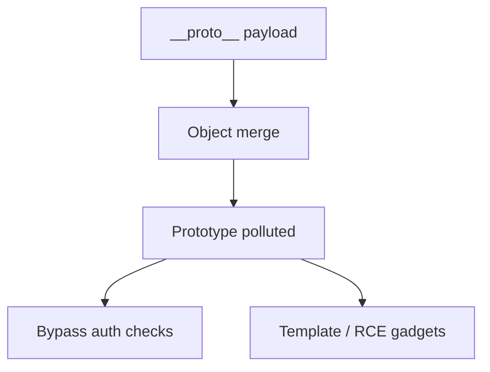
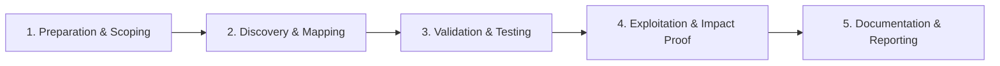

# Prototype Pollution

Pollute JavaScript object prototypes for XSS and RCE.

## Overview Diagram

Visual summary of the **attack/data flow** and the **five-phase testing workflow** for this topic.

### Attack / Data Flow

<div class="sr-diagram" markdown="1">



</div>

### Testing Workflow

<div class="sr-diagram sr-diagram-methodology" markdown="1">



</div>

## How It Works

Prototype pollution is a JavaScript vulnerability where attackers modify `Object.prototype` (or other builtins) by injecting properties through unsafe object merge, extend, or clone operations.

Typical vulnerable pattern:

```javascript
function merge(target, source) {
  for (let key in source) {
    target[key] = source[key];
  }
}
```

Payload via query string or JSON:

```json
{"__proto__": {"polluted": true}}
```

or

```json
{"constructor": {"prototype": {"polluted": true}}}
```

After pollution, `{}.polluted` is true because new objects inherit the poisoned prototype.

**Client-side**: Gadgets in libraries read from `obj.polluted` options → XSS.

**Server-side (Node.js)**: Pollution affects template engines, authorization checks, or `child_process` options → RCE in severe cases.

## Exploitation

**Client-side**

1. Find `lodash.merge`, `jQuery.extend`, or custom deep merge on `location.hash` or JSON configs.
2. Pollute: `?__proto__[test]=polluted` or JSON `__proto__` key.
3. Chain gadgets: if app checks `if (obj.isAdmin)` and `isAdmin` can be set on prototype, bypass auth UI.

**Server-side Node**

```json
{"__proto__": {"shell": "node", "NODE_OPTIONS": "--require /proc/self/environ"}}
```

When polluted properties flow into `child_process.spawn` options or template engines.

**Attack flow**

```
Malicious key in merge → prototype polluted → later object access reads attacker property → XSS / RCE / auth bypass
```

**Tools**

- ppmap for gadget research
- Burp to fuzz JSON bodies with `__proto__`, `constructor.prototype`

**Detection**

- After payload, evaluate `({}).polluted` in console or check behavior changes globally.

## Defense & Mitigation

**Safe merging**

- Use `Object.create(null)` for dictionaries without prototype chain.
- Freeze `Object.prototype` in hardened environments (`Object.freeze(Object.prototype)`).
- Libraries: upgrade lodash (CVE fixes), use `structuredClone` or safe merge utilities that block `__proto__`, `constructor`, `prototype`.

**Input validation**

- Reject keys matching `__proto__`, `constructor`, `prototype` in JSON parsers for untrusted input.
- JSON schema validation with additional property restrictions.

**Server-side Node**

- Avoid recursive merge on request bodies; validate schema explicitly.
- Run with least privilege; isolate workers.

**Dependencies**

- Audit client bundles for vulnerable merge helpers; pin patched versions.

## Pro Tips

Practical advice from real engagements — use these to test faster and report better.

!!! tip "JSON __proto__"
    Send `{"__proto__": {"isAdmin": true}}` on every JSON endpoint.

!!! tip "Query string pollution"
    `?__proto__[isAdmin]=true` works on some Node parsers.

!!! tip "Client + server"
    Pollute in browser for DOM XSS gadgets; pollute server for auth bypass.

!!! tip "ppmap scanner"
    Run ppmap against Node apps after mapping routes.

!!! tip "Check merge libraries"
    lodash `merge`, jQuery `extend`, recursive assign — grep source for usage.

## Testing Methodology

Work through each phase in order. Every step has a checkbox — complete them all for thorough, reproducible coverage.

### Phase 1 — Preparation & Scoping

- [ ] Confirm target is in program scope and ROE allows this test type
- [ ] Set up isolated lab or proxy (Burp/ZAP) with scope filters
- [ ] Document baseline application behavior and account roles
- [ ] Identify test accounts for each privilege level
- [ ] Identify JS merge/extend on user JSON (`__proto__`, `constructor.prototype`)

### Phase 2 — Discovery & Mapping

- [ ] Map client-side libraries: lodash merge, jQuery.extend, recursive assign
- [ ] Find server-side Node merge on JSON bodies
- [ ] Review query string parsers that build nested objects
- [ ] Check GraphQL variable merging and template configs

### Phase 3 — Validation & Testing

- [ ] Send `{"__proto__": {"isAdmin": true}}` and observe auth changes
- [ ] Test `constructor.prototype` pollution variants
- [ ] Use ppmap or manual JSON nesting for discovery
- [ ] Validate server-side pollution via response or behavior

### Phase 4 — Exploitation & Impact Proof

- [ ] Demonstrate auth bypass or RCE gadget if available
- [ ] Show client-side XSS via polluted config sinks
- [ ] Document polluted property and affected code path
- [ ] Test fix by freezing Object.prototype in lab

### Phase 5 — Documentation & Reporting

- [ ] Write step-by-step reproduction with HTTP requests/responses
- [ ] Capture screenshots or video showing impact (redact sensitive data)
- [ ] Rate severity using program CVSS or impact matrix
- [ ] Provide concrete remediation guidance for developers
- [ ] Retest after fix if program allows verification
- [ ] Recommend `Object.create(null)` maps and safe merge libraries

## Tools

| Tool | Usage |
|------|-------|
| `burp` | [Intercept, repeater & scanner](../../TOOLS_GUIDE.md#burp-suite) |
| `ppmap` | [Prototype pollution scanner](../../TOOLS_GUIDE.md#ppmap) |
| `dom clobbering scanners` | [Browser DevTools + DOM XSS sinks review](../../TOOLS_GUIDE.md) |

## Resources

- [PortSwigger Prototype Pollution](https://portswigger.net/web-security/prototype-pollution)

## Verification Checklist

- [ ] Review scope and rules of engagement
- [ ] Document baseline behavior
- [ ] Test edge cases and parser differentials
- [ ] Capture proof-of-concept safely
- [ ] Write remediation guidance
