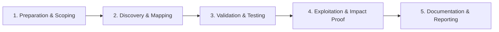

# Race Condition

Exploit time-of-check to time-of-use flaws.

## Overview Diagram

Visual summary of the **attack/data flow** and the **five-phase testing workflow** for this topic.

### Attack / Data Flow

<div class="sr-diagram" markdown="1">

```mermaid
sequenceDiagram
    participant A as Attacker
    participant S as Server
    participant DB as Database
    par Parallel requests
        A->>S: Transfer $100
        A->>S: Transfer $100
    end
    S->>DB: Check balance once
    DB-->>S: OK
    S->>DB: Double spend
classDef attacker fill:#ef4444,stroke:#b91c1c,color:#fff
classDef target fill:#6c3ce0,stroke:#5429c4,color:#fff
classDef tool fill:#f59e0b,stroke:#d97706,color:#1a1a1a
classDef success fill:#10b981,stroke:#059669,color:#fff
classDef warn fill:#f97316,stroke:#ea580c,color:#fff

```

</div>

### Testing Workflow

<div class="sr-diagram sr-diagram-methodology" markdown="1">



</div>

## How It Works

Race conditions in web applications exploit the gap between **checking** a condition and **using** the result (time-of-check to time-of-use, TOCTOU). Parallel requests can pass a limit check simultaneously before any request completes the state update.

Classic web examples:

- Double-spend: two parallel transfers when balance covers only one
- Coupon reuse: same discount code applied concurrently
- Vote or like limits bypassed
- Account creation with single-use invitation tokens
- File upload race: swap file after path check

Single-threaded request handling does not eliminate races when multiple app instances, async workers, or database transactions with weak isolation interact.

Microsecond-level windows matter: attackers send dozens of simultaneous HTTP/2 or TCP connections with Burp Turbo Intruder or custom asyncio scripts.

## Exploitation

**Identify targets**

1. Operations with limits: balance, inventory, rate limits, one-time tokens.
2. Multi-step flows where step 2 assumes step 1 state unchanged.
3. File operations: upload then execute, move then read.

**Parallel request technique**

Send 20–100 identical POSTs in the same millisecond:

```python
import asyncio, aiohttp

async def post(session):
    await session.post("https://target.com/apply-coupon", data={"code": "SAVE50"})

async def main():
    async with aiohttp.ClientSession() as s:
        await asyncio.gather(*[post(s) for _ in range(50)])

asyncio.run(main())
```

**Attack flow**

```
Request A and B read balance=100 → both pass check for 100 debit → both commit → balance=-100 or double payout
```

**Last-byte synchronization**

- Align requests with `Connection: close` bursts
- HTTP/2 single-connection multiplexing for tighter timing
- Turbo Intruder `race` mode with gate release

**Indicators**

- Inconsistent final state vs expected single-operation outcome
- Multiple success responses where only one should succeed

## Defense & Mitigation

**Atomic operations**

- Use database constraints: `CHECK (balance >= 0)`, unique indexes on coupon usage per user.
- Single atomic SQL: `UPDATE accounts SET balance = balance - 100 WHERE id = 1 AND balance >= 100`.

**Transactions and locking**

- `SELECT ... FOR UPDATE` in transactions for financial operations.
- Distributed locks (Redis Redlock) for cross-instance critical sections—use carefully with fencing tokens.

**Idempotency**

- Idempotency keys on payment APIs; server stores processed key set.
- One-time tokens consumed atomically with compare-and-swap.

**Design**

- Avoid check-then-act in application memory; push rules to DB or transactional message queues.

**Testing**

- Load tests with deliberate parallelism in staging.
- Property-based tests asserting invariant (balance never negative).

## Testing Methodology

Work through each phase in order. Every step has a checkbox — complete them all for thorough, reproducible coverage.

### Phase 1 — Preparation & Scoping

- [ ] Confirm target is in program scope and ROE allows this test type
- [ ] Set up isolated lab or proxy (Burp/ZAP) with scope filters
- [ ] Document baseline application behavior and account roles
- [ ] Identify test accounts for each privilege level
- [ ] Identify limit-once operations: transfers, votes, coupon redemption

### Phase 2 — Discovery & Mapping

- [ ] Map state-changing endpoints with concurrency impact
- [ ] Review single-use tokens, inventory counters, rate limits
- [ ] Note microservice timing windows between check and use
- [ ] Identify financial or privilege-escalation targets

### Phase 3 — Validation & Testing

- [ ] Send 20–100 parallel requests with Burp Turbo Intruder or asyncio
- [ ] Compare single request vs burst outcomes
- [ ] Measure window: add delays between check and update if possible
- [ ] Test last-byte sync and HTTP/2 single-connection races

### Phase 4 — Exploitation & Impact Proof

- [ ] Demonstrate double spend, double vote, or limit bypass
- [ ] Capture timing diagram and success rate
- [ ] Prove business impact with account balances or quotas
- [ ] Stop after clear proof — avoid harming other users

### Phase 5 — Documentation & Reporting

- [ ] Write step-by-step reproduction with HTTP requests/responses
- [ ] Capture screenshots or video showing impact (redact sensitive data)
- [ ] Rate severity using program CVSS or impact matrix
- [ ] Provide concrete remediation guidance for developers
- [ ] Retest after fix if program allows verification
- [ ] Recommend database transactions, locks, or idempotency keys

## Tools

| Tool | Usage |
|------|-------|
| `burp turbo intruder` | [Race condition & burst attacks](../../TOOLS_GUIDE.md#burp-suite) |
| `race-the-web` | [Race condition testing](../../TOOLS_GUIDE.md#race-the-web) |
| `python asyncio` | [Async HTTP for race condition PoCs](../../TOOLS_GUIDE.md) |

## Resources

- [PortSwigger Race Conditions](https://portswigger.net/web-security/race-conditions)

## Verification Checklist

- [ ] Review scope and rules of engagement
- [ ] Document baseline behavior
- [ ] Test edge cases and parser differentials
- [ ] Capture proof-of-concept safely
- [ ] Write remediation guidance
